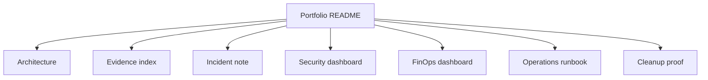

# 7교시: Cloud Operations Portfolio Packet


이 시간은 Week 5 산출물을 포트폴리오 패킷으로 묶는다. 목표는 캡처를 많이 모으는 것이 아니라 AWS 운영 판단을 README 하나에서 추적할 수 있게 만드는 것이다.

## 수업 목표
- architecture, evidence, incident, security, cost, cleanup proof를 하나의 README로 연결한다.
- 민감 정보를 제거하고 의미 없는 중복 캡처를 줄인다.
- 면접이나 회고에서 "무엇을 만들었고 어떻게 운영 판단했는지" 설명할 수 있는 패킷을 만든다.

## 오늘 만들 산출물
| 산출물 | 형태 | 반드시 들어갈 값 |
|---|---|---|
| Portfolio README | markdown | architecture, evidence index, decisions, cleanup |
| Evidence index | 표 | 파일명, AWS 화면, 판단 근거 |
| Architecture diagram | mermaid 또는 이미지 | account/Region, network, compute, data, observability |
| Final redaction check | 체크리스트 | secret/account email/access key 제거 |

실습 템플릿은 `labs/portfolio-packet/README.md`를 사용한다.

## 패킷 구성
| 섹션 | 넣을 내용 | 부족한 예 |
|---|---|---|
| Overview | 어떤 AWS 구성을 운영했는가 | "AWS 실습함" |
| Architecture | VPC/subnet/EC2/ALB/S3/RDS/CloudWatch 관계 | 개별 서비스 캡처만 있음 |
| Evidence index | 정상/장애/보안/비용/cleanup 증거 링크 | 캡처 파일만 나열 |
| Incident note | 증상, evidence, action, verification | 원인 추측만 있음 |
| Security review | IAM/SG/S3/CloudTrail 판단 | "보안 확인" |
| FinOps review | Budget/Cost/resource action | 비용 추측 |
| Cleanup/handoff | 삭제/유지/다음 단계 | 정리 여부 불명확 |

## 핵심 개념
Portfolio packet은 보여주기용 결과물이 아니라 운영 사고를 압축한 증거 묶음이다. 좋은 README는 "이 resource가 왜 있었고, 어떤 증거로 정상/장애/보안/비용을 판단했으며, 마지막에 무엇을 지웠는지"를 읽는 사람이 따라갈 수 있게 한다.

## 구조


## 실습 절차
1. `labs/portfolio-packet/README.md` 템플릿을 복사한다.
2. Week 5 대표 architecture를 한 개 고른다.
3. Mermaid 또는 이미지로 resource 관계를 그린다.
4. evidence 파일을 정상, 장애, 보안, 비용, cleanup으로 분류한다.
5. 각 evidence가 어떤 판단을 뒷받침하는지 한 줄로 적는다.
6. secret, account email, access key, token, password가 보이는 자료를 제거하거나 가린다.
7. cleanup proof와 retained resource 사유를 README 마지막에 넣는다.

## 제출 품질 기준
| 통과 | 부족 |
|---|---|
| README만 읽어도 architecture와 운영 판단이 보인다 | 이미지 파일만 흩어져 있다 |
| evidence마다 판단 문장이 있다 | "성공 캡처"만 있다 |
| 보안/비용/장애/cleanup이 모두 있다 | 정상 실행만 있다 |
| 민감 정보가 제거되어 있다 | account email/key/token이 보인다 |
| 남긴 resource의 사유와 cleanup 시각이 있다 | 비용 후보가 불명확하다 |

## Evidence Note
```markdown
# W5D5S7 portfolio packet
- Packet title:
- Architecture summary:
- Best evidence:
- Incident/security/cost evidence:
- Removed sensitive materials:
- Cleanup proof:
- Remaining risk:
```

## 한 줄 요약
```text
좋은 portfolio packet은 AWS를 많이 눌렀다는 흔적이 아니라 운영 판단을 재현할 수 있는 증거 묶음이다.
```
