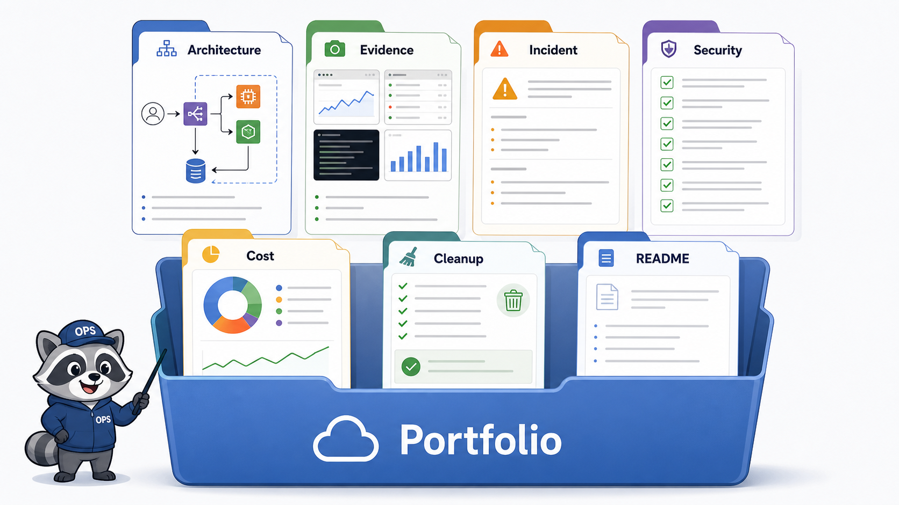
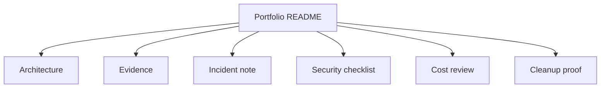

# 7교시: Portfolio packet 구성



이 visual은 Week 5 evidence를 portfolio packet으로 묶을 때 필요한 구성 요소를 보여준다.

## 수업 목표
- Week 5 evidence를 portfolio packet으로 재구성한다.
- architecture, incident, security, cost, cleanup proof를 README로 연결한다.
- 보여주기용 캡처가 아니라 운영 판단을 설명하는 산출물을 만든다.

## 오늘 반드시 가져갈 것
| 필수 개념 | 왜 필수인가 | 놓치면 생기는 문제 | 확인 지점 |
|---|---|---|---|
| Architecture | resource 관계를 한눈에 보여준다 | 개별 화면만 있고 구조가 없다 | diagram |
| Evidence | 판단 근거를 제공한다 | 성공 캡처만 있다 | screenshots, notes |
| Incident note | 문제 해결 사고를 보여준다 | 장애 대응 역량이 드러나지 않는다 | incident markdown |
| Cleanup proof | 비용/보안 책임을 마무리한다 | 잔여 resource 위험이 남는다 | deleted/retained list |

## 핵심 개념
Portfolio packet은 학습 자료를 압축해서 보여주는 제출물이다. 단순히 많이 한 흔적보다 운영 판단이 드러나야 한다. 어떤 architecture였고, 어떤 evidence로 정상/장애/비용/보안을 판단했으며, 어떤 resource를 지웠고 무엇을 왜 남겼는지를 README 하나에서 추적할 수 있어야 한다.

## 구조로 보기


이 구조는 Console 화면을 암기하기 위한 그림이 아니다. 운영 질문이 들어왔을 때 어떤 evidence를 먼저 확인하고, 어떤 판단을 문서에 남길지 정하는 기준이다.

## 공식 문서 확인 지점
| 확인할 문서 키워드 | 읽을 때 볼 질문 |
|---|---|
| Well-Architected | 이 판단이 운영 우수성, 보안, 비용 중 어디에 해당하는가 |
| CloudWatch 또는 CloudTrail | 상태와 변경 이력을 어떤 evidence로 확인하는가 |
| IAM 또는 Security | 누가 접근할 수 있고 무엇이 공개되어 있는가 |
| Billing 또는 Cost | 비용 원인과 owner를 설명할 수 있는가 |

## 운영 판단 연습
| 판단 질문 | 확인 기준 |
|---|---|
| 무엇을 대표 산출물로 둘 것인가 | Week 5 운영 흐름을 가장 잘 보여주는 resource를 선택한다 |
| 어떤 증거를 넣을 것인가 | 정상, 실패, 보안, 비용, cleanup evidence를 균형 있게 넣는다 |
| 무엇을 제거할 것인가 | 민감 정보와 의미 없는 중복 캡처를 제거한다 |

## 흔한 실패와 첫 확인 위치
| 흔한 실패 | 첫 확인 위치 |
|---|---|
| 캡처 파일만 모아두고 설명 README가 없다 | README에서 각 evidence가 어떤 판단을 뒷받침하는지 연결한다 |

## 실습/시뮬레이션 절차
1. Week 5 evidence에서 이 교시 주제와 연결되는 화면을 2개 이상 고른다.
2. 각 화면에 대해 resource name, Region, 상태값, owner/tag, 비용 또는 보안 영향을 적는다.
3. 공식 문서 키워드와 Console 화면의 용어가 일치하는지 확인한다.
4. 판단이 필요한 항목은 `확인한 값 -> 판단 -> 다음 행동` 형식으로 기록한다.
5. 민감 정보가 보이는 screenshot은 폐기하거나 가린 뒤 다시 저장한다.

## 복구와 정리 기준
| 상황 | 먼저 볼 evidence | 다음 행동 |
|---|---|---|
| 상태가 불명확하다 | service detail, health, logs | 정상 기준과 비교한다 |
| 최근 변경이 의심된다 | CloudTrail, deployment history | 변경 시각과 증상 시각을 비교한다 |
| 비용이 남는다 | Cost Explorer, resource inventory | 삭제/중지/유지 판단을 남긴다 |
| 공개 또는 권한이 의심된다 | IAM, SG, public endpoint, secret | 접근 범위를 줄이고 재확인한다 |

## 화면 캡처 가이드
- Region, resource name, 상태값, tag, policy, metric name처럼 재현 가능한 값을 남긴다.
- account email, secret value, access key, token, password는 캡처하지 않는다.
- 실패 화면은 error message만 자르지 말고 어떤 service와 설정에서 발생했는지 보이게 한다.
- cleanup evidence는 삭제 버튼보다 삭제 후 검색 결과와 비용 후보 확인이 중요하다.

## Evidence 점검
- 화면에는 민감 정보 대신 resource 이름, Region, 상태값, rule, tag처럼 재현 가능한 값이 보여야 한다.
- 기록에는 "성공했다"보다 어떤 값이 어떤 상태였는지가 남아야 한다.
- 실패를 기록할 때는 증상, 확인한 화면, 수정한 값, 재확인 결과를 한 세트로 남긴다.
- portfolio README, architecture diagram, cleanup proof 중 최소 두 가지는 최종 패킷에 남긴다.

## Evidence Note
```markdown
# W5D5S7 portfolio packet
- Region/account boundary:
- Resource or evidence source:
- 확인한 값:
- 판단:
- 다음 행동:
- cleanup/handoff 상태:
```

## 혼자 다시 따라오기
- 최소 재현 경로: architecture, evidence, incident, security, cost, cleanup 항목을 포함한 README 초안을 만든다.
- 공식 문서 키워드: `architecture decision`, `evidence`, `incident report`, `security checklist`, `cost review`
- 스스로 확인할 화면: markdown preview, image links, git diff
- 흔한 실패 3개: 민감 정보 노출, 캡처만 있고 판단 없음, cleanup proof 없음
- 다음 준비 상태: portfolio packet만 봐도 Week 5 운영 역량을 설명할 수 있어야 한다.

## 한 줄 요약
```text
좋은 portfolio packet은 많이 했다는 증거가 아니라 운영 판단을 재현할 수 있는 증거를 묶는다.
```
