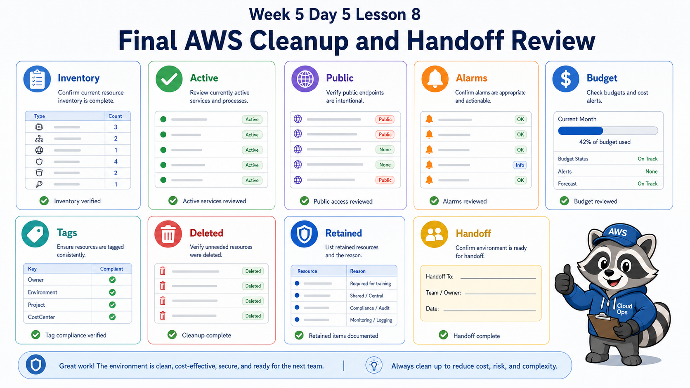
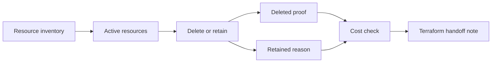

# 8교시: 최종 cleanup/handoff



이 visual은 resource inventory, 삭제 증거, 유지 사유, handoff note를 최종 정리하는 흐름을 보여준다.

## 수업 목표
- Week 5 resource inventory를 최종 확인한다.
- 삭제한 resource와 남긴 resource를 이유와 함께 구분한다.
- Terraform 보강 수업으로 넘어갈 handoff note를 작성한다.

## 오늘 반드시 가져갈 것
| 필수 개념 | 왜 필수인가 | 놓치면 생기는 문제 | 확인 지점 |
|---|---|---|---|
| Inventory | 남아 있는 resource를 찾는 기준이다 | 눈에 보이는 것만 삭제한다 | service list |
| Deleted proof | 삭제 후 다시 검색한 증거다 | 삭제했다고 생각만 한다 | empty result |
| Retained reason | 남긴 resource의 목적과 비용을 설명한다 | 불필요한 비용이 남는다 | retained list |
| Handoff | 다음 단계에서 재현할 정보를 남긴다 | Terraform 수업에서 무엇을 코드화할지 모른다 | handoff note |

## 핵심 개념
최종 cleanup은 Week 5의 마지막 운영 실습이다. 삭제 버튼을 누르는 것이 끝이 아니라, 삭제 후 검색 결과와 비용 후보를 확인해야 한다. 남길 resource가 있다면 유지 사유, 예상 비용, owner, 삭제 예정 시각을 적는다. 이 handoff note는 Terraform 보강 수업에서 어떤 AWS resource를 코드로 재현할지 결정하는 기준이 된다.

## 구조로 보기


이 구조는 Console 화면을 암기하기 위한 그림이 아니다. 운영 질문이 들어왔을 때 어떤 evidence를 먼저 확인하고, 어떤 판단을 문서에 남길지 정하는 기준이다.

## 공식 문서 확인 지점
| 확인할 문서 키워드 | 읽을 때 볼 질문 |
|---|---|
| Well-Architected | 이 판단이 운영 우수성, 보안, 비용 중 어디에 해당하는가 |
| CloudWatch 또는 CloudTrail | 상태와 변경 이력을 어떤 evidence로 확인하는가 |
| IAM 또는 Security | 누가 접근할 수 있고 무엇이 공개되어 있는가 |
| Billing 또는 Cost | 비용 원인과 owner를 설명할 수 있는가 |

## 운영 판단 연습
| 판단 질문 | 확인 기준 |
|---|---|
| 무엇이 남아 있는가 | EC2, ALB, ECR/ECS/App Runner, S3/RDS, logs, secrets, budgets를 확인한다 |
| 무엇을 삭제했는가 | 삭제 후 service list와 검색 결과를 남긴다 |
| 무엇을 다음으로 넘길 것인가 | Terraform으로 재현할 resource와 제외할 resource를 구분한다 |

## 흔한 실패와 첫 확인 위치
| 흔한 실패 | 첫 확인 위치 |
|---|---|
| cleanup을 EC2 terminate로만 끝낸다 | ALB, target group, ECR image, log group, snapshot, secret, budget까지 inventory로 본다 |

## 실습/시뮬레이션 절차
1. Week 5 evidence에서 이 교시 주제와 연결되는 화면을 2개 이상 고른다.
2. 각 화면에 대해 resource name, Region, 상태값, owner/tag, 비용 또는 보안 영향을 적는다.
3. 공식 문서 키워드와 Console 화면의 용어가 일치하는지 확인한다.
4. 판단이 필요한 항목은 `확인한 값 -> 판단 -> 다음 행동` 형식으로 기록한다.
5. 민감 정보가 보이는 screenshot은 폐기하거나 가린 뒤 다시 저장한다.

## 복구와 정리 기준
| 상황 | 먼저 볼 evidence | 다음 행동 |
|---|---|---|
| 상태가 불명확하다 | service detail, health, logs | 정상 기준과 비교한다 |
| 최근 변경이 의심된다 | CloudTrail, deployment history | 변경 시각과 증상 시각을 비교한다 |
| 비용이 남는다 | Cost Explorer, resource inventory | 삭제/중지/유지 판단을 남긴다 |
| 공개 또는 권한이 의심된다 | IAM, SG, public endpoint, secret | 접근 범위를 줄이고 재확인한다 |

## 화면 캡처 가이드
- Region, resource name, 상태값, tag, policy, metric name처럼 재현 가능한 값을 남긴다.
- account email, secret value, access key, token, password는 캡처하지 않는다.
- 실패 화면은 error message만 자르지 말고 어떤 service와 설정에서 발생했는지 보이게 한다.
- cleanup evidence는 삭제 버튼보다 삭제 후 검색 결과와 비용 후보 확인이 중요하다.

## Evidence 점검
- 화면에는 민감 정보 대신 resource 이름, Region, 상태값, rule, tag처럼 재현 가능한 값이 보여야 한다.
- 기록에는 "성공했다"보다 어떤 값이 어떤 상태였는지가 남아야 한다.
- 실패를 기록할 때는 증상, 확인한 화면, 수정한 값, 재확인 결과를 한 세트로 남긴다.
- resource inventory, deleted/retained table, Terraform handoff note 중 최소 두 가지는 최종 패킷에 남긴다.

## Evidence Note
```markdown
# W5D5S8 cleanup handoff
- Region/account boundary:
- Resource or evidence source:
- 확인한 값:
- 판단:
- 다음 행동:
- cleanup/handoff 상태:
```

## 혼자 다시 따라오기
- 최소 재현 경로: Week 5 전체 resource를 service별로 검색하고 deleted/retained/handoff 표를 완성한다.
- 공식 문서 키워드: `resource cleanup`, `Cost Explorer`, `tagging`, `retained resources`, `Infrastructure as Code`
- 스스로 확인할 화면: EC2, ELB, ECS/App Runner, ECR, S3, RDS, CloudWatch, Secrets Manager, Cost Explorer
- 흔한 실패 3개: 삭제 후 검색 누락, 남긴 resource 비용 미기록, Terraform handoff 없음
- 다음 준비 상태: Week 5를 비용/보안/재현성 측면에서 닫고 Terraform 보강으로 넘길 수 있어야 한다.

## 한 줄 요약
```text
최종 cleanup은 비용을 멈추는 절차이자 Terraform으로 넘길 운영 지식을 정리하는 handoff다.
```
