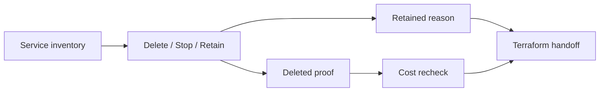

# 8교시: Final AWS Cleanup And Handoff


이 시간은 Week 5의 마지막 운영 실습이다. 삭제 버튼을 누르는 것이 끝이 아니라, service별 inventory를 돌고 삭제 후 재조회 evidence와 남긴 resource의 사유를 남긴다.

## 수업 목표
- Week 5에서 만들었을 가능성이 있는 resource를 service별로 최종 점검한다.
- 삭제한 resource와 남긴 resource를 비용/보안/재현성 기준으로 구분한다.
- Terraform 보강 수업으로 넘길 resource와 제외할 resource를 handoff note로 정리한다.

## 오늘 만들 산출물
| 산출물 | 형태 | 반드시 들어갈 값 |
|---|---|---|
| Final inventory | 표 | service, resource, status, action |
| Deleted proof | screenshot 또는 note | 삭제 후 empty/search result |
| Retained resource list | 표 | owner, purpose, estimated cost, cleanup date |
| Terraform handoff note | markdown | 코드화할 resource, 제외할 resource, 이유 |

실습 템플릿은 `labs/cleanup-handoff/README.md`를 사용한다.

## 최종 inventory 순서
| 순서 | Service | 확인할 것 | 놓치기 쉬운 비용/보안 |
|---|---|---|---|
| 1 | EC2 | instances, security groups, key pairs | stopped instance의 EBS 비용, public SSH |
| 2 | EBS | volumes, snapshots | unattached volume, snapshot |
| 3 | ELB | load balancers, target groups | ALB 시간 비용 |
| 4 | ECS/App Runner | services, tasks | 계속 실행 중인 service |
| 5 | ECR | repositories, images | image storage |
| 6 | S3 | buckets, objects, versions | public access, versioned objects |
| 7 | RDS | DB instances, snapshots | deletion protection, final snapshot |
| 8 | CloudWatch | log groups, alarms, dashboards | log retention/storage |
| 9 | Secrets Manager/SSM | secrets/parameters | secret 유지 비용, 민감정보 |
| 10 | IAM | access keys, temporary lab policies | 과도한 권한, 장기 key |
| 11 | Billing | Cost Explorer, Budgets | 비용 데이터 지연, forecast |

## 핵심 개념
Cleanup은 비용과 보안을 닫는 절차다. "삭제했다"는 말은 부족하다. 삭제 후 service list에서 사라졌는지, 남긴 resource는 왜 남겼는지, 다음 확인 시각이 언제인지가 있어야 한다. 이 기록이 Terraform 보강 수업에서 무엇을 코드화할지 결정하는 기준이 된다.

## Cleanup 구조


## 실습 절차
1. `labs/cleanup-handoff/README.md`의 inventory 표를 복사한다.
2. Console Region을 실습 Region으로 맞춘다.
3. 위 inventory 순서대로 service를 확인한다.
4. 각 resource에 `Deleted`, `Stopped`, `Retained`, `Not found`, `Need owner decision` 중 하나를 붙인다.
5. 삭제한 resource는 삭제 후 다시 검색한 화면을 evidence로 남긴다.
6. 남긴 resource는 owner, purpose, 예상 비용, cleanup 예정 시각을 적는다.
7. Cost Explorer/Billing dashboard에서 비용 데이터 지연 또는 forecast를 기록한다.
8. Terraform 보강으로 넘길 resource와 제외할 resource를 구분한다.

## Terraform handoff 기준
| Terraform으로 넘길 후보 | 제외하거나 주의할 후보 |
|---|---|
| VPC, subnet, SG, EC2, ALB, S3 bucket 기본 구조 | 개인 access key, secret value, 실습용 임시 public rule |
| tag 규칙, budget, CloudWatch alarm | 실제 결제 정보, account-level 민감 설정 |
| 반복 가능한 작은 web architecture | 비용 큰 NAT Gateway/RDS/EKS는 별도 승인 필요 |

## Evidence 점검
- service별 final inventory가 있다.
- 삭제 resource는 삭제 후 재조회 증거가 있다.
- retained resource에는 owner, purpose, cleanup date가 있다.
- public endpoint와 public SG rule이 남아 있다면 명확한 사유가 있다.
- Terraform handoff note가 있다.

## Evidence Note
```markdown
# W5D5S8 final cleanup handoff
- Account/Region:
- Deleted resources:
- Stopped resources:
- Retained resources:
- Remaining public exposure:
- Remaining cost candidates:
- Terraform handoff candidates:
- Next check time:
```

## 한 줄 요약
```text
최종 cleanup은 Week 5 비용과 보안을 닫고 Terraform으로 넘길 재현 대상을 정하는 운영 절차다.
```
