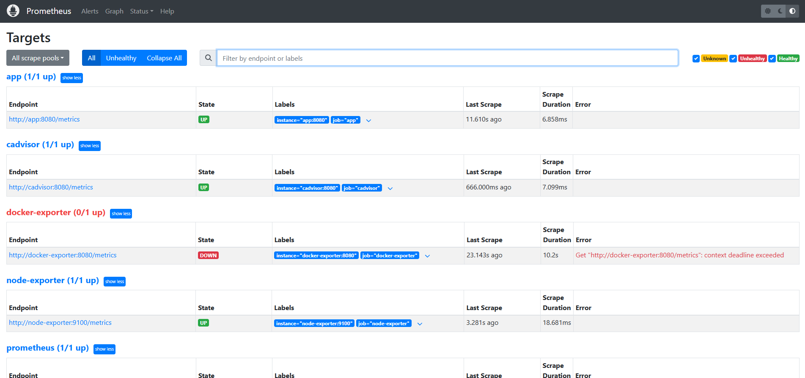
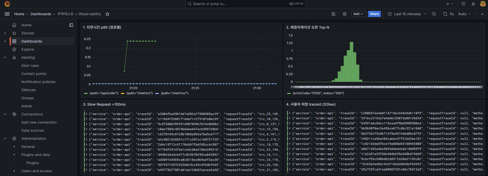
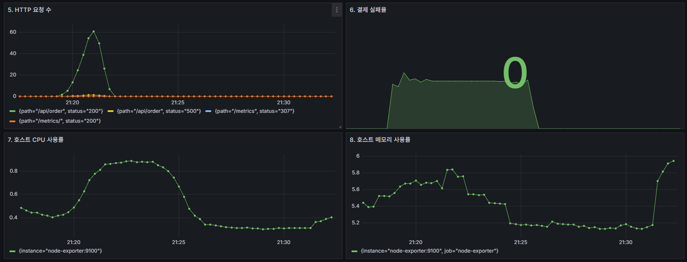
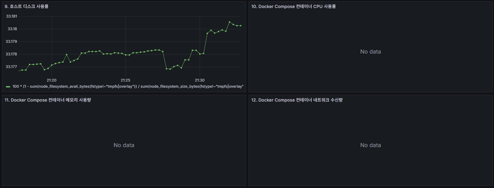
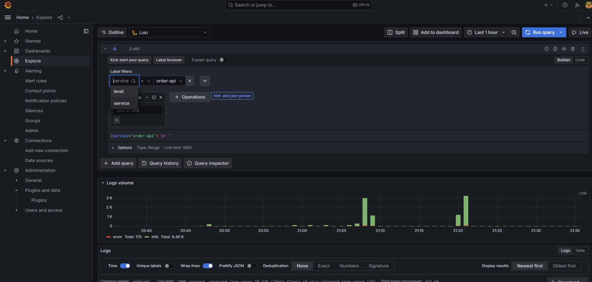
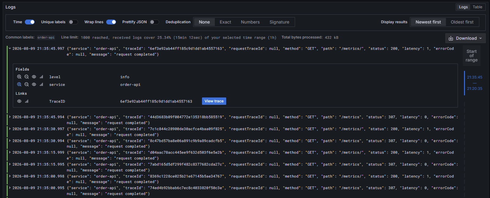

# Lesson 2. k6 부하 테스트와 Observability 실습

> 목표: Windows와 macOS에서 k6를 설치하고, `week_over/loadtest`를 Docker Compose로 기동한 뒤, 앱에 부하를 주고 Grafana·Prometheus·Loki·Tempo에서 결과를 확인한다.
>
> 이 문서는 현재 저장소의 Python 샘플 앱과 `smoke.js`, `load.js`, `docker-compose.yml`을 기준으로 작성했다.

## 0. 실습에서 완성할 흐름

```text
Windows PowerShell / macOS Terminal
  └─ k6 설치 및 실행
       └─ HTTP 요청 → Docker Compose의 app:8080
                         ├─ /metrics → Prometheus
                         ├─ JSON 로그 → Loki
                         ├─ OTLP trace → Tempo
                         └─ CPU/메모리/네트워크 → node-exporter,
                                            cAdvisor,
                                            docker-exporter

Grafana
  └─ Prometheus + Loki + Tempo를 하나의 대시보드에서 확인
```

이번 실습에서 사용하는 서비스와 포트는 다음과 같다.

| 서비스 | 주소 | 역할 |
|---|---|---|
| Sample App | `http://localhost:8080` | 부하 대상 API |
| Prometheus | `http://localhost:9090` | 애플리케이션·인프라 메트릭 저장 |
| Grafana | `http://localhost:3000` | 대시보드 |
| Loki | `http://localhost:3100` | JSON 로그 저장 |
| Tempo | `http://localhost:3200` | trace 조회 API |
| node-exporter | `http://localhost:9100` | Linux/WSL2 호스트 메트릭 |
| cAdvisor | `http://localhost:8081` | 컨테이너 cgroup 메트릭 |
| docker-exporter | `http://localhost:8082` | Docker Compose 컨테이너별 메트릭 |

---

## 1. 사전 준비

### 1.1 Docker Desktop 설치 및 실행

Windows와 macOS 모두 Docker Desktop을 설치하고 실행한다. Docker Desktop이 실행 중이지 않으면 Compose가 이미지를 받거나 컨테이너를 시작할 수 없다.

- Windows: WSL2 backend와 Linux containers를 사용한다.
- macOS: Apple Silicon(M 시리즈) 또는 Intel에 맞는 Docker Desktop을 설치한다. Docker Desktop이 Linux 컨테이너를 실행하는 기본 설정이면 된다.
- Apple Silicon에서 이미지를 실행할 때는 먼저 `platform: linux/amd64`를 임의로 추가하지 않는다. 현재 사용하는 공식 이미지들은 Docker Desktop의 멀티 아키텍처 처리를 우선 사용한다.

Windows PowerShell 또는 macOS Terminal에서 버전을 확인한다.

```shell
docker version
docker compose version
```

두 명령 모두 Docker Server와 Compose 버전을 출력해야 한다. Docker 자체가 동작하는지 처음 한 번 확인하려면 다음도 실행한다.

```shell
docker run --rm hello-world
```

`Hello from Docker!`가 출력되면 기본 Docker 실행 환경이 준비된 것이다.

> 주의: `8080`, `3000`, `9090`, `3100`, `3200`, `4317`, `4318`, `8081`, `8082`, `9100` 포트를 다른 프로그램이 사용 중이면 Compose 기동이 실패한다.

### 1.2 k6 설치

k6는 JavaScript로 HTTP 부하 시나리오를 작성하고 실행하는 부하 발생기다. 호스트에 k6를 설치하는 방법과 Docker 컨테이너 안에서 실행하는 방법을 모두 설명한다.

#### Windows: winget

```powershell
winget search k6
winget install k6
k6 version
```

설치 후 기존 PowerShell 창을 닫고 새로 열면 PATH가 반영된다.

#### Windows: Chocolatey

```powershell
choco install k6
k6 version
```

#### macOS: Homebrew

Homebrew가 없다면 [brew.sh](https://brew.sh/)의 설치 안내에 따라 먼저 설치한다. 그 다음 macOS Terminal에서 실행한다.

```bash
brew update
brew install k6
k6 version
```

#### Windows/macOS 공통: Docker 안에서만 실행

호스트에 k6를 설치하지 않아도 Docker 이미지로 실행할 수 있다.

```shell
docker run --rm grafana/k6:latest version
```

### 1.3 운영체제별 명령 문법

| 목적 | Windows PowerShell | macOS Terminal(zsh/bash) |
|---|---|---|
| 폴더 이동 | `Set-Location D:\paperclip\week_over\loadtest` | `cd ~/paperclip/week_over/loadtest` |
| 환경변수 설정 | `$env:TARGET_URL = 'http://localhost:8080/api/health'` | `export TARGET_URL='http://localhost:8080/api/health'` |
| 환경변수 해제 | `$env:TARGET_URL = $null` | `unset TARGET_URL` |
| k6 실행 | `k6 run .\k6\smoke.js` | `k6 run ./k6/smoke.js` |
| Compose 실행 | `docker compose up -d --build` | `docker compose up -d --build` |

macOS의 Docker Desktop도 Compose 서비스 이름 `app`, `loki`, `prometheus`, `tempo`를 내부 네트워크에서 해석한다. 반면 호스트에 직접 설치한 k6는 두 운영체제 모두 `app`을 해석하지 못하므로 `localhost` URL을 사용해야 한다.

> Windows Docker Desktop의 node-exporter/cAdvisor는 WSL2 Linux VM 메트릭을 수집할 수 있고, macOS Docker Desktop의 exporter도 Docker Desktop Linux VM 기준으로 동작할 수 있다. 대시보드의 호스트 CPU·메모리는 물리 OS와 완전히 동일한 의미가 아닐 수 있다.

---

## 2. 실습 폴더로 이동

저장소 위치에 따라 운영체제별로 `loadtest` 폴더로 이동한다.

### Windows PowerShell

```powershell
Set-Location D:\paperclip\week_over\loadtest
Get-Location
Get-ChildItem
```

### macOS Terminal

저장소를 홈 디렉터리 아래 `paperclip`에 clone했다면 다음과 같다.

```bash
cd ~/paperclip/week_over/loadtest
pwd
ls
```

저장소 위치가 다르면 `cd` 뒤에 실제 경로를 사용한다. 예를 들어 Desktop에 clone했다면 다음처럼 이동한다.

```bash
cd ~/Desktop/paperclip/week_over/loadtest
```

두 운영체제 모두 다음 항목이 보여야 한다.

```text
docker-compose.yml
app/
k6/
grafana/
prometheus/
tempo/
docker-exporter/
```

k6 스크립트가 있는지도 확인한다.

```powershell
Get-ChildItem .\k6
```

macOS에서는 다음을 사용한다.

```bash
ls -la ./k6
```

실행 대상은 다음 세 파일이다.

- `k6\smoke.js`: `/api/health`를 1 VU로 30초 호출
- `k6\load.js`: `/api/order`를 0 → 10 → 50 → 0 VU로 약 2분 실행
- `k6\ci-gate.js`: CI 게이트용 20 VU 실행

`smoke.TEMPLATE.js`는 참고용 템플릿이다. 이번 실습에서 실행할 파일은 `smoke.js`와 `load.js`다.

---

## 3. Docker Compose로 전체 스택 기동

`loadtest` 폴더에서 다음 명령을 실행한다.

```powershell
docker compose up -d --build
```

이 명령은 다음을 수행한다.

1. Python 샘플 앱 이미지를 빌드한다.
2. Prometheus, Grafana, Loki, Tempo를 실행한다.
3. node-exporter와 cAdvisor를 실행한다.
4. Docker socket을 읽는 docker-exporter를 빌드·실행한다.
5. k6 스크립트를 실행할 수 있는 Compose profile도 준비한다.

컨테이너 상태를 확인한다.

```powershell
docker compose ps
```

최소한 다음 서비스가 `Up` 상태여야 한다.

```text
app
prometheus
grafana
loki
tempo
node-exporter
cadvisor
docker-exporter
```

`k6`는 `profiles: ["load"]`로 정의되어 있으므로 `docker compose up` 때 계속 실행되는 서비스가 아니다. k6는 뒤의 실행 단계에서 one-off 컨테이너로 실행한다.

### 3.1 준비 상태 확인

Compose의 `depends_on`은 컨테이너 시작 순서만 보장하며, 애플리케이션이 실제로 요청을 받을 때까지 기다려주지는 않는다. 따라서 다음 확인을 수행한다.

```powershell
Invoke-WebRequest http://localhost:8080/api/health -UseBasicParsing
Invoke-WebRequest http://localhost:8080/metrics -UseBasicParsing
Invoke-WebRequest http://localhost:3100/ready -UseBasicParsing
Invoke-WebRequest http://localhost:3200/ready -UseBasicParsing
```

Prometheus와 Grafana가 응답하는지도 확인한다.

```powershell
Invoke-WebRequest http://localhost:9090/-/ready -UseBasicParsing
Invoke-WebRequest http://localhost:3000/api/health -UseBasicParsing
```

macOS에서는 `curl`을 사용한다.

```bash
curl -f http://localhost:8080/api/health
curl -f http://localhost:8080/metrics >/dev/null
curl -f http://localhost:3100/ready
curl -f http://localhost:3200/ready
curl -f http://localhost:9090/-/ready
curl -f http://localhost:3000/api/health
```

처음 이미지가 올라오는 시점에는 일부 요청이 실패할 수 있다. `docker compose ps`에서 컨테이너가 `Up`인지 확인하고, 필요하면 10~20초 기다린 뒤 다시 실행한다.

---

## 4. k6 Smoke Test 실행

Smoke Test는 긴 부하 테스트 전에 앱 주소, 네트워크, k6 스크립트, 기본 응답을 빠르게 확인하는 단계다.

### 4.1 Windows/macOS 호스트에서 k6 실행

호스트에서 실행하는 k6는 Docker Compose 내부 DNS 이름인 `app`을 알 수 없다. 따라서 Windows와 macOS 모두 `TARGET_URL`을 반드시 `localhost`로 덮어쓴다.

#### Windows PowerShell

```powershell
$env:TARGET_URL = 'http://localhost:8080/api/health'
k6 run .\k6\smoke.js
```

#### macOS Terminal

```bash
export TARGET_URL='http://localhost:8080/api/health'
k6 run ./k6/smoke.js
```

`smoke.js`의 기본 조건은 다음과 같다.

- VU: 1
- 실행 시간: 30초
- `checks`: 99% 초과
- HTTP 실패율: 1% 미만
- p95 응답 시간: 500ms 미만
- 요청 사이에 1초 sleep

성공하면 마지막 요약에서 다음처럼 threshold가 `succeeded`로 표시된다.

```text
checks.........................: 100.00% ✓ 29  ✗ 0
http_req_failed.................: 0.00%  ✓ 0   ✗ 29
http_req_duration p(95).........: ...ms
```

실제 수치는 실행 환경에 따라 달라진다. 중요한 것은 `thresholds`가 통과했는지다.

### 4.2 Smoke Test 요청 확인

다른 PowerShell 창에서 앱 응답을 직접 확인할 수도 있다.

```powershell
Invoke-RestMethod http://localhost:8080/api/health
```

macOS에서는 Terminal에서 다음을 실행한다.

```bash
curl http://localhost:8080/api/health
```

예상 응답:

```json
{"status":"ok"}
```

실행 후 환경변수를 지우고 싶으면 다음을 사용한다.

```powershell
$env:TARGET_URL = $null
```

macOS에서는 다음을 사용한다.

```bash
unset TARGET_URL
```

---

## 5. k6 Load Test 실행

Smoke Test가 통과하면 실제 부하 시나리오를 실행한다.

### 5.1 `load.js` 시나리오 읽기

현재 `load.js`는 다음 stages를 사용한다.

```javascript
stages: [
  { duration: '30s', target: 10 },
  { duration: '1m', target: 50 },
  { duration: '30s', target: 0 },
]
```

따라서 전체 실행 시간은 약 2분이다.

```text
0 VU ──30초──> 10 VU ──1분──> 50 VU ──30초──> 0 VU
```

각 VU는 `/api/order`를 호출하고 0.5초 sleep한다. 요청마다 `X-Trace-Id` 헤더를 보내지만, Grafana/Tempo 연결에 사용하는 최종 trace ID는 앱이 생성한 32자리 hexadecimal trace ID다.

### 5.2 Windows/macOS 호스트에서 `load.js` 실행

호스트 k6는 `app`이라는 Docker DNS 이름을 사용할 수 없으므로 Windows와 macOS 모두 `localhost`를 지정한다.

#### Windows PowerShell

```powershell
$env:TARGET_URL = 'http://localhost:8080/api/order'
k6 run .\k6\load.js
```

#### macOS Terminal

```bash
export TARGET_URL='http://localhost:8080/api/order'
k6 run ./k6/load.js
```

실행 중에는 다음 항목을 확인한다.

- VU 수가 10, 50까지 증가하는가?
- `http_req_duration` p95가 500ms 미만인가?
- p99가 1000ms 미만인가?
- `checks`가 95% 초과인가?
- HTTP 실패율이 1% 미만인가?

### 5.3 샘플 앱의 의도된 2% 오류

`app/python/main.py`의 `/api/order`는 실습을 위해 약 2% 확률로 다음 오류를 반환한다.

```json
{"errorCode":"E002","status":500}
```

따라서 정상적으로 앱과 k6가 연결되어도 다음 threshold는 실패할 수 있다.

```javascript
http_req_failed: ['rate<0.01']
```

이것은 네트워크나 Docker Compose가 반드시 고장났다는 뜻이 아니다. 의도된 결제 timeout 시나리오가 HTTP 500으로 관측된 것이다.

이번 결과를 판정할 때는 다음을 구분한다.

| 상황 | 해석 |
|---|---|
| `/api/health` Smoke가 실패 | 앱 기동, 포트, URL, 네트워크 문제 가능성 |
| `load.js` p95/p99 초과 | 지연시간 또는 부하 처리 문제 가능성 |
| `load.js` HTTP 실패율만 약 2% | 샘플 앱의 의도된 E002 오류 가능성 |
| k6 실행은 성공하지만 Grafana에 늦게 표시 | Prometheus scrape 15초 및 Loki 전송 지연 대기 필요 |

실제 서비스의 성능 게이트를 실험할 때는 오류 주입을 끄거나, 의도된 오류율을 별도 기준으로 분리하는 것이 좋다.

```

         /\      Grafana   /‾‾/  
    /\  /  \     |\  __   /  /   
   /  \/    \    | |/ /  /   ‾‾\ 
  /          \   |   (  |  (‾)  |
 / __________ \  |_|\_\  \_____/ 


     execution: local
        script: /scripts/load.js
        output: -

     scenarios: (100.00%) 1 scenario, 5 max VUs, 50s max duration (incl. graceful stop):
              * default: Up to 5 looping VUs for 20s over 3 stages (gracefulRampDown: 30s, gracefulStop: 30s)


  █ THRESHOLDS 

    checks
    ✓ 'rate>0.95' rate=96.34%

    http_req_duration
    ✓ 'p(95)<500' p(95)=194.84ms
    ✓ 'p(99)<1000' p(99)=203.41ms

    http_req_failed
    ✗ 'rate<0.01' rate=3.65%


  █ TOTAL RESULTS 

    checks_total.......: 164    8.003438/s
    checks_succeeded...: 96.34% 158 out of 164
    checks_failed......: 3.65%  6 out of 164

    ✗ HTTP status is 200
      ↳  96% — ✓ 79 / ✗ 3
    ✗ application response has orderId
      ↳  96% — ✓ 79 / ✗ 3

    HTTP
    http_req_duration..............: avg=135.54ms min=53.8ms   med=136.23ms max=204.91ms p(90)=189.98ms p(95)=194.84ms
      { expected_response:true }...: avg=134.73ms min=53.8ms   med=133.8ms  max=204.91ms p(90)=190.47ms p(95)=195.23ms
    http_req_failed................: 3.65%  3 out of 82
    http_reqs......................: 82     4.001719/s

    EXECUTION
    iteration_duration.............: avg=636.38ms min=554.77ms med=637.58ms max=705.77ms p(90)=691.03ms p(95)=695.99ms
    iterations.....................: 82     4.001719/s
    vus............................: 1      min=1       max=5
    vus_max........................: 5      min=5       max=5

    NETWORK
    data_received..................: 15 kB  750 B/s
    data_sent......................: 8.9 kB 434 B/s


running (20.5s), 0/5 VUs, 82 complete and 0 interrupted iterations
default ✓ [======================================] 0/5 VUs  20s
ERRO[0020] thresholds on metrics 'http_req_failed' have been crossed 
```

### 5.4 유저 플로우 기반 부하 테스트 케이스 설계

부하 테스트는 엔드포인트 하나를 빠르게 반복하는 것보다, 사용자가 실제로 수행하는 작업의 순서를 재현하는 방식으로 설계하는 것이 좋다. 사용자는 보통 로그인한 뒤 상품을 검색하고, 상세 정보를 확인하고, 장바구니에 담은 다음 주문을 완료한다. 이 흐름을 그대로 테스트해야 각 단계의 지연, 세션·토큰 전달, 데이터 정합성, 최종 비즈니스 결과를 함께 확인할 수 있다.

엔드포인트 단위 테스트만 사용하면 다음 문제를 놓치기 쉽다.

- 로그인에서 받은 토큰을 다음 요청에 전달하지 못하는 문제
- 검색 결과의 상품 ID와 상세·장바구니 요청의 상품 ID가 연결되지 않는 문제
- 장바구니 수량이나 주문 금액이 다음 단계에서 달라지는 문제
- 개별 요청은 빠르지만 전체 사용자 여정이 지나치게 긴 문제
- 한 단계의 오류가 다음 단계에 어떤 영향을 주는지 알 수 없는 문제

#### 5.4.1 테스트 케이스를 만드는 순서

각자 프로젝트에서는 다음 순서로 테스트 케이스를 만든다.

1. **사용자 목표를 정한다.** 예를 들어 “사용자가 상품을 검색해 주문을 완료한다”처럼 결과가 포함된 문장으로 작성한다.
2. **사전 조건과 테스트 데이터를 정한다.** 테스트 계정, 상품 ID, 재고, 권한, 쿠폰, 결제 sandbox 여부를 기록한다.
3. **정상 흐름과 주요 실패 분기를 나눈다.** 정상 로그인, 잘못된 비밀번호, 검색 결과 없음, 재고 부족, 결제 timeout 등을 별도 케이스로 구분한다.
4. **각 단계의 요청과 상관관계를 기록한다.** 로그인 응답의 token, 검색 결과의 productId, 주문 응답의 orderId처럼 다음 단계에서 사용할 값을 명시한다.
5. **기능·성능·관측 기준을 함께 작성한다.** 상태 코드만 보지 말고 응답 필드, p95/p99, 오류율, 로그, trace, 자원 사용량을 연결한다.
6. **작은 Smoke로 시작해 Load로 확장한다.** 먼저 1 VU로 한 여정이 끝까지 성공하는지 확인하고, 같은 케이스에 VU와 duration을 늘린다.

#### 5.4.2 프로젝트별 테스트 케이스 양식

아래 표를 복사해 프로젝트의 API와 데이터에 맞게 채운다. `UF`는 User Flow의 약자이며, 케이스 ID는 프로젝트 전체에서 중복되지 않게 관리한다.

| 항목 | 작성 내용 |
|---|---|
| Case ID | `UF-01`, `UF-02`처럼 고유한 식별자 |
| 사용자 목표 | 사용자가 이루려는 최종 결과 |
| 사전 조건/테스트 데이터 | 계정, 권한, 상품·주문 ID, 재고, 환경, sandbox 여부 |
| 플로우 단계 | 사용자가 수행하는 순서와 각 단계의 입력·출력 |
| 대상 엔드포인트 | HTTP method, URL, 주요 헤더·본문 |
| 기능 체크 | 상태 코드, 응답 필드, 업무 규칙, 데이터 정합성 |
| 부하 프로파일 | Smoke, Load, Stress, Spike, Soak 중 선택하고 VU·duration·ramp를 기록 |
| 성공 기준 | 허용 p95/p99, 오류율, 체크 성공률, 업무 오류 허용 범위 |
| 확인할 관측 데이터 | Grafana 패널, Prometheus PromQL, Loki LogQL, Tempo trace, 컨테이너 자원 |

#### 5.4.3 예시: 유저 플로우 기반 5개 케이스

다음 5개는 대부분의 웹·API 프로젝트에 적용할 수 있는 기본 골격이다. `login`, `search`, `cart`, `payment` 경로는 프로젝트마다 다르므로 실제 OpenAPI 문서나 라우팅 코드의 경로·본문·응답 필드로 교체한다.

| Case ID | 사용자 플로우와 단계 | 대상 API 예시 | 핵심 체크·성공 기준 | 권장 프로파일 |
|---|---|---|---|---|
| `UF-01` | **서비스 진입/상태 확인**: 랜딩 페이지 또는 앱에 접속하고 서비스가 요청을 받을 수 있는지 확인한다. | `GET /api/health` 또는 `GET /` | HTTP 200, 응답의 `status`가 `ok`, 체크 성공률 99% 초과, p95 500ms 미만 | Smoke: 1 VU, 30초 |
| `UF-02` | **로그인/세션 생성**: 로그인 정보를 제출하고 받은 token 또는 session cookie로 사용자 정보를 조회한다. | `POST /api/login` → `GET /api/me` | 로그인 200, token/session 존재, 다음 요청이 200, 다른 사용자의 데이터가 노출되지 않음 | Smoke 후 Load: 정상·실패 계정 분리 |
| `UF-03` | **검색/목록 탐색**: 키워드나 필터를 입력하고 목록을 받은 뒤 결과를 선택한다. | `GET /api/products?keyword=...` → `GET /api/products/{productId}` | 목록 배열 형식, `productId` 존재, 상세 조회가 선택한 ID와 일치, 빈 검색 결과도 올바른 200/204 정책 준수 | Load: 검색어·필터를 VU별로 분산 |
| `UF-04` | **상세 확인/장바구니 상호작용**: 상품 상세를 확인하고 수량을 지정해 장바구니에 추가·조회한다. | `GET /api/products/{productId}` → `POST /api/cart/items` → `GET /api/cart` | 추가 응답 200/201, 상품 ID·수량 일치, 장바구니 합계 정합성, 재고 부족 오류는 정의한 4xx로 처리 | Load 또는 Stress: 재고·수량 경계값 포함 |
| `UF-05` | **주문/결제 완료**: 장바구니를 주문으로 전환하고 결제 결과와 주문 번호를 확인한다. | 일반 프로젝트: `POST /api/checkout` → `POST /api/payment` → `GET /api/orders/{orderId}` | 주문 번호·상태 존재, 결제 성공/실패 상태가 일치, 중복 주문 없음, p95/p99와 업무 오류율을 별도로 판정 | Load, Spike, 필요 시 Soak |

이 저장소의 샘플 앱에 바로 적용하면 다음처럼 단순화한다.

- `UF-01`은 `GET /api/health`와 `smoke.js`로 실행한다.
- `UF-05`의 간소화된 주문 단계는 `GET /api/order`와 `load.js`로 실행한다. 정상 응답에는 `orderId`가 있어야 한다.
- 샘플 앱에는 로그인, 검색, 장바구니, 실제 결제 엔드포인트가 없으므로 `UF-02`~`UF-04`와 일반적인 `POST /api/checkout`, `POST /api/payment` 경로는 **각자 프로젝트에서 실제 경로로 바꿔 사용하는 자리표시자**다.
- `/api/order`는 실습을 위해 약 2%의 `E002` HTTP 500 오류를 주입한다. 따라서 연결성·성능 기준과 의도된 업무 오류율을 분리해 기록한다. `http_req_failed < 1%`가 실패해도 p95/p99가 통과하고 E002 비율이 예상 범위인지 함께 확인한다.

#### 5.4.4 테스트 케이스를 k6 스크립트로 옮기는 방법

한 케이스를 k6로 옮길 때는 한 iteration을 한 사용자의 여정으로 생각한다. `group()`으로 단계 이름을 남기고, 요청마다 `check()`를 작성하며, 사용자가 생각하는 시간을 `sleep()`으로 표현한다.

```javascript
import http from 'k6/http';
import { check, group, sleep } from 'k6';

const BASE_URL = __ENV.BASE_URL || 'http://app:8080';

export default function () {
  group('UF-05 주문 완료', function () {
    const order = http.get(`${BASE_URL}/api/order`, { timeout: '5s' });

    check(order, {
      '주문 응답이 200이다': (r) => r.status === 200,
      'orderId가 있다': (r) => r.status === 200 && r.json('orderId') !== undefined,
    });

    // 실제 사용자의 다음 행동 간격을 모델링한다.
    sleep(0.5);
  });
}
```

로그인·검색·장바구니가 있는 프로젝트는 응답 값을 다음 요청에 연결한다. 아래 코드는 구조를 보여주는 예시이며, 실제 필드명과 API 경로로 바꿔야 한다.

```javascript
const login = http.post(`${BASE_URL}/api/login`, JSON.stringify({
  email: user.email,
  password: user.password,
}), { headers: { 'Content-Type': 'application/json' } });

check(login, { '로그인이 성공한다': (r) => r.status === 200 });
const token = login.json('token');
const headers = { headers: { Authorization: `Bearer ${token}` } };

const results = http.get(`${BASE_URL}/api/products?keyword=${user.keyword}`, headers);
const productId = results.json('items.0.id');
http.post(`${BASE_URL}/api/cart/items`, JSON.stringify({ productId, quantity: 1 }), {
  ...headers,
  headers: { ...headers.headers, 'Content-Type': 'application/json' },
});
```

테스트 데이터와 실행별 값을 섞지 않도록 다음 방법을 사용한다.

- **고정된 소규모 데이터**: 스크립트 옆의 JSON/CSV를 읽고 `SharedArray`로 VU 간 데이터를 공유한다. 모든 VU가 같은 사용자·검색어·캐시 키만 쓰지 않도록 `__VU`와 `__ITER`로 분산한다.
- **실행 전에 준비할 데이터**: `setup()`에서 테스트용 계정이나 상품을 준비하고, 반환한 값을 각 VU에 전달한다. 데이터 생성 API가 있으면 종료 후 정리 절차도 케이스에 기록한다.
- **응답에서 얻는 데이터**: token, session cookie, productId, orderId를 변수에 저장해 다음 요청에 전달한다. 이를 correlation이라고 하며, 이전 응답의 값을 하드코딩하지 않는 것이 핵심이다.
- **CSV 데이터**: k6 기본 파일 읽기와 CSV 파싱 또는 프로젝트에서 승인한 데이터 모듈을 사용한다. 비밀번호·토큰·실제 개인정보가 들어 있는 CSV는 저장소에 커밋하지 않는다.

예를 들어 JSON fixture를 VU별로 나누는 형태는 다음과 같다.

```javascript
import { SharedArray } from 'k6/data';

const users = new SharedArray('test users', () =>
  JSON.parse(open('./data/users.json'))
);

export function setup() {
  return { runId: `load-${Date.now()}` };
}

export default function (data) {
  const user = users[(__VU - 1) % users.length];
  // data.runId를 요청 헤더나 테스트 데이터 식별자에 사용한다.
}
```

#### 5.4.5 테스트 프로파일 선택

같은 테스트 케이스라도 목적에 따라 부하 프로파일을 바꾼다.

| 프로파일 | 목적 | 예시 |
|---|---|---|
| Smoke | 스크립트·URL·기본 응답·데이터가 정상인지 빠르게 확인 | 1 VU, 30초, `UF-01` 또는 전체 여정 1회 |
| Load | 예상 정상 사용량에서 성능과 오류율 확인 | 10 → 50 VU, 2분, 현재 `load.js` |
| Stress | 한계점을 찾고 어느 자원에서 병목이 생기는지 확인 | 목표 VU를 단계적으로 증가, p95/p99와 CPU·메모리 기록 |
| Spike | 갑작스러운 트래픽 증가와 회복 여부 확인 | 5 VU에서 짧은 시간에 100 VU로 증가 후 원복 |
| Soak | 장시간 실행 중 메모리 누수·로그 증가·커넥션 고갈 확인 | 낮은 일정 부하를 수십 분~수 시간 유지 |
| CI gate | 배포 전 최소 성능 기준을 자동 판정 | 짧은 실행, p95·HTTP 오류율·핵심 check threshold |

현재 샘플의 `smoke.js`는 `UF-01`, `load.js`는 간소화된 `UF-05`, `ci-gate.js`는 CI gate 예시로 볼 수 있다. 실제 서비스에서는 결제 sandbox 오류처럼 예상된 업무 실패를 기술적 장애와 같은 threshold로 묶지 말고 별도 metric과 성공 기준으로 관리한다.

#### 5.4.6 테스트 데이터와 안전 수칙

- 실제 결제·문자·메일·외부 파트너 호출을 부하 테스트에 연결하지 말고 sandbox 또는 mock을 사용한다.
- 운영 데이터가 아닌 staging 전용 계정·상품·주문을 사용하고, 테스트 시작·종료와 정리 담당자를 기록한다.
- VU마다 고유한 사용자·주문·멱등성 키를 사용해 중복 주문과 서로의 장바구니 오염을 막는다.
- 모든 VU가 같은 캐시 키를 사용하면 실제 사용 패턴과 다른 결과가 나오므로 검색어·상품·페이지를 분산한다.
- 비밀번호, access token, 실제 개인정보, 카드 번호를 코드·CSV·로그·스크린샷에 남기지 않는다.
- 주문·결제 테스트는 테스트 금액과 sandbox 상태를 확인하고, 실패 시 자동 재시도로 실제 주문이 중복 생성되지 않게 한다.
- 부하 중에는 Grafana의 Loki·Tempo에 민감한 요청 본문이 전송되지 않는지 확인한다.

#### 5.4.7 이번 실습의 제출 과제

각자 프로젝트의 API를 기준으로 다음 결과물을 만든다.

1. 위 양식으로 `UF-01`~`UF-05` 다섯 개의 케이스 매트릭스를 작성한다. 엔드포인트가 없는 단계는 실제 프로젝트의 경로로 대체하고, 없으면 “미구현”으로 표시한다.
2. 다섯 케이스 중 하나를 선택해 1 VU Smoke를 구현한다. 정상 응답뿐 아니라 핵심 응답 필드와 상관관계를 검사한다.
3. 같은 케이스를 Load 프로파일로 확장한다. VU, ramp, think time, 테스트 데이터 분산 방식을 기록한다.
4. p95/p99, HTTP 오류율, 업무 오류율, check 성공률의 threshold를 정하고 예상 오류와 실제 장애를 구분한다.
5. 실행 결과의 k6 요약, `docker compose ps`, Prometheus 메트릭, Grafana 대시보드, Loki slow request, Tempo trace를 캡처한다.
6. 실패한 케이스는 “어느 단계에서”, “어떤 응답·로그·trace로”, “어떤 자원 메트릭과 함께” 실패했는지 원인을 설명한다.

이 과정을 마치면 단순히 `/api/order`를 반복한 결과가 아니라, 사용자 목표와 시스템 관측 데이터를 연결한 재현 가능한 부하 테스트 케이스가 된다.

---

## 6. Docker Compose 안에서 k6 실행하기

이 방식은 k6까지 Docker Compose 네트워크 안에서 실행한다. 이 경우 k6가 `app`이라는 서비스 이름을 해석할 수 있으므로 `TARGET_URL`을 지정하지 않아도 된다.

### 6.1 Compose 네트워크에서 Smoke Test

`docker-compose.yml`의 k6 서비스 기본 command는 `/scripts/smoke.js`다.

```powershell
docker compose --profile load run --rm k6
```

이 명령은 다음과 같다.

- `--profile load`: k6 서비스가 load profile에 포함되어 있음을 활성화
- `run`: 일회성 컨테이너 실행
- `--rm`: 종료 후 k6 컨테이너 자동 삭제
- 기본 command: `run /scripts/smoke.js`

### 6.2 Compose 네트워크에서 Load Test

`load.js`를 실행하려면 command를 덮어쓴다.

```powershell
docker compose --profile load run --rm k6 run /scripts/load.js
```

`load.js`의 기본 URL은 다음이다.

```text
http://app:8080/api/order
```

이 주소는 **Docker Compose 내부에서만** 유효하다. Windows 브라우저나 호스트 k6에서는 `http://localhost:8080`을 사용해야 한다.

### 6.3 Compose 네트워크에서 CI Gate 실행

필요하면 CI 조건을 로컬에서 확인할 수 있다.

```powershell
docker compose --profile load run --rm k6 run /scripts/ci-gate.js
```

현재 `ci-gate.js`는 20 VU로 1분 동안 `/api/order`를 호출하며 p95 500ms와 HTTP 실패율 1% 미만을 검사한다. 샘플 앱의 2% 오류 주입 때문에 실패할 수 있다는 점은 `load.js`와 같다.

### 6.4 두 실행 방식 비교

| 항목 | Windows 호스트 k6 | Compose k6 |
|---|---|---|
| 실행 명령 | `k6 run .\k6\load.js` | `docker compose --profile load run --rm k6 run /scripts/load.js` |
| URL | `http://localhost:8080/...` | `http://app:8080/...` |
| k6 설치 | Windows 설치 필요 | Docker만 있으면 됨 |
| 결과 출력 | 현재 PowerShell | 현재 PowerShell에 전달 |
| 네트워크 확인 | 호스트 → publish port | Compose network → service DNS |

수업 실습에서는 두 방법 중 하나만 실행해도 된다. Docker Compose까지 포함한 재현성을 우선하면 Compose k6 방식이 편하고, k6 설치와 로컬 실행을 학습하려면 호스트 k6 방식을 먼저 수행한다.

---

## 7. Prometheus에서 메트릭 확인

k6가 부하를 발생시키는 동안 별도 터미널에서 Prometheus를 확인한다.

### 7.0 실습 결과 캡처

아래 PNG는 이번 실습에서 확인한 결과를 한 장으로 합친 캡처다. 위쪽에는 Grafana traceId 패널 오류와 Inspect > Error 화면이 있고, 아래쪽에는 Prometheus Targets 상태가 있다.



*그림 7-1. Grafana의 LogQL/Prometheus datasource 오류와 Prometheus Targets에서 docker-exporter가 DOWN인 상태를 함께 확인한 화면*

> Grafana의 `unexpected character: '|'` 오류는 Prometheus에 Loki LogQL을 보낸 경우 발생한다. traceId 패널의 datasource는 `Prometheus`가 아니라 `Loki`여야 한다. 해결 절차는 [Grafana에서 `unexpected character: '|'`가 보일 때](#10-grafana에서-unexpected-character가-보일-때)를 참고한다.

### 7.1 Target 상태

브라우저에서 다음 주소를 연다.

```text
http://localhost:9090/targets
```

다음 target이 `UP`인지 확인한다.

```text
app
prometheus
node-exporter
cadvisor
docker-exporter
```

PowerShell에서 API로 확인하려면 다음을 실행한다.

```powershell
$targets = Invoke-RestMethod http://localhost:9090/api/v1/targets
$targets.data.activeTargets |
  Select-Object @{Name='job';Expression={$_.labels.job}},
                @{Name='instance';Expression={$_.labels.instance}},
                health,lastError
```

### 7.2 기본 PromQL 확인

```powershell
$up = [uri]::EscapeDataString('up')
Invoke-RestMethod "http://localhost:9090/api/v1/query?query=$up"
```

macOS에서는 다음처럼 실행한다.

```bash
curl -G 'http://localhost:9090/api/v1/query' --data-urlencode 'query=up'
```

브라우저의 Prometheus expression 입력창에서도 다음을 실행한다.

```promql
up
```

애플리케이션 메트릭:

```promql
http_requests_total
http_request_duration_seconds_bucket
app_logs_total
```

부하 테스트 중 유용한 쿼리:

```promql
sum by(path,status)(rate(http_requests_total[1m]))
```

```promql
histogram_quantile(
  0.95,
  sum by (le, path)(rate(http_request_duration_seconds_bucket[1m]))
)
```

```promql
sum(rate(app_logs_total{level="error"}[1m]))
```

### 7.3 하드웨어·컨테이너 메트릭

현재 대시보드에는 다음 메트릭도 포함되어 있다.

```promql
node_cpu_seconds_total
node_memory_MemTotal_bytes
docker_container_cpu_usage_seconds_total
docker_container_memory_working_set_bytes
docker_container_network_receive_bytes_total
```

Windows Docker Desktop에서는 node-exporter와 cAdvisor가 Windows 물리 호스트 자체가 아니라 Docker Desktop의 Linux VM/WSL2 환경을 기준으로 측정할 수 있다. 따라서 패널의 제목과 실제 측정 대상이 다를 수 있다.

또한 cAdvisor는 Docker Desktop의 layerdb 구조 때문에 컨테이너별 이름을 제대로 수집하지 못할 수 있다. 이 실습은 Docker Compose 컨테이너별 메트릭을 위해 `docker-exporter`를 별도로 사용한다.

---

## 8. Grafana 대시보드 확인

브라우저에서 Grafana를 연다.

```text
http://localhost:3000
```

기본 로컬 실습 계정:

```text
아이디: admin
비밀번호: admin
```

대시보드는 자동 provisioning되므로 별도로 JSON을 Import할 필요가 없다. 직접 주소를 입력하려면 다음을 사용한다.

```text
http://localhost:3000/d/loadtest-observability
```

### 8.1 Grafana 대시보드 캡처

실행 중인 Grafana 대시보드 화면은 다음 캡처로 확인한다.



*그림 8-1. Grafana 대시보드 화면 1*



*그림 8-2. Grafana 대시보드 화면 2*



*그림 8-3. Grafana 대시보드 화면 3*

현재 대시보드는 12개 패널을 2열로 배치한다.

| 패널 | 확인 내용 |
|---|---|
| 1 | 경로별 HTTP latency p95 |
| 2 | 애플리케이션 오류 Top N |
| 3 | 100ms 초과 slow request 로그 |
| 4 | 32자리 trace ID가 있는 로그 |
| 5 | 경로·상태별 HTTP 요청 수 |
| 6 | E002 결제 실패율 |
| 7 | 호스트 CPU |
| 8 | 호스트 메모리 |
| 9 | 호스트 디스크 |
| 10 | Docker Compose 컨테이너 CPU |
| 11 | Docker Compose 컨테이너 메모리 |
| 12 | Docker Compose 컨테이너 네트워크 수신량 |

부하를 실행한 직후에는 Grafana의 시간 범위를 `Last 15 minutes`로 맞추고 새로고침한다. Prometheus scrape 간격은 15초이므로 요청 직후 즉시 모든 시계열이 보이지 않을 수 있다.

> 참고: k6 자체의 `http_req_duration` 수치는 현재 터미널 출력이 기준이다. 현재 Compose는 k6 메트릭을 Prometheus remote write로 보내도록 구성되어 있지 않으므로 Grafana의 HTTP latency 패널은 앱이 직접 노출한 메트릭을 보여준다.

---

## 9. Loki 로그와 trace 확인

### 9.1 Loki 준비 상태

```powershell
Invoke-WebRequest http://localhost:3100/ready -UseBasicParsing
```

예상 HTTP status는 `200`이다.

Loki에 저장된 로그를 직접 확인하려면 Grafana의 **Explore**에서 `Loki` datasource를 선택한다. 다음 LogQL을 실행한다.

```logql
{service="order-api"}
```

trace ID 필터:

```logql
{service="order-api"} | json | traceId =~ "^[0-9a-f]{32}$"
```

100ms보다 느린 요청:

```logql
{service="order-api"} | json | latency > 100
```

현재 앱의 정상 요청 latency가 대략 50~200ms이므로, 실습에서는 `>100ms`가 결과를 확인하기 쉽다. `>1000ms`는 정상 실행에서 빈 결과가 될 수 있다.



*그림 9-1. Explorer > Loki*



*그림 9-2. Explorer > Loki*

### 9.2 로그에서 Tempo로 이동

1. 먼저 `load.js` 또는 `/api/order` 요청을 실행한다.
2. Grafana Explore에서 Loki datasource를 선택한다.
3. `traceId`가 포함된 JSON 로그를 찾는다.
4. 로그 라인의 `View trace` 링크를 누른다.
5. Tempo에서 해당 32자리 hexadecimal trace ID를 조회한다.

앱이 응답 헤더에 넣는 trace ID도 확인할 수 있다.

```powershell
$response = Invoke-WebRequest http://localhost:8080/api/order -UseBasicParsing
$response.Headers['X-Trace-Id']
```

정상적인 trace ID 예시는 다음과 같은 32자리 hexadecimal 문자열이다.

```text
d72844d2c3a8158b4829bc1effd7f92f
```

`trc_1234`와 같은 요청 추적용 문자열은 Tempo trace ID가 아니다. Tempo 링크에는 앱이 생성한 32자리 hexadecimal trace ID를 사용해야 한다.

### 9.3 Tempo 직접 확인

```powershell
Invoke-WebRequest http://localhost:3200/ready -UseBasicParsing
```

Tempo API에서 특정 trace를 조회하려면 다음처럼 실행한다.

```powershell
$traceId = '<Grafana 로그에서 확인한 32자리 trace ID>'
Invoke-RestMethod "http://localhost:3200/api/traces/$traceId"
```

---

## 10. Grafana에서 `unexpected character: '|'`가 보일 때

다음 오류가 표시될 수 있다.

```text
bad_data: invalid parameter "query"
parse error: unexpected character: '|'
```

이 오류는 Prometheus가 Loki용 LogQL을 해석하려고 할 때 발생한다. Prometheus는 다음 문법을 이해하지 못한다.

```logql
{service="order-api"} | json | traceId =~ "^[0-9a-f]{32}$"
```

### 확인 순서

1. 해당 패널의 datasource가 `Loki`인지 확인한다.
2. Prometheus가 아니라 Loki datasource를 선택한다.
3. Grafana 대시보드를 새로고침한다.
4. 주소는 다음 provisioned dashboard를 사용한다.

```text
http://localhost:3000/d/loadtest-observability
```

5. 브라우저에서 `Ctrl + F5`로 강력 새로고침한다.
6. 그래도 실패하면 Grafana를 재시작한다.

```powershell
docker compose restart grafana
```

현재 `grafana/dashboard.json`의 Slow Request와 traceId 패널은 panel-level과 target-level 모두 Loki datasource를 명시한다.

```json
"datasource": {
  "type": "loki",
  "uid": "loki"
}
```

Grafana 내부에서 Loki가 연결되는 주소는 다음이어야 한다.

```text
http://loki:3100
```

Grafana도 Docker Compose 컨테이너이기 때문에 provisioning 파일에서 `localhost:3100`으로 바꾸면 안 된다. `localhost`는 Grafana 컨테이너 자신을 가리키고, Loki는 `loki` 서비스 이름으로 접근해야 한다.

### 진단 명령

```powershell
docker compose ps
docker compose logs --tail=100 grafana
docker compose logs --tail=100 loki
```

Grafana 로그에서 다음처럼 확인되면 Loki 질의는 정상이다.

```text
pluginId=loki
statusCode=200
status=ok
```

반대로 `pluginId=prometheus`와 함께 LogQL 파이프라인 오류가 보이면 해당 패널의 datasource가 Prometheus로 fallback된 것이다.

---

## 11. 실행 결과에 이미지 삽입하기

실습 보고서나 제출 자료에는 아래 위치에 결과 화면을 캡처해서 추가한다. 이미지 파일은 나중에 직접 넣으면 된다.

### 11.1 권장 캡처 목록

1. `k6 version` 및 Smoke Test 최종 요약
2. `load.js` 최종 요약과 threshold 결과
3. `docker compose ps` 전체 서비스 상태
4. Prometheus Targets의 `UP` 상태
5. Grafana 2열 대시보드 전체 화면
6. Grafana Loki Slow Request 패널
7. Loki 로그에서 Tempo trace로 이동한 화면
8. Tempo trace 상세 화면
9. Docker Compose 컨테이너 CPU·메모리 패널

### 11.2 이미지 삽입 예시

`week_over/loadtest/asset/` 폴더에 캡처 파일을 넣고 다음처럼 작성한다.

```markdown


```

캡처에는 가능하면 다음 정보가 함께 보이도록 한다.

- 실행 시간
- 대상 URL
- VU 또는 stages
- p95/p99
- HTTP 실패율
- threshold 통과 여부
- Grafana 시간 범위

---

## 12. 종료 및 정리

테스트가 끝나면 먼저 필요했던 로그를 저장한다.

```powershell
docker compose logs --tail=100 app > app.log
docker compose logs --tail=100 prometheus > prometheus.log
docker compose logs --tail=100 grafana > grafana.log
```

k6 one-off 컨테이너를 포함해 전체 스택을 종료한다.

```powershell
docker compose --profile load down --remove-orphans
```

이 명령은 다음을 제거한다.

- Compose 컨테이너
- Compose 네트워크
- one-off k6 컨테이너

이미지와 Docker build cache는 남는다. 다음 실습에서 다시 시작할 때는 다음 명령을 사용한다.

```powershell
docker compose up -d --build
```

로컬에서 생성된 Compose 이미지까지 제거하려면 다음을 사용할 수 있다.

```powershell
docker compose --profile load down --rmi local --remove-orphans
```

> `docker system prune`은 현재 프로젝트 이외의 이미지·컨테이너·캐시까지 지울 수 있으므로 수업 실습 정리 명령으로 함부로 사용하지 않는다.

---

## 13. 전체 실행 명령 모음

### A. Windows에 k6를 설치하고 호스트에서 실행

```powershell
Set-Location D:\paperclip\week_over\loadtest

# 최초 1회
winget search k6
winget install k6
k6 version

# 전체 스택 기동
docker compose up -d --build
docker compose ps

# 준비 확인
Invoke-RestMethod http://localhost:8080/api/health

# Smoke
$env:TARGET_URL = 'http://localhost:8080/api/health'
k6 run .\k6\smoke.js

# Load
$env:TARGET_URL = 'http://localhost:8080/api/order'
k6 run .\k6\load.js

# 종료
$env:TARGET_URL = $null
docker compose --profile load down --remove-orphans
```

### B. macOS에 k6를 설치하고 호스트에서 실행

```bash
cd ~/paperclip/week_over/loadtest

# 최초 1회
brew update
brew install k6
k6 version

# 전체 스택 기동
docker compose up -d --build
docker compose ps

# 준비 확인
curl http://localhost:8080/api/health

# Smoke
export TARGET_URL='http://localhost:8080/api/health'
k6 run ./k6/smoke.js

# Load
export TARGET_URL='http://localhost:8080/api/order'
k6 run ./k6/load.js

# 종료
unset TARGET_URL
docker compose --profile load down --remove-orphans
```

### C. Docker Compose 안에서 k6까지 실행

```powershell
Set-Location D:\paperclip\week_over\loadtest

docker compose up -d --build
docker compose ps

# Smoke
docker compose --profile load run --rm k6

# Load
docker compose --profile load run --rm k6 run /scripts/load.js

# 대시보드 확인 후 종료
docker compose --profile load down --remove-orphans
```

### C. 문제가 발생했을 때 한 번에 확인

```powershell
docker compose ps
docker compose logs --tail=100 app prometheus grafana loki tempo
Invoke-WebRequest http://localhost:8080/api/health -UseBasicParsing
Invoke-WebRequest http://localhost:9090/-/ready -UseBasicParsing
Invoke-WebRequest http://localhost:3100/ready -UseBasicParsing
Invoke-WebRequest http://localhost:3200/ready -UseBasicParsing
```

---

## 14. 실습 완료 체크리스트

- [ ] Docker Desktop이 실행 중이다.
- [ ] `docker version`과 `docker compose version`이 성공한다.
- [ ] `k6 version`이 성공한다. 또는 Docker k6 이미지가 실행된다.
- [ ] Windows라면 `D:\paperclip\week_over\loadtest`, macOS라면 `~/paperclip/week_over/loadtest`로 이동했다.
- [ ] `docker compose up -d --build`가 성공했다.
- [ ] `docker compose ps`에서 핵심 서비스가 `Up`이다.
- [ ] `/api/health`가 200을 반환한다.
- [ ] Smoke Test가 threshold를 통과했다.
- [ ] `load.js`를 실행하고 p95/p99/실패율을 기록했다.
- [ ] Prometheus Targets가 `UP`이다.
- [ ] Grafana 대시보드가 2열로 표시된다.
- [ ] Loki에서 JSON 로그를 조회했다.
- [ ] 로그의 32자리 trace ID로 Tempo를 조회했다.
- [ ] 호스트와 Docker Compose 컨테이너 메트릭을 확인했다.
- [ ] 결과 화면을 캡처했다.
- [ ] `docker compose --profile load down --remove-orphans`로 정리했다.
