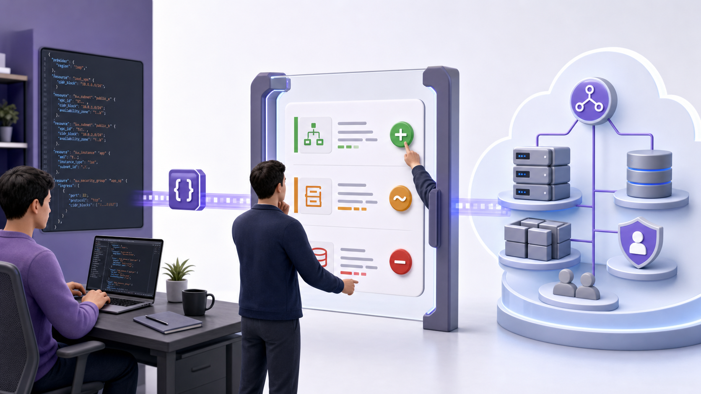
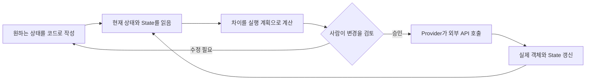

# 1교시: IaC와 Terraform, 어디까지 맡길 것인가



이 그림은 왼쪽의 코드, 가운데의 검토 단계, 오른쪽의 실제 인프라 순서로 봅니다. 사람이 검토 단계에 서 있다는 점이 오늘 이야기의 중심입니다. Terraform은 결정을 대신하는 도구가 아니라, 변경 내용을 먼저 보여주고 승인된 변경을 실행하는 도구입니다.

## 오늘의 질문

AWS Console에서 VPC를 하나 만들 수 있는데, 굳이 코드를 작성해야 할까요? 한 번 만들고 끝이라면 Console이 더 빠를 수도 있습니다. 하지만 같은 구성을 개발·검증·운영 환경에 반복하거나, 석 달 뒤 누가 왜 이 설정을 바꿨는지 찾아야 한다면 이야기가 달라집니다.

오늘은 Terraform 문법부터 시작하지 않습니다. 먼저 Terraform에 맡길 일과 맡기지 않을 일을 가려보겠습니다.

## 수업 목표

- IaC를 파일 형식이 아니라 인프라 변경 방식으로 설명한다.
- Terraform Core, Provider, 외부 API, State의 역할을 구분한다.
- Terraform이 잘하는 일과 다른 도구가 더 알맞은 일을 사례로 분류한다.
- 비용, 권한, State, Provider 변경 위험을 포함한 도입 판단표를 작성한다.

## 오늘 반드시 가져갈 것

| 필수 개념 | 왜 필요한가 | 놓치면 생기는 문제 | 확인 지점 |
|---|---|---|---|
| 선언형 구성 | 절차가 아니라 원하는 상태를 코드로 남깁니다 | 클릭 순서를 코드로 옮기고 IaC라고 오해합니다 | `.tf`의 resource argument |
| 실행 계획 | 실제 변경 전에 생성·수정·교체·삭제를 봅니다 | 코드 리뷰만 하고 인프라 영향을 놓칩니다 | `terraform plan` 요약 |
| Provider 경계 | Terraform Core가 AWS를 직접 아는 것은 아닙니다 | Provider 버전과 API 차이를 무시합니다 | `required_providers`, lock file |
| State binding | 코드 주소와 실제 객체 ID의 연결을 유지합니다 | State를 단순 캐시로 보고 삭제하거나 공유합니다 | Resource address와 remote ID |
| 운영 책임 | 자동화가 비용과 권한 책임을 없애지는 않습니다 | 빠르게 큰 범위의 사고를 재현합니다 | 승인자, 비용 Tag, 복구 계획 |

## IaC는 무엇을 코드로 만드는가

Infrastructure as Code는 인프라의 원하는 상태와 변경 근거를 사람이 검토할 수 있는 파일로 다루는 방식입니다. 여기서 중요한 단어는 `Code`보다 `변경 근거`입니다. 파일이 Git에 있다는 사실만으로 재현성이 생기지는 않습니다. 버전, 입력값, 실행 환경, State 위치, 승인 절차까지 함께 정해져야 다른 사람이 같은 결과를 만들 수 있습니다.

예를 들어 다음 두 설명을 비교해보겠습니다.

| 수동 작업 기록 | IaC 구성에서 기대하는 기록 |
|---|---|
| 서울 Region에서 VPC를 만들었습니다 | Provider Region과 VPC CIDR이 코드에 있습니다 |
| Subnet 두 개를 추가했습니다 | Subnet별 CIDR과 AZ 선택 규칙이 있습니다 |
| 보안 그룹에서 80번을 열었습니다 | source CIDR, port, protocol과 변경 diff가 있습니다 |
| 문제가 생겨 설정을 되돌렸습니다 | 이전 commit, Plan, 적용 결과가 연결됩니다 |

왼쪽 기록은 결과만 말합니다. 오른쪽 기록은 다음 사람이 다시 만들거나 변경 이유를 검토할 수 있게 합니다. 그렇다고 오른쪽이 항상 정답은 아닙니다. 일회성 조사, 즉시 대응이 필요한 장애, 애플리케이션 내부 설정처럼 다른 도구가 더 나은 영역도 있습니다.

## 선언형과 명령형을 구분해봅시다

명령형 방식은 원하는 결과에 도달하는 절차를 적습니다. 선언형 방식은 최종 상태를 적고, 도구가 현재 상태와 비교해 필요한 작업을 계산합니다.



왼쪽에서 오른쪽으로 한 번만 읽지 말고, 마지막 상태가 다시 비교 단계로 돌아가는 순환 구조를 보세요. Terraform 운영은 `apply` 한 번으로 끝나는 자동화가 아니라 작성·비교·검토·적용을 반복하는 피드백 루프입니다.

다음 예시는 결과가 같아 보여도 사고방식이 다릅니다.

```text
명령형: 서버를 만들고, 이름을 바꾸고, 보안 그룹을 붙인다.
선언형: 이 서버는 이 이름과 이 보안 그룹을 가진 상태여야 한다.
```

선언형이라고 해서 순서가 사라지는 것은 아닙니다. Terraform은 참조 관계로 의존성 그래프를 만들고 필요한 순서를 계산합니다. 계산된 순서가 사람의 의도와 맞는지는 Plan에서 확인해야 합니다.

## Terraform은 어떻게 외부 시스템을 바꾸는가

Terraform 공식 문서는 Core가 Provider를 통해 외부 API와 통신한다고 설명합니다. AWS Provider는 AWS API의 리소스와 동작을 Terraform이 이해할 수 있는 스키마로 연결합니다. Kubernetes, GitHub, DNS, SaaS도 API와 Provider가 있다면 같은 Workflow 안에서 다룰 수 있습니다.

| 구성요소 | 하는 일 | 하지 않는 일 | 첫 확인 위치 |
|---|---|---|---|
| Terraform Core | 설정을 읽고 의존성과 Plan을 계산합니다 | AWS 리소스 세부 규칙을 직접 구현하지 않습니다 | `terraform version` |
| Provider | 리소스 스키마를 제공하고 외부 API를 호출합니다 | 팀의 비용·보안 정책을 자동으로 결정하지 않습니다 | Registry, lock file |
| Configuration | 원하는 상태와 참조 관계를 표현합니다 | 실제 객체 존재 여부 자체를 보장하지 않습니다 | `.tf` 파일과 Git diff |
| State | Resource 주소와 실제 객체 identity를 연결합니다 | Secret 보관소나 백업 정책을 대신하지 않습니다 | Backend와 State 명령 |
| Plan | 예정된 변경을 보여줍니다 | 변경의 사업적 타당성을 승인하지 않습니다 | change symbol과 summary |

여기서 `State는 현재 인프라 그 자체`라고 말하면 조금 부정확합니다. State는 Terraform의 Resource instance와 원격 객체 사이의 binding과 관찰된 속성을 저장합니다. 실제 인프라는 AWS 같은 외부 시스템에 있고, 코드는 원하는 상태를 표현합니다. 세 가지가 어긋나는 상황이 Drift입니다. State는 Day 4에서 파일을 직접 관찰하며 다시 다룹니다.

## Terraform이 잘 맞는 일

다음 질문에 `예`가 많다면 Terraform 도입 가치가 커집니다.

| 판단 질문 | 예라면 얻는 효과 | 함께 준비할 것 |
|---|---|---|
| 같은 구성을 여러 번 만들어야 하나요? | 환경 재현과 표준화 | 입력값과 버전 고정 |
| 변경 전에 영향을 검토해야 하나요? | Plan 기반 리뷰 | 승인 기준과 책임자 |
| 리소스 간 의존성이 복잡한가요? | 그래프 기반 순서 계산 | 명확한 참조와 경계 |
| 여러 사람이 같은 인프라를 관리하나요? | 코드 리뷰와 변경 이력 | Remote State와 Locking |
| 삭제와 복구 절차가 필요한가요? | 수명주기 문서화 | 백업과 복구 훈련 |

반대로 서버 안에서 패키지를 설치하고 파일 한 줄을 바꾸는 구성 관리, 애플리케이션의 매 요청 처리, 장애 중 즉시 실행하는 탐색 명령까지 모두 Terraform에 넣으면 변경 주기가 서로 충돌합니다. Terraform은 인프라 수명주기에 강하지만 모든 자동화의 대체재는 아닙니다.

## 도구의 경계를 같이 보겠습니다

| 작업 | 우선 고려할 도구 | 이유 |
|---|---|---|
| VPC, Subnet, IAM Role 생성 | Terraform | API 리소스와 의존성을 선언하고 Plan으로 검토하기 좋습니다 |
| VM 내부 패키지와 설정 관리 | cloud-init, Ansible, 이미지 빌드 도구 | OS 내부 변경과 반복 적용에 더 알맞습니다 |
| 컨테이너 배포와 복구 | Kubernetes | 실행 중인 workload의 지속적인 조정이 목적입니다 |
| Kubernetes 패키지 구성 | Helm | Kubernetes manifest 묶음과 값 재사용에 맞습니다 |
| 애플리케이션 빌드·테스트·배포 승인 | CI/CD 도구 | 이벤트와 단계 중심 Workflow에 맞습니다 |
| 장애 중 원인 탐색 | CLI, 로그·관찰 도구 | 가설을 빠르게 확인하는 대화형 작업입니다 |

이 표는 도구를 하나만 고르라는 뜻이 아닙니다. Terraform으로 EKS 기반을 만들고, Helm으로 애플리케이션 패키지를 설치하며, Kubernetes가 Pod 상태를 조정하는 식으로 책임을 나눌 수 있습니다. 경계가 겹칠 때는 같은 객체를 두 도구가 동시에 소유하지 않도록 정해야 합니다.

## 장점 뒤에 붙는 조건

IaC의 장점은 자동으로 생기지 않습니다. 다음처럼 조건이 붙습니다.

| 기대하는 장점 | 실제로 필요한 조건 | 조건이 없을 때 생기는 일 |
|---|---|---|
| 재현성 | Provider·Module 버전과 입력값을 고정합니다 | 같은 코드가 다른 결과를 만듭니다 |
| 변경 이력 | Git diff와 Plan을 함께 리뷰합니다 | 코드 변경은 알지만 실제 영향은 모릅니다 |
| 빠른 배포 | 최소 권한과 승인 단계를 설계합니다 | 잘못된 변경도 더 빠르게 퍼집니다 |
| 협업 | Remote Backend와 Locking을 사용합니다 | State 덮어쓰기와 동시 실행 충돌이 납니다 |
| 복구 | State와 데이터 백업, Rollback 절차를 검증합니다 | 코드는 남았지만 데이터는 복구하지 못합니다 |

`자동화했으니 안전하다`가 아니라 `자동화했으니 같은 실수를 더 넓게 반복할 수도 있다`가 현실에 가깝습니다. 그래서 Plan, 권한, State, 비용, 복구를 별도 항목으로 확인합니다.

## 적용 여부를 판단해봅시다

다음 상황 중 하나를 골라 표를 채워보세요.

- 교육용 AWS VPC와 EC2 환경
- 팀 공용 GitHub Repository 설정
- 매일 지우고 다시 만드는 테스트 환경
- 운영 데이터베이스의 Parameter 변경

| 항목 | 판단 |
|---|---|
| 관리하려는 객체와 소유 팀 | |
| 반복 생성 또는 변경 빈도 | |
| Terraform을 쓰면 줄어드는 수동 작업 | |
| 잘못된 apply의 영향 | |
| State에 들어갈 수 있는 민감정보 | |
| 비용 증가 가능성 | |
| 승인자와 복구 담당자 | |
| Terraform 적용 / 다른 도구 / 수동 유지 | |

좋은 답안은 `Terraform을 쓰면 편합니다`로 끝나지 않습니다. 어떤 객체를 어떤 State에서 관리하며, 잘못된 변경을 누가 어디서 발견하고 어떻게 복구할지까지 적습니다.

## 자주 나오는 오해

| 오해 | 실제로 확인할 내용 |
|---|---|
| Terraform은 AWS 전용입니다 | Provider를 통해 다양한 API 기반 시스템을 관리합니다 |
| 선언형이면 실행 순서를 몰라도 됩니다 | 의존성은 자동 계산되지만 Plan과 Resource 교체 영향은 검토해야 합니다 |
| State는 지워도 다시 조회하면 됩니다 | binding을 잃으면 중복 생성·잘못된 Import·삭제 위험이 생깁니다 |
| 코드를 Git에 올리면 협업 준비가 끝납니다 | Backend, Locking, 권한, 승인, Secret 처리가 더 필요합니다 |
| `sensitive`를 쓰면 Secret이 State에 남지 않습니다 | 출력 표시를 제한할 뿐 State 저장 여부와는 별개입니다 |

## 오해 점검

1. Terraform 코드와 실제 AWS 리소스 중 어느 쪽이 무조건 유일한 진실의 원천인가요?
2. `plan`이 성공하면 보안과 비용 검토도 끝난 것인가요?
3. EC2 내부의 애플리케이션 설정을 모두 Terraform으로 관리하면 어떤 변경 경계가 섞이나요?

답을 한 문장으로 단정하기보다 Configuration, State, 실제 객체, 팀 정책을 나눠 설명해보세요.

## Evidence와 평가 기준

| 수준 | 관찰 가능한 evidence |
|---|---|
| 0 | 도구 이름과 장점만 나열하고 관리 대상·위험·복구 근거가 없습니다 |
| 1 | 대상 객체와 장점은 설명하지만 State, 승인 또는 실패 영향이 빠져 있습니다 |
| 2 | 대상과 비대상을 구분하고 State·권한·비용·Plan·복구를 실제 확인 위치와 연결합니다 |

## 공식 문서에서 확인할 부분

- What is Terraform: https://developer.hashicorp.com/terraform/intro
  - 읽을 키워드: `providers`, `Write`, `Plan`, `Apply`, `resource graph`
- Core workflow: https://developer.hashicorp.com/terraform/intro/core-workflow
  - 읽을 키워드: `review the final plan`, `collaborative workflow`
- Terraform Language overview: https://developer.hashicorp.com/terraform/language
  - 읽을 키워드: `resources`, `blocks`, `arguments`, `expressions`

공식 문서를 읽을 때는 제품 소개의 장점만 옮기지 마세요. 그 장점이 성립하려면 버전 관리, State, 승인, Provider 같은 어떤 조건이 필요한지 옆에 적어보는 편이 좋습니다.

## 전이 과제

Week 5에서 Console로 만든 AWS 리소스 하나를 고릅니다. 그 리소스를 Terraform으로 옮긴다고 가정하고 다음을 적어보세요.

- 어떤 팀이 객체를 소유하나요?
- 코드와 State는 어디에 둘까요?
- 가장 위험한 변경은 무엇인가요?
- 비용과 권한 변화는 누가 승인하나요?
- Terraform보다 다른 도구가 관리해야 할 부분은 어디인가요?

## 혼자 다시 따라오기

- 최소 재현 경로: 공식 `What is Terraform` 문서에서 Write–Plan–Apply를 읽고, 각 단계에 사람이 남길 evidence를 하나씩 적습니다.
- 다시 볼 키워드: `declarative`, `provider`, `resource graph`, `state`, `core workflow`.
- 스스로 확인할 것: 관리 대상 하나를 Configuration·State·실제 객체로 나눠 그립니다.
- 흔한 실패 3개: IaC를 스크립트와 같은 뜻으로 사용함, State를 백업 파일 정도로만 설명함, 자동화를 안전성과 동일시함.
- 첫 확인 위치: 공식 개요의 동작 방식과 Provider 설명입니다.
- 다음 준비 상태: `terraform version`을 실행할 수 있고, 비용 없는 로컬 실습 디렉터리를 만들 준비가 되어 있어야 합니다.

## 마무리

Terraform을 도입하는 첫 질문은 “무엇을 자동화할까?”보다 “어떤 객체의 변경 책임을 코드와 State에 맡길까?”에 가깝습니다. 다음 교시에는 비용이 들지 않는 작은 객체를 만들고, 이 판단이 실제 명령 흐름에서 어떻게 보이는지 확인하겠습니다.
