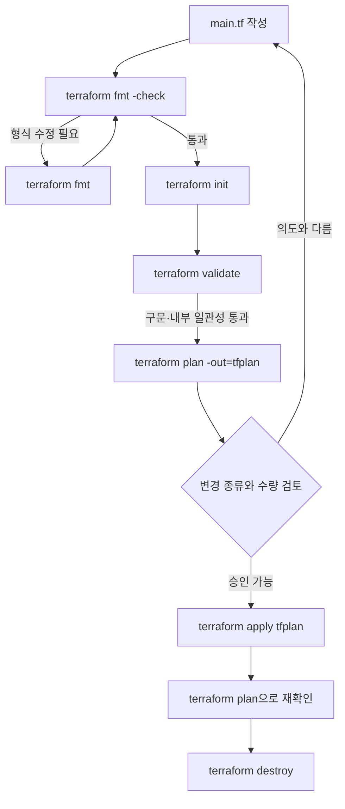

# 2교시: Write–Plan–Apply를 직접 한 바퀴 돌아보기


그림은 왼쪽의 편집기, 가운데의 Plan 검토판, 오른쪽의 적용 결과 순서로 봅니다. 가운데에서 멈춰 변경 수를 확인해야 오른쪽으로 넘어갈 수 있습니다. 이번 실습에서도 명령을 빨리 끝내는 것보다 각 단계가 무엇을 확인했는지 기록하겠습니다.

## 오늘의 질문

`terraform apply`가 성공하면 실습이 끝난 걸까요? 운영에서는 성공 메시지보다 어떤 버전으로 무엇이 바뀌었고, 다시 실행했을 때 변경이 없는지, 마지막에 무엇을 정리했는지가 더 오래 남습니다.

이번에는 외부 Provider를 다운로드하거나 AWS 리소스를 만들지 않습니다. Terraform에 내장된 `terraform_data` 리소스를 사용해 Configuration, Plan, State의 흐름만 분리해서 관찰합니다.

## 수업 목표

- Terraform CLI와 작업 디렉터리의 역할을 확인한다.
- `init`, `fmt`, `validate`, `plan`, `apply`, `show`, `destroy`를 목적에 맞게 실행한다.
- Plan의 create, update, replace, destroy 표시를 구분한다.
- 첫 적용 뒤 다시 Plan을 실행해 변경 없음 상태를 확인한다.
- State와 로컬 작업 파일을 Git에 넣을지 판단한다.

## 오늘 반드시 가져갈 것

| 필수 개념 | 왜 필요한가 | 놓치면 생기는 문제 | 확인 지점 |
|---|---|---|---|
| 작업 디렉터리 | Terraform은 현재 디렉터리의 구성 전체를 읽습니다 | 다른 State나 `.tf`를 섞어 실행합니다 | `pwd`, `ls`, 파일 목록 |
| 초기화 | Backend와 Provider·Module 사용 준비를 합니다 | Plan 전에 필요한 의존성이 준비되지 않습니다 | `terraform init` 출력 |
| 검증의 경계 | `fmt`, `validate`, `plan`이 확인하는 범위가 다릅니다 | 구문 성공을 실제 변경 안전성으로 오해합니다 | 각 명령의 결과 |
| Plan 판독 | apply 전에 작업 종류와 수량을 봅니다 | 의도하지 않은 replace/destroy를 승인합니다 | symbol과 summary |
| 재실행과 정리 | 적용 뒤 변경 없음과 종료 상태를 확인합니다 | 성공 메시지만 남고 실제 잔여 상태를 모릅니다 | 두 번째 Plan, destroy 후 State |

## 실습 환경을 확인합니다

설치가 안되어 있으면 설치를 해야 합니다.
### Mac
```bash
brew tap hashicorp/tap
brew install hashicorp/tap/terraform
```
### WSL
```bash
sudo apt install terraform
```

저장소 루트에서 다음 명령을 실행합니다.

```bash
terraform version
uname -s
uname -m
printf '%s\n' "$SHELL"
```

Windows 학생은 `uname` 대신 PowerShell의 환경 정보를 기록해도 됩니다. 중요한 것은 강의 화면과 버전 숫자를 맞추는 일이 아니라, 자신의 실행 조건을 evidence에 남기는 것입니다.

| 확인 항목 | 기록 예시 | 다른 경우 할 일 |
|---|---|---|
| Terraform CLI | `Terraform v1.x.x` | 설치 공식 문서와 과정의 version constraint 확인 |
| OS/Architecture | `Darwin arm64`, `Linux x86_64` | Provider binary 호환성 확인 |
| Shell | `zsh`, `bash`, PowerShell | 줄바꿈과 환경변수 문법을 맞춤 |
| Working directory | `.../day1/labs/cli-lifecycle` | 다른 실습의 State가 섞이지 않았는지 확인 |

## 실습 파일을 살펴봅시다

실습 경로로 이동합니다.

```bash
cd week_over/terraform/day1/labs/cli-lifecycle
ls -la
```

`main.tf`에는 다음과 같은 리소스가 있습니다.

```hcl
terraform {
  required_version = ">= 1.5.0, < 2.0.0"
}

variable "environment" {
  description = "Name used to distinguish the practice environment."
  type        = string
  default     = "study"
}

resource "terraform_data" "lesson" {
  input = {
    course     = "terraform"
    environment = var.environment
    checkpoint = "write-plan-apply"
  }

  triggers_replace = [var.environment]
}
```

`terraform_data`는 Terraform에 내장된 리소스라 별도 클라우드 객체를 만들지 않습니다. 그래도 State에는 Resource 주소와 입력·출력 값이 기록됩니다. 덕분에 비용이나 인증 문제 없이 Plan과 State의 기본 동작을 볼 수 있습니다.

## 명령은 각각 다른 질문을 합니다



위에서 아래로 읽으면서 실패했을 때 어디로 돌아가는지 보세요. `validate`가 성공해도 Plan 검토를 건너뛰지 않습니다. 공식 문서도 `validate`는 원격 서비스나 실제 실행 맥락을 검증하지 않는다고 설명합니다.

| 명령 | 답하는 질문 | 답하지 못하는 질문 |
|---|---|---|
| `terraform fmt -check` | 표준 형식과 다른 파일이 있나요? | 구성이 의미상 안전한가요? |
| `terraform init` | 이 작업 디렉터리를 사용할 준비가 되었나요? | 변경 결과가 의도와 맞나요? |
| `terraform validate` | 구문과 내부 참조가 일관적인가요? | 원격 권한·비용·정책이 맞나요? |
| `terraform plan` | 현재 입력과 State에서 무엇이 바뀔까요? | 이 변경을 사업적으로 승인해도 되나요? |
| `terraform apply` | 승인된 작업을 실행할까요? | 결과가 운영 목표를 충족했나요? |
| `terraform show` | Plan이나 State에 어떤 값이 있나요? | 서비스가 건강하게 응답하나요? |

## 1단계: 형식과 초기화

먼저 형식 차이가 있는지 확인합니다.

```bash
terraform fmt -check -diff
```

아무 출력 없이 종료 코드가 0이면 형식 검사가 통과한 것입니다. 차이가 나오면 다음 명령으로 수정하고 다시 검사합니다.

```bash
terraform fmt
terraform fmt -check -diff
```

이제 작업 디렉터리를 초기화합니다.

```bash
terraform init
```

이 실습에는 외부 Provider와 Module이 없으므로 다운로드 항목이 거의 없습니다. 다른 프로젝트에서는 `init`이 Backend에 접근하고 Provider plugin과 Module을 설치할 수 있습니다. 초기화가 만드는 `.terraform/`은 작업 캐시이며 Git에 넣지 않습니다.

### 기대 결과

- `Terraform has been successfully initialized!`에 해당하는 성공 메시지
- 현재 디렉터리에 `.terraform/` 생성
- 외부 Provider가 없다면 `.terraform.lock.hcl`이 생성되지 않을 수 있음

### 실패하면

| 증상 | 첫 확인 | 다음 행동 |
|---|---|---|
| `terraform: command not found` | `PATH`, 설치 위치 | 공식 설치 절차로 CLI 설치 후 새 shell 실행 |
| Unsupported Terraform version | `terraform version`, `required_version` | 임의로 constraint를 지우지 말고 과정 지원 버전 확인 |
| 다른 Backend 관련 오류 | 현재 경로의 모든 `.tf` 파일 | 별도 실습 파일이나 이전 Backend 설정이 섞였는지 확인 |

## 2단계: Configuration 검증

```bash
terraform validate
```

기대 결과는 `Success! The configuration is valid.`입니다. 이 문장은 AWS 권한도, 비용도, 실제 리소스 생성 가능성도 검증했다는 뜻이 아닙니다. 현재 Configuration의 구문과 내부 일관성을 확인했다는 뜻입니다.

실패를 일부러 만들어보고 싶다면 `main.tf`의 `var.environment`를 존재하지 않는 `var.enviroment`로 바꿔 `validate`를 실행합니다. 오류 메시지에서 파일, 줄, 알 수 없는 변수 이름을 찾은 뒤 원래 이름으로 복구합니다.

## 3단계: Plan을 파일로 저장하고 읽기

```bash
terraform plan -out=tfplan
```

이번 실습에서는 다음과 비슷한 요약을 기대합니다.

```text
Plan: 1 to add, 0 to change, 0 to destroy.
```

저장된 Plan을 사람이 읽는 형태와 JSON 형태로 각각 확인할 수 있습니다.

```bash
terraform show tfplan
terraform show -json tfplan
```

저장된 Plan 파일은 사람이 읽는 텍스트 파일이 아니며 민감정보를 포함할 수 있습니다. Git에 올리지 않고 실습 후 제거합니다.

### Plan 기호를 읽는 순서

| 표시 | 의미 | 적용 전 질문 |
|---|---|---|
| `+` | 생성 | 이름, Region, 비용, 수량이 의도와 맞나요? |
| `~` | 제자리 수정 | 중단이나 정책 변경이 생기나요? |
| `-/+` 또는 `+/-` | 교체 | 데이터와 endpoint, downtime 영향은 무엇인가요? |
| `-` | 삭제 | 백업, 보호 정책, 승인자가 확인했나요? |
| `(known after apply)` | 적용 뒤 결정 | 어떤 의존성 때문에 지금 모르는 값인가요? |

요약 숫자만 보지 말고 Resource 주소와 바뀌는 attribute를 함께 읽습니다. 실제 AWS 실습에서는 `1 to add` 하나가 NAT Gateway인지, Tag 하나인지에 따라 비용과 위험이 크게 달라집니다.

## 4단계: 저장된 Plan 적용

```bash
terraform apply tfplan
```

저장한 Plan을 적용하면 중간에 Configuration을 바꾼 새 계획이 아니라 검토한 Plan을 실행할 수 있습니다. 적용 뒤 다음을 확인합니다.

```bash
terraform output
terraform state list
terraform state show terraform_data.lesson
```

기대할 Resource 주소는 다음과 같습니다.

```text
terraform_data.lesson
```

`state show`에서 `input`, `output`, `id`가 어떻게 기록되는지 봅니다. State 파일을 편집기로 직접 고치지는 않습니다.

## 5단계: 같은 명령을 다시 실행합니다

```bash
terraform plan
```

구성을 바꾸지 않았다면 `No changes`가 나와야 합니다. 이 확인이 멱등성에 대한 첫 관찰입니다. 다만 한 번 `No changes`가 나왔다고 모든 외부 시스템에서 영원히 같은 결과가 보장되는 것은 아닙니다. Provider 동작, 외부 변경, 시간 의존 입력이 있으면 결과가 달라질 수 있습니다.

## 6단계: 교체를 안전하게 관찰합니다

환경 이름을 입력으로 바꿔봅니다.

```bash
terraform plan -var='environment=practice'
```

`triggers_replace`에 `environment`가 들어 있으므로 기존 `terraform_data.lesson`의 교체가 계획됩니다. 적용하지 말고 Plan만 읽습니다.

다음을 기록하세요.

- 같은 Resource 주소가 유지되는가?
- 어떤 attribute 때문에 replacement가 발생하는가?
- destroy와 create 중 어느 쪽이 먼저 표시되는가?
- 실제 데이터베이스였다면 이 교체를 승인할 수 있는가?

이 작은 실습에서 교체 기호에 익숙해지면 Day 2 이후 AWS Resource 문서를 볼 때 어떤 argument 변경이 교체를 부르는지 더 조심해서 읽을 수 있습니다.

## 7단계: 정리하고 잔여 상태 확인

기본 입력값으로 만든 리소스를 제거합니다.

```bash
terraform destroy
```

Plan에서 `0 to add, 0 to change, 1 to destroy`와 Resource 주소를 확인한 뒤 승인합니다. 정리 후 다시 확인합니다.

```bash
terraform state list
terraform plan
```

`state list`에는 관리 Resource가 없어야 합니다. 하지만 Configuration은 여전히 리소스를 원하므로 `terraform plan`은 다시 생성 계획을 보여줍니다. 이 차이가 중요합니다. `destroy`는 코드를 지우는 명령이 아니라 현재 Configuration이 관리하던 실제 객체를 제거하는 별도 작업입니다.

저장된 Plan 파일도 제거합니다.

```bash
rm -f tfplan
```

## Git에 무엇을 남길까요

실습 폴더의 `.gitignore`를 확인합니다.

| 항목 | Git 관리 | 이유 |
|---|---|---|
| `*.tf` | 포함 | 원하는 상태와 입력 인터페이스를 리뷰합니다 |
| `.terraform.lock.hcl` | 포함 | 선택된 Provider 버전과 checksum을 재현합니다 |
| `.terraform/` | 제외 | 다운로드된 plugin과 로컬 Backend 정보가 있을 수 있습니다 |
| `*.tfstate*` | 제외 | 민감한 속성과 실제 객체 identity가 들어갈 수 있습니다 |
| `tfplan`, `*.tfplan` | 제외 | 저장 Plan에 민감한 값이 포함될 수 있습니다 |
| `*.tfvars` | 상황별 판단 | 실제 Secret이 있으면 제외하고 안전한 example만 공유합니다 |

공식 문서는 `.terraform.lock.hcl`을 버전 관리해 Provider 선택 변경을 코드 리뷰하라고 안내합니다. 반대로 `.terraform/`과 State, 저장 Plan은 저장소에 올리지 않습니다.

## 실패 기록 연습

실패가 났다면 `안 됨`이라고만 적지 말고 다음 형식을 사용합니다.

```markdown
### Terraform CLI failure note
- 명령:
- 종료 코드:
- 첫 오류 문장:
- 영향받은 Resource 주소:
- 변경 전 Plan 요약:
- 확인한 파일/줄:
- 수정한 내용:
- 재실행 명령과 결과:
- 남은 위험:
```

## 오해 점검

| 질문 | 확인할 답 |
|---|---|
| `fmt`가 통과하면 Configuration이 유효한가요? | 형식만 확인했으므로 `validate`와 Plan이 더 필요합니다 |
| `validate`가 성공하면 AWS 리소스 생성도 가능한가요? | 원격 권한과 실제 실행 맥락은 보장하지 않습니다 |
| 저장 Plan은 Git에 올려도 되나요? | 민감정보가 포함될 수 있어 제외합니다 |
| `destroy` 뒤 Configuration도 사라지나요? | `.tf`는 남고 다음 Plan은 다시 생성을 제안합니다 |
| 첫 적용 성공이 재현성의 증거인가요? | 같은 입력의 두 번째 Plan과 환경·버전 기록이 더 필요합니다 |

## Evidence 제출

다음 내용을 `evidence.md`에 기록합니다.

```markdown
# Day 1 Lesson 2 evidence
- OS / architecture / shell:
- Terraform version:
- Working directory:
- fmt result:
- validate result:
- first plan summary:
- applied resource address:
- second plan result:
- replacement trigger:
- destroy summary:
- final state list result:
- sensitive files excluded from Git:
```

| 수준 | 관찰 가능한 evidence |
|---|---|
| 0 | apply 성공 문장만 있고 버전, Plan, 정리 결과가 없습니다 |
| 1 | 명령과 Plan은 있지만 재실행, 교체 관찰 또는 cleanup 확인이 빠졌습니다 |
| 2 | 환경·명령·Plan·State·no-change·replace·destroy를 연결하고 실패 시 복구 기록까지 남겼습니다 |

## 공식 문서에서 확인할 부분

- CLI commands: https://developer.hashicorp.com/terraform/cli/commands
- Initialize working directory: https://developer.hashicorp.com/terraform/cli/init
- Validate command: https://developer.hashicorp.com/terraform/cli/commands/validate
- Core workflow: https://developer.hashicorp.com/terraform/intro/core-workflow
- Dependency lock file: https://developer.hashicorp.com/terraform/language/files/dependency-lock

문서에서 `validate`가 확인하지 않는 범위와 lock file을 버전 관리하는 이유를 찾아 자신의 말로 한 줄씩 적습니다.

## 전이 과제

이 실습의 `terraform_data.lesson`을 실제 `aws_vpc.main`이라고 가정해보세요. 각 명령 단계에서 추가로 확인해야 할 항목을 적습니다.

- `init`: 어떤 Provider와 버전이 설치되나요?
- `plan`: Region, CIDR, Tag, 비용 영향은 맞나요?
- `apply`: 어떤 AWS identity가 API를 호출하나요?
- `show`: State에 어떤 속성과 민감정보가 남을 수 있나요?
- `destroy`: 연결된 Subnet과 다른 Resource에는 어떤 영향이 있나요?

## 혼자 다시 따라오기

- 최소 재현 경로: 실습 폴더에서 `init → validate → plan -out=tfplan → apply tfplan → plan → destroy`를 실행합니다.
- 다시 볼 키워드: `working directory`, `saved plan`, `validate scope`, `dependency lock file`, `resource address`.
- 스스로 확인할 명령: `terraform version`, `terraform state list`, `terraform state show terraform_data.lesson`.
- 흔한 실패 3개: 저장소 루트처럼 다른 `.tf`가 있는 경로에서 실행함, Plan을 읽지 않고 apply함, destroy 후 State와 Plan을 다시 확인하지 않음.
- 첫 확인 위치: `pwd`, 현재 디렉터리의 `.tf` 목록, 첫 오류 문장입니다.
- 주의할 점: State와 저장 Plan은 제출하지 않고 명령 결과에서 민감정보를 제거합니다.
- 다음 준비 상태: Plan 기호와 요약을 읽고 `fmt`, `validate`, `plan`의 검증 범위를 구분할 수 있어야 합니다.

## 마무리

Terraform Workflow는 명령 목록이 아니라 질문의 순서입니다. 형식이 맞는지, 구성이 일관적인지, 무엇이 바뀌는지, 그 변경을 승인할 수 있는지, 적용 뒤 상태가 맞는지 차례로 묻습니다. Day 2에는 처음 보는 AWS Resource를 이 Workflow에 넣기 위해 공식 문서에서 무엇을 찾아야 하는지 연습하겠습니다.
