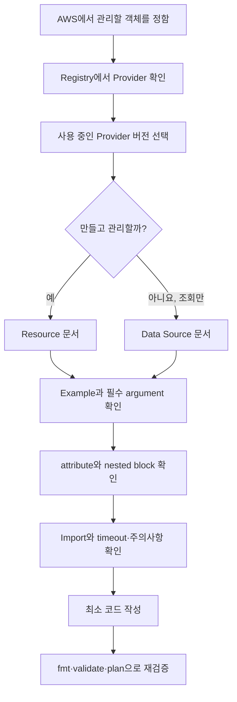

# 3교시: 처음 보는 Terraform 오브젝트를 공식 문서에서 찾는 법


이 그림에서는 왼쪽의 검색 결과보다 가운데의 공식 명세 카드와 오른쪽의 실제 설계 메모를 봅니다. 검색은 입구일 뿐이고, 최종 코드는 현재 선택한 Provider 버전의 argument와 attribute를 근거로 작성해야 합니다.

## 오늘의 질문

`AWS EC2 Terraform`을 검색하면 예제는 아주 많이 나옵니다. 그런데 그 코드가 지금 설치할 AWS Provider 버전에서도 맞는지, 어떤 값이 필수인지, 변경하면 인스턴스가 교체되는지는 검색 결과만 보고 알기 어렵습니다.

이번 시간에는 코드를 외우지 않습니다. 처음 보는 리소스를 만났을 때 공식 문서에서 필요한 정보를 꺼내는 순서를 연습합니다.

## 수업 목표

- HashiCorp Developer와 Terraform Registry의 역할을 구분한다.
- Provider의 namespace, source address, version을 확인한다.
- Resource와 Data Source 문서를 구분한다.
- Example, argument, attribute, import 정보를 설계 메모로 옮긴다.
- AWS 서비스 개념과 Terraform Resource type을 일대일로 단순 치환하지 않는다.

## 오늘 반드시 가져갈 것

| 필수 개념 | 왜 필요한가 | 놓치면 생기는 문제 | 확인 지점 |
|---|---|---|---|
| 문서의 버전 | Provider 문서는 릴리스 버전과 함께 바뀝니다 | 예전 argument나 동작을 현재 코드에 섞습니다 | Registry의 version selector |
| Provider 주소 | 같은 이름의 비공식 Provider가 있을 수 있습니다 | 출처와 유지보수 주체를 확인하지 못합니다 | namespace/name, source |
| Resource와 Data Source | 관리할 객체와 읽기만 할 정보를 구분합니다 | 기존 객체를 새로 만들거나 소유권을 섞습니다 | `Resources`, `Data Sources` |
| Argument와 Attribute | 넣는 값과 읽어 쓰는 값을 나눕니다 | computed 값을 설정하려 하거나 필수 입력을 빠뜨립니다 | Schema/Reference section |
| Import identity | 기존 객체를 편입할 때 ID 형식이 Resource마다 다릅니다 | 잘못된 주소나 ID로 Import합니다 | Import section |

## 공식 문서는 두 군데를 오갑니다

Terraform 자체 문법과 Workflow는 HashiCorp Developer에서 봅니다. AWS의 VPC나 EC2처럼 Provider가 정의한 객체는 Terraform Registry의 해당 Provider 문서에서 봅니다.

| 알고 싶은 것 | 먼저 갈 곳 | 예시 |
|---|---|---|
| `resource` 블록 문법 | Terraform Language | block label, reference, meta-argument |
| `for_each`의 제약 | Terraform Language | map/set, instance key |
| AWS Provider 인증 방식 | AWS Provider overview/guide | environment, shared config, role |
| `aws_vpc`가 받는 값 | AWS Provider Resource 문서 | CIDR, tags, DNS options |
| 기존 VPC의 Import ID | `aws_vpc` Resource 문서 | Resource별 identity 형식 |
| 재사용 Module 입력값 | 해당 Module 문서 | source, version, input, output |

개념 문서와 Provider 문서를 섞어 읽으면 책임 경계가 흐려집니다. Terraform Core는 `aws_vpc`의 CIDR 규칙을 직접 정하지 않습니다. 그 스키마와 API 연결은 AWS Provider가 제공합니다.

## Registry에서 Provider의 신원을 먼저 확인합니다

Provider 페이지에 도착하면 코드보다 먼저 다음을 적습니다.

```markdown
- Provider display name:
- Namespace/name:
- Source address:
- 선택한 version:
- 문서가 연결된 release:
- 공식 또는 검증 상태를 판단한 근거:
- 마지막으로 문서를 확인한 날짜:
```

`hashicorp/aws`에서 `hashicorp`는 namespace이고 `aws`는 Provider 이름입니다. Configuration에서는 보통 다음처럼 source와 허용 버전을 선언합니다.

```hcl
terraform {
  required_providers {
    aws = {
      source  = "hashicorp/aws"
      version = "팀이 검증한 범위"
    }
  }
}
```

강의 자료가 특정 버전 숫자를 영구 정답처럼 제시하지 않는 이유가 여기 있습니다. Provider는 계속 릴리스됩니다. 프로젝트는 지원 범위를 코드에 선언하고, `terraform init`이 선택한 정확한 버전과 checksum은 lock file에서 리뷰해야 합니다.

## 검색에서 코드까지 가는 경로



위에서 아래로 읽으면서 `만들 것인가, 읽을 것인가`에서 경로가 갈리는 것을 보세요. Example Usage를 복사한 뒤 끝내지 않고, schema와 Import까지 확인한 다음 로컬 검증으로 돌아옵니다.

## Resource와 Data Source를 구분해봅시다

이름이 비슷해서 초반에 자주 섞입니다.

```hcl
resource "aws_vpc" "main" {
  cidr_block = "10.20.0.0/16"
}

data "aws_vpc" "selected" {
  id = "vpc-xxxxxxxx"
}
```

첫 번째 블록은 `aws_vpc.main`이라는 관리 대상 Resource instance를 선언합니다. 두 번째는 `data.aws_vpc.selected`라는 조회 객체입니다. Data Source는 외부 정보를 읽지만 해당 VPC의 생성·수정·삭제 수명주기를 소유하지 않습니다.

| 상황 | 우선 선택 | 이유 |
|---|---|---|
| 이 프로젝트가 새 VPC를 만들고 수명주기를 책임집니다 | Resource | Configuration과 State에서 관리합니다 |
| 중앙 네트워크 팀의 기존 VPC ID를 읽습니다 | Data Source 또는 명시적 입력 | 다른 팀 객체의 소유권을 가져오지 않습니다 |
| Console에서 만든 VPC를 이제 이 프로젝트가 책임집니다 | Resource + Import | 기존 객체와 Resource 주소를 binding합니다 |
| 단순히 현재 계정 정보를 조회합니다 | Data Source | 읽은 값을 다른 구성에 사용합니다 |

Data Source가 무조건 안전한 것은 아닙니다. 이름이나 Tag가 모호하면 여러 후보가 나오거나 예상과 다른 객체를 선택할 수 있습니다. 조회 조건과 반환 결과가 안정적인지 Plan에서 확인합니다.

## Resource 문서는 이 순서로 읽습니다

### 1. 설명과 Example Usage

먼저 이 Resource가 실제 서비스의 무엇을 관리하는지 확인합니다. Example은 최소 형태와 블록 이름을 잡는 데 씁니다. 그대로 운영 코드라고 생각하지 않습니다. Tag, 암호화, 로깅, 보안 정책이 생략된 입문 예제일 수 있습니다.

### 2. Argument Reference 또는 Schema

argument는 Configuration에서 제공하는 입력입니다. 문서 UI나 버전에 따라 `Required`, `Optional`, `Read-Only` 또는 유사한 구분으로 표시될 수 있습니다.

| 표시 | 읽는 질문 | 코드 검토 예시 |
|---|---|---|
| Required | 반드시 어떤 값을 줘야 하나요? | VPC의 CIDR 범위 |
| Optional | 생략하면 기본값이 무엇인가요? | DNS 관련 설정 |
| Read-only/Computed | 적용 뒤 Provider가 알려주는 값인가요? | ARN, owner ID, 생성된 ID |
| Nested block | 여러 필드가 한 구조로 묶이나요? | rule, configuration, policy block |
| Conflict/Mutual exclusion | 같이 쓸 수 없는 argument가 있나요? | 두 설정 방식 중 하나 선택 |

### 3. Attribute Reference

attribute는 다른 블록이 참조할 수 있는 값입니다. 예를 들어 생성된 VPC의 ID를 Subnet의 `vpc_id`에 연결할 수 있습니다.

```hcl
resource "aws_subnet" "public" {
  vpc_id     = aws_vpc.main.id
  cidr_block = "10.20.1.0/24"
}
```

`aws_vpc.main.id`는 단순 문자열 복사가 아닙니다. Terraform이 VPC와 Subnet 사이의 암묵적 의존성을 찾는 근거도 됩니다.

### 4. Import와 Resource identity

기존 객체를 가져올 계획이 없더라도 Import 섹션을 읽어두면 Provider가 그 객체를 어떤 ID로 식별하는지 알 수 있습니다. Day 5에서는 이 정보를 실제 `import` 블록에 사용합니다.

### 5. 주의사항, Timeout, 별도 가이드

삭제가 오래 걸리는 리소스, 별도 하위 Resource로 분리된 설정, 기본값 변경, deprecated argument가 있는지 봅니다. 특히 예전 블로그가 하나의 Resource 안에 넣던 설정이 새 Provider에서는 별도 Resource로 분리됐을 수 있습니다.

## AWS 오브젝트 이름을 바로 번역하지 마세요

AWS Console의 한 화면이 Terraform Resource 하나와 정확히 대응한다고 기대하면 문서를 놓치기 쉽습니다.

| AWS에서 하고 싶은 일 | 조사할 Terraform 문서 후보 | 추가로 물을 질문 |
|---|---|---|
| VPC 구성 | `aws_vpc` | DHCP, flow log, endpoint는 별도 Resource인가요? |
| Public Subnet 구성 | `aws_subnet`, route 관련 Resource | public이라는 상태를 만드는 조건은 무엇인가요? |
| Security Group 구성 | SG와 rule 관련 Resource | inline rule과 별도 rule의 소유권이 충돌하지 않나요? |
| EC2 실행 | `aws_instance`, AMI Data Source | AMI 선택이 Region과 architecture에 맞나요? |
| S3 구성 | bucket과 기능별 Resource | versioning, encryption, public access가 분리됐나요? |

이 표의 Resource 이름은 탐색 출발점입니다. 실제 코드를 작성할 때는 선택한 AWS Provider 버전 문서를 다시 확인합니다.

## 문서 탐색 실습

다음 중 하나를 골라 `labs/document-research/resource-research-template.md`를 채웁니다.

- VPC와 Subnet
- Security Group
- EC2 Instance와 AMI 조회
- S3 Bucket

조사는 다음 순서로 진행합니다.

1. AWS에서 실제 객체의 역할을 한 문장으로 적습니다.
2. Registry에서 `hashicorp/aws` Provider와 버전을 확인합니다.
3. Resource인지 Data Source인지 분류합니다.
4. 최소 Example을 찾되 그대로 복사하지 않습니다.
5. 필수 argument와 중요한 optional argument를 나눕니다.
6. 다른 Resource가 참조할 attribute를 찾습니다.
7. Import ID 또는 identity 형식을 찾습니다.
8. 비용, 권한, 교체, 삭제 위험을 한 가지 이상 적습니다.
9. 문서 URL과 확인 날짜를 남깁니다.

## AI 답변을 검증하는 질문

AI가 코드를 제안하면 다음 질문을 붙입니다.

| 검증 질문 | evidence |
|---|---|
| 이 Resource type이 현재 Provider 버전에 있나요? | 버전을 선택한 Registry 문서 URL |
| argument 이름과 타입이 맞나요? | Schema/Argument section |
| 이 값은 입력인가요, computed attribute인가요? | Required/Optional/Read-only 표시 |
| 변경 시 교체나 삭제가 생기나요? | 문서 설명과 실제 Plan |
| 더 이상 권장되지 않는 방식인가요? | warning, deprecated 표시, upgrade guide |
| Import ID 형식이 맞나요? | 해당 Resource의 Import section |

AI에게 출처를 물어보는 것만으로 검증이 끝나지 않습니다. 링크를 직접 열어 namespace, version, 해당 항목을 확인해야 합니다.

## 자주 나오는 실패

| 증상 | 원인 후보 | 첫 확인 위치 |
|---|---|---|
| `Unsupported argument` | 다른 버전 문서나 다른 Resource 예제를 봄 | 선택한 Provider 버전의 schema |
| `Reference to undeclared resource` | Resource label 또는 주소가 다름 | 현재 디렉터리의 block label |
| Data Source가 후보를 못 찾음 | Region, filter, Tag가 다름 | Provider Region과 조회 조건 |
| 계획에 예상치 못한 새 Resource가 뜸 | 조회할 객체를 Resource로 선언함 | `resource`/`data` block type |
| Import가 ID를 해석하지 못함 | 다른 Resource의 ID 형식을 사용함 | 같은 버전의 Import section |

## 오해 점검

1. Registry 검색 첫 결과가 공식 Provider라고 단정해도 될까요?
2. Example Usage에 없으면 필요 없는 설정일까요?
3. Data Source로 조회한 객체는 Terraform이 삭제할 수 있나요?
4. `id`가 Attribute Reference에 있으니 Configuration에서 임의로 넣어도 될까요?
5. 최신 문서만 보면 기존 프로젝트의 Provider 동작도 정확히 알 수 있을까요?

## Evidence와 평가

| 수준 | 관찰 가능한 evidence |
|---|---|
| 0 | 블로그나 AI 코드만 붙이고 Provider source, version, 공식 URL이 없습니다 |
| 1 | 공식 문서는 찾았지만 argument·attribute·Import 또는 위험 분석이 빠졌습니다 |
| 2 | 버전이 고정된 공식 문서에서 Resource/Data Source, 입력·출력, identity, 위험을 찾아 설계와 연결합니다 |

## 공식 문서

- Terraform Language: https://developer.hashicorp.com/terraform/language
- Provider documentation format: https://developer.hashicorp.com/terraform/registry/providers/docs
- Query infrastructure data: https://developer.hashicorp.com/terraform/language/data-sources
- Terraform Registry: https://registry.terraform.io/

Provider 문서가 각 Provider release와 연결된다는 점과 Resource 문서가 Example, Argument, Attribute 같은 구조를 갖는 이유를 확인합니다.

## 전이 과제

Week 5에서 만든 AWS 리소스 하나를 고릅니다. 현재 Console 화면의 필드와 Registry 문서의 argument가 어떻게 대응하는지 표로 만드세요. 일대일 대응이 되지 않는 항목은 별도 Resource, Data Source, Provider 기본값, AWS 관리 속성 중 어디에 속하는지 조사합니다.

## 혼자 다시 따라오기

- 최소 재현 경로: Registry에서 Provider source/version을 확인하고 Resource 하나의 required argument, attribute, Import 형식을 적습니다.
- 다시 볼 키워드: `namespace`, `provider version`, `resource`, `data source`, `argument`, `attribute`, `import`.
- 흔한 실패 3개: 버전 선택을 보지 않음, Example을 운영 코드로 그대로 사용함, Resource와 Data Source를 바꿈.
- 첫 확인 위치: Provider 페이지 상단의 source/version과 왼쪽 문서 분류입니다.
- 다음 준비 상태: `aws_vpc.main.id` 같은 주소를 type, label, attribute로 나눠 말할 수 있어야 합니다.

## 마무리

공식 문서를 잘 읽는다는 것은 페이지를 많이 여는 일이 아닙니다. 관리할 객체를 정하고, 맞는 Provider 버전에서 입력·출력·identity를 찾아 Plan으로 다시 검증하는 일입니다. 다음 시간에는 문서에서 찾은 블록들이 한 Configuration 안에서 어떤 주소와 의존성을 만드는지 직접 관찰하겠습니다.
