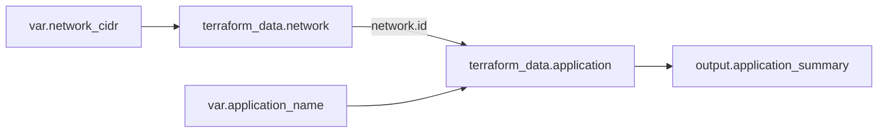

# 4교시: 블록, 주소, 참조와 의존성을 한 장으로 읽기


그림은 개별 카드의 이름보다 카드 사이 연결을 먼저 봅니다. Terraform에서는 파일의 위아래 순서보다 값의 참조가 실행 순서를 만듭니다. 이번 시간에는 블록을 외우는 대신 각 객체의 주소와 데이터 흐름을 추적합니다.

## 오늘의 질문

`main.tf` 위쪽에 VPC를 쓰고 아래쪽에 Subnet을 쓰면 VPC가 먼저 만들어질까요? Terraform은 파일 순서를 실행 순서로 사용하지 않습니다. Subnet이 `aws_vpc.main.id`를 참조하기 때문에 둘의 관계를 알아냅니다.

## 수업 목표

- Block, label, argument, expression을 코드에서 구분한다.
- 주요 top-level block의 책임과 주소 형태를 설명한다.
- Resource, Data Source, Module instance 주소를 읽는다.
- 값 참조가 만드는 암묵적 의존성을 그래프로 확인한다.
- `depends_on`이 필요한 경우와 남용 위험을 구분한다.

## 오늘 반드시 가져갈 것

| 필수 개념 | 왜 필요한가 | 놓치면 생기는 문제 | 확인 지점 |
|---|---|---|---|
| Block 구조 | Terraform 언어의 기본 문장 구조입니다 | type, label, argument를 한 덩어리로 외웁니다 | `<TYPE> <LABEL> { BODY }` |
| Resource 주소 | Plan과 State에서 관리 대상을 정확히 찾습니다 | 같은 이름의 instance나 Module 내부 객체를 혼동합니다 | `terraform state list` |
| Reference | 한 객체의 값을 다른 객체에 전달합니다 | 문자열을 복사하고 의존성을 잃습니다 | `resource.label.attribute` |
| 암묵적 의존성 | Terraform이 안전한 실행 순서를 계산합니다 | 파일 순서가 실행 순서라고 오해합니다 | reference와 graph |
| 명시적 의존성 | 값 참조로 보이지 않는 관계만 보완합니다 | 모든 블록에 `depends_on`을 붙여 그래프를 뭉칩니다 | Plan의 unknown 범위 |

## HCL 문장을 해부해봅시다

```hcl
resource "aws_vpc" "main" {
  cidr_block = var.vpc_cidr
}
```

| 코드 조각 | 이름 | 역할 |
|---|---|---|
| `resource` | block type | 관리 Resource를 선언합니다 |
| `"aws_vpc"` | 첫 번째 label | Provider가 정의한 Resource type입니다 |
| `"main"` | 두 번째 label | 이 Configuration 안에서 사용하는 local name입니다 |
| `{ ... }` | block body | argument와 nested block을 담습니다 |
| `cidr_block` | argument name | Resource schema가 받는 입력 이름입니다 |
| `var.vpc_cidr` | expression | 다른 named value를 참조해 값을 계산합니다 |

Terraform Language의 기본 요소는 많지 않습니다. Block은 구조를 만들고, argument는 이름에 값을 할당하며, expression은 그 값을 계산합니다. Provider가 Resource별로 어떤 argument와 nested block을 허용할지 정합니다.

## 주요 블록의 역할을 나눕니다

| 블록 | 하는 일 | 주소/참조 예시 | 자세히 다루는 날 |
|---|---|---|---|
| `terraform` | CLI version, Provider requirement, Backend 등 Terraform 동작을 정합니다 | 일반 Resource처럼 참조하지 않음 | Day 2, Day 4 |
| `provider` | Region이나 인증 방식 같은 Provider 설정을 만듭니다 | `aws`, `aws.secondary` | Day 2 |
| `resource` | 외부 객체의 수명주기를 관리합니다 | `aws_vpc.main.id` | Day 2 |
| `data` | 기존 정보를 읽습니다 | `data.aws_ami.selected.id` | Day 2 |
| `variable` | Root/Module 입력 인터페이스를 만듭니다 | `var.vpc_cidr` | Day 3 |
| `locals` | Configuration 내부의 이름 있는 표현식을 만듭니다 | `local.common_tags` | Day 3 |
| `output` | Module 밖으로 값을 노출합니다 | `module.network.vpc_id` | Day 3~4 |
| `module` | 다른 Configuration 묶음을 호출합니다 | `module.network` | Day 4 |
| `import` | 기존 객체를 Resource 주소에 편입합니다 | `to = aws_vpc.main` | Day 5 |
| `moved` | 주소 변경 의도를 State 이동으로 선언합니다 | `from`, `to` | Day 4 |

한 파일에 여러 block을 둘 수도 있고, 여러 `.tf` 파일로 나눌 수도 있습니다. 같은 디렉터리의 `.tf` 파일은 하나의 Module Configuration으로 합쳐집니다. `network.tf`가 먼저 실행되고 `compute.tf`가 나중 실행되는 구조가 아닙니다.

## 주소는 객체를 찾는 좌표입니다

다음 주소를 왼쪽부터 읽어봅시다.

| 주소 | 읽는 법 |
|---|---|
| `aws_vpc.main` | root module의 `aws_vpc` type, `main` 이름 Resource |
| `aws_vpc.main.id` | 해당 Resource가 제공하는 `id` attribute 참조 |
| `data.aws_ami.selected.id` | `aws_ami` Data Source의 `selected` instance가 읽은 ID |
| `aws_subnet.public[0]` | `count`로 만든 첫 번째 Resource instance |
| `aws_subnet.public["a"]` | `for_each` key `a`를 가진 Resource instance |
| `module.network.aws_vpc.main` | State 관점에서 network Module 내부의 VPC Resource |
| `module.network.vpc_id` | 호출자에게 공개된 Module output 참조 |

Module 내부 Resource를 호출자가 `module.network.aws_vpc.main.id`처럼 직접 참조할 수 있다고 생각하기 쉽습니다. Module 호출자의 공개 인터페이스는 output입니다. State 주소에서 내부 Resource를 볼 수 있는 것과 Configuration에서 직접 접근할 수 있는 것은 다릅니다.

## 값 참조가 의존성을 만듭니다

```hcl
resource "terraform_data" "network" {
  input = {
    cidr = var.network_cidr
  }
}

resource "terraform_data" "application" {
  input = {
    network_id = terraform_data.network.id
    name       = var.application_name
  }
}
```

`application`이 `network.id`를 읽기 때문에 Terraform은 network가 먼저 준비되어야 한다고 판단합니다. Block을 파일 아래에 썼기 때문이 아닙니다.



화살표는 실행 명령의 순서표가 아니라 값과 의존성의 방향입니다. 변수 값이 network와 application으로 들어가고, application 결과가 output으로 나갑니다.

## 실습: 주소와 그래프를 직접 확인합니다

`labs/object-model`로 이동합니다.

```bash
cd week_over/terraform/day2/labs/object-model
terraform init
terraform fmt -check
terraform validate
terraform plan -out=tfplan
```

Plan에서 다음 두 주소를 찾습니다.

```text
terraform_data.network
terraform_data.application
```

적용한 뒤 State 주소와 값을 확인합니다.

```bash
terraform apply tfplan
terraform state list
terraform state show terraform_data.network
terraform state show terraform_data.application
terraform output
```

그래프는 DOT 형식으로 출력할 수 있습니다.

```bash
terraform graph > graph.dot
```

Graphviz가 설치되어 있다면 PNG로 렌더링할 수 있지만 필수는 아닙니다.

```bash
dot -Tpng graph.dot -o graph.png
```

`graph.dot`에서 `network`와 `application`의 연결을 찾습니다. 렌더링 도구가 없어도 텍스트 evidence로 제출할 수 있습니다.

## 암묵적 의존성과 `depends_on`

대부분의 관계는 attribute reference로 표현하는 편이 좋습니다.

```hcl
network_id = terraform_data.network.id
```

값을 전달할 필요는 없지만 선행 작업이 끝나야 의미가 있는 숨은 관계라면 `depends_on`을 고려할 수 있습니다.

```hcl
resource "terraform_data" "policy_ready" {
  input = "policy-ready"
}

resource "terraform_data" "service" {
  input      = "service"
  depends_on = [terraform_data.policy_ready]
}
```

| 상황 | 선택 | 이유 |
|---|---|---|
| 다른 Resource의 ID를 입력으로 사용 | attribute reference | 값 전달과 의존성이 함께 드러납니다 |
| Module output을 다음 Module에 전달 | output reference | 공개 인터페이스로 관계를 표현합니다 |
| API에는 값 관계가 없지만 정책 적용 후 생성해야 함 | 제한적인 `depends_on` 검토 | 숨은 동작 관계를 명시합니다 |
| 실행 순서가 불안해서 모든 Resource에 추가 | 사용하지 않음 | 그래프가 과도하게 보수적이고 unknown이 늘 수 있습니다 |

`depends_on`은 순서를 손으로 프로그래밍하는 기본 도구가 아닙니다. 숨은 의존성을 표현하는 마지막 수단에 가깝습니다. 가능하면 필요한 값을 참조해 관계와 데이터 흐름을 함께 드러냅니다.

## Provider 설정과 Resource의 관계

```hcl
provider "aws" {
  region = "ap-northeast-2"
}

provider "aws" {
  alias  = "secondary"
  region = "ap-northeast-1"
}
```

기본 설정은 `aws`, alias 설정은 `aws.secondary`로 구분합니다. Resource가 어느 설정을 사용할지 명시할 수 있습니다.

```hcl
resource "aws_vpc" "tokyo" {
  provider   = aws.secondary
  cidr_block = "10.30.0.0/16"
}
```

Provider alias는 단순 문자열 Tag가 아닙니다. 다른 Region이나 계정 자격증명 같은 별도 Provider Configuration을 선택합니다. alias를 쓸 때는 대상 계정·Region·권한·State 경계를 evidence에 남깁니다.

## Unknown value를 읽는 연습

Plan에서 `(known after apply)`가 보이면 오류가 아닐 수 있습니다. 아직 만들지 않은 Resource의 ID처럼 적용 뒤 Provider가 알려줄 값입니다. 중요한 것은 어떤 값이 왜 아직 unknown인지 설명하는 것입니다.

| unknown 상황 | Plan에서 물을 질문 |
|---|---|
| 새 Resource의 `id` | 생성 뒤 Provider가 반환하는 값인가요? |
| unknown ID를 받는 하위 Resource | 의존성이 의도한 방향인가요? |
| Data Source 조회가 apply까지 지연됨 | 조회 argument가 변경 예정 Resource에 의존하나요? |
| `depends_on` 뒤 많은 값이 unknown | 명시적 의존성 범위가 너무 넓지 않나요? |

## 파일을 나누는 기준

Terraform은 파일 이름 순서로 실행하지 않지만, 사람은 파일을 읽습니다. 다음 정도의 관례는 탐색에 도움을 줍니다.

| 파일 | 담을 내용 | 주의할 점 |
|---|---|---|
| `versions.tf` | CLI와 Provider requirement | 인증값을 넣지 않습니다 |
| `providers.tf` | Provider configuration | 장기 credential을 하드코딩하지 않습니다 |
| `variables.tf` | 입력 변수 | 실제 Secret default를 두지 않습니다 |
| `main.tf` 또는 도메인별 파일 | Resource와 Data Source | 파일 순서를 의존성으로 사용하지 않습니다 |
| `outputs.tf` | 외부에 공개할 값 | 민감정보 노출을 검토합니다 |

파일을 잘게 나누는 것과 Module을 만드는 것은 다릅니다. 같은 디렉터리의 파일은 하나의 Module입니다. 재사용 가능한 입력·출력 경계는 Day 4에서 다룹니다.

## 실패를 일부러 만들어봅시다

`terraform_data.application`의 `terraform_data.network.id`를 `terraform_data.networking.id`로 바꿔 `terraform validate`를 실행합니다.

기록할 내용:

- 첫 오류 문장
- 선언되지 않았다고 나온 주소
- 실제 block label
- 수정한 줄
- 재실행 결과

그다음 참조를 문자열 `"network"`로 바꿔 Plan을 봅니다. 구문은 통과하지만 network와 application 사이의 값 의존성이 사라집니다. `validate 성공`과 `설계 의도 충족`이 다른 문제라는 것을 그래프로 확인합니다.

## 자주 나오는 오해

| 오해 | 교정 |
|---|---|
| `main.tf`가 항상 먼저 실행됩니다 | 같은 Module의 파일은 합쳐지고 참조 관계가 순서를 만듭니다 |
| Resource label은 AWS의 실제 이름입니다 | Terraform Configuration 안의 local name입니다 |
| Data Source도 State에 보이니 수명주기를 관리합니다 | 조회 결과를 기록할 수 있지만 원격 객체를 생성·삭제하지 않습니다 |
| Module 내부 Resource는 호출자가 직접 참조합니다 | 호출자는 Module output을 공개 인터페이스로 사용합니다 |
| `depends_on`을 많이 쓰면 더 안전합니다 | 불필요한 순차화와 넓은 unknown 범위를 만들 수 있습니다 |

## 정리 실습

```bash
terraform destroy -auto-approve
rm -f tfplan graph.dot graph.png
terraform state list
```

마지막 `state list`가 비어 있는지 확인합니다. Configuration은 남아 있으므로 다음 Plan은 다시 두 Resource 생성을 제안합니다.

## Evidence와 평가

`labs/object-model/evidence-template.md`에 다음을 남깁니다.

| 수준 | 관찰 가능한 evidence |
|---|---|
| 0 | 블록 이름만 나열하고 주소·참조·그래프 evidence가 없습니다 |
| 1 | 주소와 State는 확인했지만 의존성이 생긴 표현식이나 실패 복구가 빠졌습니다 |
| 2 | block 구조, Resource 주소, reference, graph, unknown, 실패·수정·재확인을 연결합니다 |

## 공식 문서

- Terraform Language overview: https://developer.hashicorp.com/terraform/language
- Configure resources: https://developer.hashicorp.com/terraform/language/resources/configure
- Terraform block reference: https://developer.hashicorp.com/terraform/language/block/terraform
- Query infrastructure data: https://developer.hashicorp.com/terraform/language/data-sources
- Module block reference: https://developer.hashicorp.com/terraform/language/block/module

공식 문서에서 파일 순서보다 암묵적·명시적 관계를 사용한다는 설명과, Data Source가 읽기 작업만 수행한다는 설명을 찾아 evidence에 연결합니다.

## 전이 과제

Week 5의 VPC→Subnet→Security Group→EC2 관계를 Resource 주소로 표현합니다. 각 화살표에 실제로 전달할 attribute를 적으세요. 값 전달 없이 순서만 필요하다고 생각한 관계는 왜 그런지 설명하고 `depends_on`이 정말 필요한지 다시 검토합니다.

## 혼자 다시 따라오기

- 최소 재현 경로: object-model 실습에서 `init → validate → plan → apply → state list → graph → destroy`를 실행합니다.
- 다시 볼 키워드: `block type`, `block label`, `resource address`, `reference`, `implicit dependency`, `depends_on`.
- 흔한 실패 3개: 파일 순서를 의존성으로 생각함, label과 실제 클라우드 이름을 혼동함, 문자열 복사로 참조를 끊음.
- 첫 확인 위치: 오류에 나온 주소와 실제 block header입니다.
- 다음 준비 상태: 주소를 type·label·instance key·attribute로 나누고 그래프의 화살표 근거를 코드에서 찾을 수 있어야 합니다.

## 마무리

Terraform Configuration을 읽을 때는 파일을 위에서 아래로만 보지 않습니다. 주소를 찾고, 어떤 expression이 값을 전달하는지 따라가며, 그 참조가 만든 의존성을 Plan과 graph에서 확인합니다. 이 읽기 방식이 잡히면 Day 3의 `for_each`와 복잡한 컬렉션도 단순한 문법 암기가 아니라 여러 instance 주소를 만드는 규칙으로 이해할 수 있습니다.
