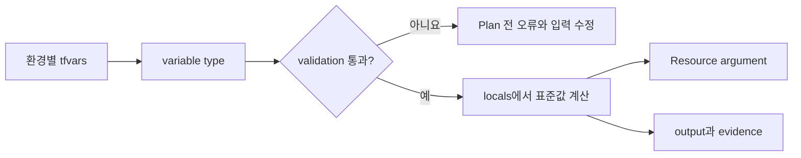

# 5교시: 타입과 표현식으로 환경 입력을 설계하기


왼쪽의 dev·stage·prod 입력 묶음이 가운데 타입 검사대를 통과해 오른쪽의 동일한 구조로 조립되는 장면입니다. 환경마다 코드를 복사하는 대신, 공통 구조와 달라지는 입력을 분리하는 관점으로 봅니다.

## 오늘의 질문

개발 환경은 인스턴스 한 대, 운영 환경은 세 대가 필요하다면 `main-dev.tf`와 `main-prod.tf`를 따로 만들어야 할까요? 작은 차이를 코드 복사로 해결하면 수정도 두 번 해야 하고, 두 환경은 곧 서로 다른 설계가 됩니다. 먼저 타입이 있는 입력으로 차이를 표현해보겠습니다.

## 수업 목표

- primitive, collection, structural type을 구분한다.
- `variable`, `locals`, `output`의 책임을 나눈다.
- validation과 `terraform console`로 입력을 검증한다.
- 환경별 값의 주입 방법과 우선순위를 설명한다.
- `sensitive`가 State의 Secret을 제거하는 기능이 아님을 확인한다.

## 오늘 반드시 가져갈 것

| 개념 | 쓰는 이유 | 놓치면 생기는 문제 | 확인 위치 |
|---|---|---|---|
| 명시적 타입 | Module 입력 계약을 만듭니다 | 잘못된 모양의 값이 뒤늦게 실패합니다 | variable `type` |
| validation | 팀 규칙을 Plan 전에 검사합니다 | 오타나 허용하지 않는 환경명이 적용까지 갑니다 | validation error |
| locals | 입력을 내부 표준 형태로 변환합니다 | 같은 결합 로직을 여러 Resource에 반복합니다 | `local.*` |
| 입력 우선순위 | 실제 적용값의 출처를 추적합니다 | 로컬과 CI의 Plan이 달라집니다 | CLI, tfvars, `TF_VAR_` |
| 민감정보 경계 | 화면 숨김과 안전한 저장을 구분합니다 | `sensitive`만 믿고 State를 공개합니다 | Plan 표시와 State 접근권한 |

## Terraform 값에는 타입이 있습니다

| 분류 | 타입 | 예 | 주의점 |
|---|---|---|---|
| Primitive | `string`, `number`, `bool` | `"dev"`, `2`, `true` | 따옴표와 자동 변환에 의존하지 않습니다 |
| Collection | `list(T)`, `set(T)`, `map(T)` | subnet 목록, Tag map | set은 순서와 index가 없습니다 |
| Structural | `tuple([...])`, `object({...})` | 환경 설정 객체 | 각 위치나 속성의 타입이 계약에 포함됩니다 |
| Absence | `null` | 선택 입력 생략 | 빈 문자열과 의미가 다릅니다 |

공식 문서는 `null`을 값의 부재로 설명합니다. optional argument에 `null`을 주면 생략한 것처럼 처리될 수 있지만, 필수 argument라면 오류가 납니다. `""`, `[]`, `{}`, `null`은 같은 값이 아닙니다.

## 환경 설정을 object로 묶어봅시다

```hcl
variable "environment_config" {
  description = "Settings that vary by deployment environment."
  type = object({
    name              = string
    instance_count    = number
    enable_monitoring = bool
    allowed_cidrs     = set(string)
    extra_tags        = map(string)
  })

  validation {
    condition     = contains(["dev", "stage", "prod"], var.environment_config.name)
    error_message = "Environment must be dev, stage, or prod."
  }
}
```

object는 관련 값을 한 계약으로 묶습니다. 이름만 `prod`인데 monitoring은 꺼져 있는 모순도 별도 validation으로 검사할 수 있습니다.



입력 파일이 Resource로 바로 흩어지지 않고, 타입·검증·내부 변환을 거치는 흐름을 보세요. Day 4에서는 이 계약을 Child Module 입력으로 옮깁니다.

## variable, locals, output의 책임

| 구성 | 질문 | 예 |
|---|---|---|
| `variable` | 호출자나 환경이 무엇을 결정하나요? | 환경명, CIDR, 규모 |
| `locals` | Module 내부에서 어떻게 표준화하나요? | 공통 Tag, 이름 prefix, 병합된 설정 |
| `output` | 다음 계층에 무엇을 공개하나요? | VPC ID, endpoint, 운영 확인값 |

```hcl
locals {
  common_tags = merge(
    {
      Environment = var.environment_config.name
      ManagedBy   = "terraform"
    },
    var.environment_config.extra_tags
  )
}
```

`merge`에서는 뒤에 온 map의 같은 key가 앞의 값을 덮습니다. `ManagedBy`를 사용자가 바꾸게 둘 것인지 금지할 것인지 팀 정책을 먼저 정해야 합니다.

## 표현식과 함수를 console에서 시험합니다

```bash
cd week_over/terraform/day3/labs/expressions
terraform init
terraform console -var-file=environments/dev.tfvars
```

console에서 다음을 한 줄씩 실행합니다.

```hcl
var.environment_config.name
var.environment_config.allowed_cidrs
sort(tolist(var.environment_config.allowed_cidrs))
merge({ ManagedBy = "terraform" }, var.environment_config.extra_tags)
var.environment_config.enable_monitoring ? "detailed" : "basic"
```

| 함수/표현식 | 사용할 때 | 주의할 점 |
|---|---|---|
| `merge` | map을 우선순위대로 결합 | 뒤 map이 같은 key를 덮습니다 |
| `toset`/`tolist` | 컬렉션 모양 변환 | set을 list로 바꾸면 정렬을 별도로 고려합니다 |
| `lookup` | map key의 기본값 제공 | object의 필수 속성 문제를 숨기지 않습니다 |
| `try` | 여러 표현식 중 성공한 값 선택 | 실제 schema 오류를 과하게 숨기지 않습니다 |
| `can` | 표현식 평가 가능 여부 확인 | validation에서 유용합니다 |
| 조건식 | 조건에 따라 두 값 중 선택 | 양쪽 결과 타입이 호환되어야 합니다 |
| `jsonencode` | 정책이나 JSON 문자열 생성 | 문자열 이어붙이기보다 구조를 먼저 만듭니다 |

## 환경별 입력값은 어떻게 넣을까요

실습에는 `environments/dev.tfvars`와 `prod.tfvars`가 있습니다. 이 파일은 교육용 비민감 값만 담습니다.

```bash
terraform plan -var-file=environments/dev.tfvars
terraform plan -var-file=environments/prod.tfvars
```

| 방식 | 알맞은 사용 | 운영 주의점 |
|---|---|---|
| variable default | 안전한 공통 기본값 | 운영값을 묵시적으로 만들지 않습니다 |
| `terraform.tfvars` | 한 Root Module의 자동 입력 | 어떤 환경인지 파일명만으로 불분명할 수 있습니다 |
| `*.auto.tfvars` | 자동 로딩이 필요한 비민감 설정 | lexical order와 덮어쓰기를 확인합니다 |
| `-var-file` | 환경별 파일을 명시적으로 선택 | 실행 명령과 승인 evidence에 파일을 기록합니다 |
| `TF_VAR_name` | CI/CD의 값 주입 | 복합 타입은 shell escaping이 어렵습니다 |
| `-var` | 일회성 명시적 override | 명령 이력에 민감값을 남기지 않습니다 |

CLI의 명시적 값은 높은 우선순위를 갖습니다. 정확한 우선순위는 공식 variable 문서에서 확인하고, `어떤 값이 이겼는가`보다 `왜 두 출처에 같은 변수를 정의했는가`를 먼저 고칩니다.

## Secret은 입력 파일에 넣지 않습니다

```hcl
variable "database_password" {
  type      = string
  sensitive = true
}
```

`sensitive`는 CLI 출력에서 값을 가리는 데 도움을 주지만 State 저장 자체를 막는 약속은 아닙니다. 실제 Secret은 비밀 저장소, 짧은 수명의 자격증명, CI의 보호 변수 같은 별도 경로로 주입하고 State와 Plan 접근도 제한합니다.

## 실습과 실패 관찰

```bash
terraform fmt -check
terraform validate
terraform plan -var-file=environments/dev.tfvars
terraform plan -var-file=environments/prod.tfvars
terraform plan -var-file=environments/invalid.tfvars
```

마지막 명령은 validation 오류가 나야 정상입니다. 오류에 환경명 계약이 보이는지 확인합니다.

| 비교 항목 | dev | prod | 왜 다른가 |
|---|---|---|---|
| instance count |  |  | 용량 요구 |
| monitoring mode |  |  | 관찰 수준 |
| allowed CIDR 수 |  |  | 접근 경계 |
| 최종 Tag |  |  | 소유권·비용 분류 |

## 오해 점검

- `sensitive = true`면 State에 값이 남지 않나요?
- set의 첫 번째 요소를 `[0]`으로 읽을 수 있나요?
- `locals`는 환경에서 값을 직접 입력받는 인터페이스인가요?
- dev와 prod의 차이가 크다면 tfvars만 계속 늘리는 것이 좋은가요?

환경 차이가 입력값을 넘어 Resource 구조와 권한 경계까지 달라진다면 별도 Root Module과 State로 나누는 편이 낫습니다. 이 판단은 Day 4에서 이어갑니다.

## Evidence와 평가

| 수준 | evidence |
|---|---|
| 0 | 값만 바꾸고 타입, 출처, validation 기록이 없습니다 |
| 1 | 환경별 Plan은 있지만 입력 우선순위나 Secret 경계 설명이 빠졌습니다 |
| 2 | 타입 계약, validation 실패, dev/prod 차이, 최종 locals, 입력 출처를 재현 가능하게 기록합니다 |

## 공식 문서

- Types and Values: https://developer.hashicorp.com/terraform/language/expressions/types
- Expressions: https://developer.hashicorp.com/terraform/language/expressions
- Input Variables: https://developer.hashicorp.com/terraform/language/values/variables
- Local Values: https://developer.hashicorp.com/terraform/language/values/locals
- Output Values: https://developer.hashicorp.com/terraform/language/values/outputs

## 혼자 다시 따라오기

- 최소 경로: dev/prod/invalid tfvars로 Plan을 실행하고 차이와 validation 오류를 기록합니다.
- 다시 볼 키워드: `object type`, `set`, `null`, `validation`, `TF_VAR_`, `-var-file`, `sensitive`.
- 흔한 실패: 복합 타입의 모양이 다름, 자동 로딩 파일이 값을 덮음, Secret을 tfvars에 저장함.
- 첫 확인 위치: variable type과 실제 입력 파일입니다.
- 다음 준비 상태: 환경별 차이를 안정적인 map key로 표현할 준비가 되어 있어야 합니다.
