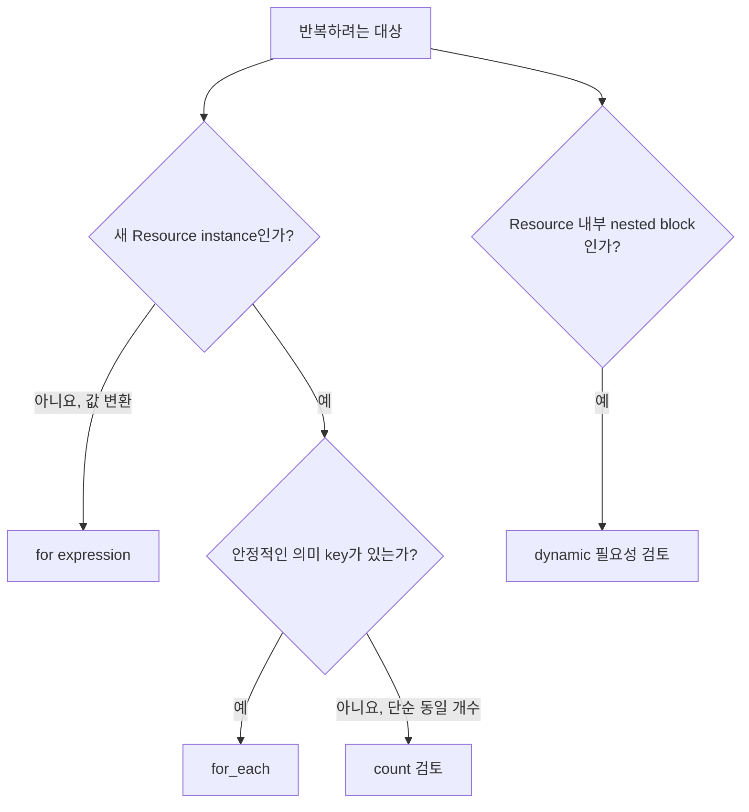

# 6교시: `for`, `for_each`, `count`로 반복을 안전하게 다루기


한쪽은 번호표가 붙은 객체가 중간 삽입으로 밀리고, 다른 쪽은 이름표가 붙은 객체가 그대로 유지되는 장면입니다. 반복 문법보다 Resource instance의 주소가 얼마나 안정적인지를 먼저 봅니다.

## 오늘의 질문

Subnet 세 개를 만들 때 `count = 3`이면 충분해 보입니다. 그런데 두 번째 Subnet을 목록에서 빼면 세 번째 객체의 index가 바뀝니다. Terraform은 사람이 생각한 이름이 아니라 State 주소로 객체를 구분합니다.

## 수업 목표

- `for` expression과 Resource 반복 meta-argument를 구분한다.
- `count`와 `for_each`가 만드는 주소를 비교한다.
- 안정적인 key가 있는 map을 설계한다.
- 중첩 구조를 `dynamic` block으로 생성하는 조건을 설명한다.
- lifecycle 기능을 안전장치가 아닌 변경 규칙으로 평가한다.

## 오늘 반드시 가져갈 것

| 개념 | 판단 기준 | 실패 위험 | 확인 위치 |
|---|---|---|---|
| `for` expression | 값을 변환하려는가 | Resource 생성과 혼동 | console 결과 |
| `count` | 동일 객체를 index로 식별해도 되는가 | 목록 삽입·삭제로 주소 이동 | `[0]`, `[1]` |
| `for_each` | 의미 있는 고유 key가 있는가 | key 변경은 다른 instance로 인식 | `["public-a"]` |
| `dynamic` | 반복 가능한 nested block이 필요한가 | 과도한 추상화로 문서와 코드가 멀어짐 | 생성될 block 수 |
| lifecycle | 교체·삭제 규칙을 정말 바꿔야 하는가 | drift를 숨기거나 삭제를 막음 | Plan과 운영 절차 |

## 반복 기능은 두 종류입니다

| 기능 | 결과 | 예 |
|---|---|---|
| `for` expression | list, set, map 같은 값 | Tag map 변환, ID 목록 생성 |
| `count` | 여러 Resource/Module instance | `resource.item[0]` |
| `for_each` | key별 Resource/Module instance | `resource.item["api"]` |
| `dynamic` | Resource 안의 반복 nested block | 여러 rule block |



## `for`는 값을 만듭니다

```hcl
locals {
  subnet_names = [for key, subnet in var.subnets : "${key}-${subnet.zone}"]
  public_subnets = {
    for key, subnet in var.subnets : key => subnet
    if subnet.public
  }
}
```

첫 표현식은 list를, 두 번째는 조건에 맞는 map을 만듭니다. Resource가 생기는 것은 이 값을 `for_each`에 전달했을 때입니다.

## count와 for_each 주소 비교

```hcl
resource "terraform_data" "counted" {
  count = length(var.ordered_services)
  input = var.ordered_services[count.index]
}

resource "terraform_data" "keyed" {
  for_each = var.services
  input    = each.value
}
```

| 입력 변경 | `count` 주소 영향 | `for_each` 주소 영향 |
|---|---|---|
| 목록 끝에 추가 | 새 마지막 index | 새 key만 추가 |
| 목록 중간 삽입 | 뒤 index의 의미가 이동 | 기존 key 유지 |
| 항목 이름 변경 | 같은 index의 값 변경 | 이전 key 삭제 + 새 key 생성 |
| 순서만 변경 | 여러 index 값 변경 가능 | map key가 같으면 주소 유지 |

`for_each`가 언제나 정답은 아닙니다. key 자체를 바꾸면 Terraform은 새 instance로 봅니다. key는 표시 이름보다 수명주기 identity에 가깝게 설계합니다.

## 실습: 중간 항목을 빼봅니다

```bash
cd week_over/terraform/day3/labs/repetition
terraform init
terraform plan -var-file=before.tfvars -out=before.tfplan
terraform apply before.tfplan
terraform plan -var-file=after.tfvars
```

`ordered_services`에서는 중간 항목이 빠지고, `services` map에서는 같은 key만 제거됩니다. Plan에서 주소별 변화가 어떻게 다른지 기록합니다. 실습은 `terraform_data`를 사용해 비용 없이 State 주소만 관찰합니다.

```bash
terraform state list
```

예상 주소 형태:

```text
terraform_data.counted[0]
terraform_data.keyed["api"]
```

## for_each 입력의 모양

`for_each`는 map 또는 set of strings를 사용합니다. list를 무심코 `toset`으로 바꾸면 중복과 순서가 사라집니다. 그것이 의도한 identity인지 확인해야 합니다.

```hcl
variable "subnets" {
  type = map(object({
    cidr   = string
    zone   = string
    public = bool
  }))
}
```

| 좋은 key 후보 | 좋지 않은 key 후보 |
|---|---|
| `public-a`, `private-a`처럼 역할과 수명이 안정적 | 목록 순번을 문자열로 바꾼 `0`, `1` |
| 팀이 변경 규칙을 합의한 service ID | 자주 바뀌는 화면 표시 이름 |
| Import 대상과 매핑 가능한 고유 이름 | apply 전 알 수 없는 Resource ID |

`for_each`의 key는 Plan 시점에 알아야 합니다. 다른 Resource를 만든 뒤 생기는 ID를 key로 쓰려 하면 계획을 계산할 수 없습니다.

## `dynamic` block은 언제 쓰나요

Provider Resource 안에 반복 가능한 nested block이 있을 때 사용합니다.

```hcl
dynamic "ingress" {
  for_each = var.ingress_rules
  content {
    from_port = ingress.value.port
    to_port   = ingress.value.port
    protocol  = "tcp"
    cidr_blocks = ingress.value.cidrs
  }
}
```

실제 AWS Security Group에서는 inline rule과 별도 rule Resource의 소유권 충돌 여부를 현재 Provider 문서에서 확인해야 합니다. `dynamic`은 문서에 없는 block을 만들지 못합니다.

| 사용할 만한 상황 | 피할 상황 |
|---|---|
| 같은 nested block이 입력에 따라 여러 번 필요 | argument 한두 개를 짧게 쓰면 끝남 |
| Module이 명확한 rule object 계약을 제공 | Provider schema를 그대로 복제한 거대한 범용 Module |
| 반복 구조가 공식 문서와 쉽게 대응 | 여러 단계 dynamic으로 읽기 어려움 |

## lifecycle은 마지막에 검토합니다

| 규칙 | 쓰는 이유 | 주의점 |
|---|---|---|
| `create_before_destroy` | 교체 중 새 객체를 먼저 준비 | 이름 충돌과 동시 비용 가능 |
| `prevent_destroy` | 실수로 삭제되는 것을 차단 | 정식 삭제 절차에서도 해제 필요 |
| `ignore_changes` | 외부 시스템이 소유한 속성을 제외 | 실제 drift를 장기간 숨길 수 있음 |
| `replace_triggered_by` | 관련 객체 변화에 교체 연결 | 불필요한 교체 범위를 검토 |

`prevent_destroy`는 백업이 아니고 `ignore_changes`는 drift 해결이 아닙니다. Plan에서 보이지 않게 만드는 선택은 소유권 문서와 별도 관찰 수단이 있어야 합니다.

RDS, Route 53, IAM, KMS처럼 영향 범위가 큰 객체의 선택 기준은 [위험 민감 리소스 관리 가이드](../risk-sensitive-resources.md)에서 별도로 다룹니다. 리소스 이름만 보고 Terraform 관리 여부를 결정하지 않고, 단일 소유권·데이터 복구·변경 경로를 기준으로 Resource, Import, Data Source, 명시적 ID 입력 중 하나를 고릅니다.

## 정리

```bash
terraform destroy -var-file=before.tfvars -auto-approve
rm -f before.tfplan
terraform state list
```

## 오해 점검

- `for`를 쓰면 Resource가 여러 개 생기나요?
- `for_each`로 바꾸면 모든 주소가 자동 보존되나요?
- list를 `toset`으로 바꿔도 데이터 의미가 항상 같나요?
- `ignore_changes`를 쓰면 외부 변경 문제가 해결되나요?

## Evidence와 평가

| 수준 | evidence |
|---|---|
| 0 | 반복 문법 예제만 있고 주소와 Plan 비교가 없습니다 |
| 1 | count/for_each 주소를 확인했지만 key 설계와 변경 영향 설명이 없습니다 |
| 2 | 입력 변화, State 주소, 교체·삭제 영향, key 선택 근거와 lifecycle 위험을 연결합니다 |

## 공식 문서

- Expressions: https://developer.hashicorp.com/terraform/language/expressions
- For Expressions: https://developer.hashicorp.com/terraform/language/expressions/for
- Dynamic Blocks: https://developer.hashicorp.com/terraform/language/expressions/dynamic-blocks
- Meta-arguments: https://developer.hashicorp.com/terraform/language/meta-arguments
- `for_each`: https://developer.hashicorp.com/terraform/language/meta-arguments/for_each
- `count`: https://developer.hashicorp.com/terraform/language/meta-arguments/count

## 혼자 다시 따라오기

- 최소 경로: before를 apply하고 after로 Plan한 뒤 counted/keyed 주소 변화를 비교합니다.
- 다시 볼 키워드: `for expression`, `instance key`, `count.index`, `each.key`, `dynamic`, `lifecycle`.
- 흔한 실패: index를 identity로 착각, 자주 바뀌는 key 사용, `ignore_changes`로 drift 은폐.
- 첫 확인 위치: 입력 collection과 `terraform state list` 주소입니다.
- 다음 준비 상태: 환경 입력 map을 Child Module `for_each`에 전달할 수 있어야 합니다.
