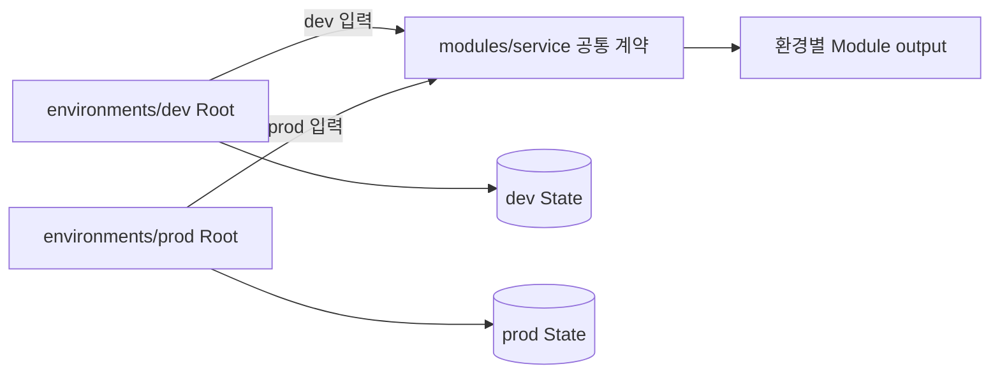

# 7교시: 공통 Module과 환경별 Root Module 나누기


가운데의 공통 부품은 하나지만, 오른쪽의 환경별 조립대는 입력과 State가 나뉘어 있습니다. Module 재사용과 환경 격리를 같은 문제로 보지 않는 것이 이번 시간의 출발점입니다.

## 오늘의 질문

dev와 prod가 같은 Network Module을 사용하면 두 환경이 같은 State에 들어가도 될까요? 아닙니다. 코드를 재사용하는 경계와 장애·권한·승인 범위를 나누는 경계는 서로 다릅니다.

## 수업 목표

- Root Module과 Child Module의 책임을 구분한다.
- `modules/`와 `environments/` 구조로 공통 코드와 환경별 실행 단위를 나눈다.
- Module 입력·출력과 Provider 전달 원칙을 적용한다.
- dev와 prod가 서로 다른 State를 사용해야 하는 이유를 설명한다.
- Resource를 Module로 이동할 때 `moved` 블록으로 주소 변경을 선언한다.

## 오늘 반드시 가져갈 것

| 개념 | 왜 필요한가 | 놓치면 생기는 문제 | 확인 위치 |
|---|---|---|---|
| Root Module | Backend, Provider, 환경 입력과 실행 책임을 가집니다 | Child Module이 계정과 State를 결정합니다 | 환경 디렉터리 |
| Child Module | 반복되는 Resource 구조를 입력·출력 계약으로 묶습니다 | 복사본별 구현이 달라집니다 | `modules/*` |
| 환경별 State | 장애와 권한 범위를 분리합니다 | dev apply가 prod를 함께 변경합니다 | Backend key/working directory |
| Module output | 내부 Resource를 공개 인터페이스로 연결합니다 | 호출자가 내부 주소에 의존합니다 | `module.name.output` |
| 주소 이동 | 리팩터링을 삭제·재생성으로 오해하지 않게 합니다 | 기존 Resource가 destroy/create로 계획됩니다 | `moved`와 Plan |

## 추천 구조

```text
day4/labs/module-environments/
├── modules/
│   └── service/
│       ├── main.tf
│       ├── variables.tf
│       └── outputs.tf
└── environments/
    ├── dev/
    │   └── main.tf
    └── prod/
        └── main.tf
```



같은 Module source를 사용해도 Root Module과 State는 별개입니다. 공통 Module 수정은 두 환경에 영향을 줄 수 있으므로 각각 별도 Plan과 승인을 거칩니다.

## Root와 Child의 책임

| 책임 | Root Module | Child Module |
|---|---|---|
| Backend와 State 위치 | 결정 | 결정하지 않음 |
| Provider Configuration/인증 좌표 | 구성 | requirement만 선언하고 전달받음 |
| 환경별 값 | 선택 | type과 validation으로 계약 |
| Resource 구현 | 필요시 포함 | 재사용할 구조를 구현 |
| 출력 공개 | 상위 시스템에 전달 | Root가 사용할 최소 output 제공 |

공식 문서는 Provider Configuration을 Root Module에 두도록 권장합니다. Child Module은 `required_providers`로 필요 조건을 밝히되 Region이나 인증정보를 직접 고정하지 않습니다.

## Module 인터페이스를 읽습니다

```hcl
module "service" {
  source = "../../modules/service"

  environment = "dev"
  replicas    = 1
  owner       = "platform-lab"
}
```

| 요소 | 의미 | 검토 질문 |
|---|---|---|
| `module "service"` | 호출 instance의 local name | State와 output에서 안정적인가? |
| `source` | Child Module 위치 | local/registry/VCS source와 version이 고정됐는가? |
| 입력 argument | Child variable에 전달 | 환경 차이를 과도하게 숨기지 않는가? |
| output | Child가 공개한 값 | 민감하거나 내부 구현에 종속되지 않는가? |

Module은 Provider Resource의 모든 argument를 그대로 변수로 노출하는 wrapper가 아닙니다. 팀이 반복하고 싶은 운영 표준과 선택 가능한 차이를 나누는 인터페이스입니다.

## 실습: dev와 prod를 따로 실행합니다

```bash
cd week_over/terraform/day4/labs/module-environments/environments/dev
terraform init
terraform plan
terraform apply -auto-approve
terraform state list
```

prod도 별도 디렉터리에서 실행합니다.

```bash
cd ../prod
terraform init
terraform plan
terraform apply -auto-approve
terraform state list
```

실습은 내장 `terraform_data`만 사용합니다. 두 State에서 같은 Child Module 주소를 볼 수 있지만 입력과 실제 instance ID는 다릅니다.

| 비교 | dev | prod |
|---|---|---|
| Working directory |  |  |
| Module address |  |  |
| replicas |  |  |
| State 파일 |  |  |
| 적용 승인 주체 |  |  |

## Module을 얼마나 크게 만들까요

| 신호 | 판단 |
|---|---|
| 함께 생성·변경·삭제되고 같은 팀이 소유 | 같은 Module 후보 |
| 변경 주기와 위험 등급이 다름 | Module과 State 분리 후보 |
| 선택적 기능 때문에 조건문이 계속 증가 | 작은 조합형 Module 검토 |
| 호출자가 Provider schema 대부분을 알아야 함 | 추상화 가치 재검토 |
| RDS·DNS와 Stateless Compute가 한 apply에 있음 | 위험 등급별 Root/State 분리 |

## 주소를 바꾸는 리팩터링

기존 주소가 `terraform_data.service`였는데 Module 안으로 옮기면 새 주소는 `module.service.terraform_data.this`가 됩니다. 아무 설명 없이 코드만 옮기면 Terraform은 이전 객체 삭제와 새 객체 생성을 계획할 수 있습니다.

```hcl
moved {
  from = terraform_data.service
  to   = module.service.terraform_data.this
}
```

`moved`는 State binding의 주소 변경 의도를 선언합니다. 모든 이동을 자동으로 해결하지는 않으므로 Plan에서 destroy/create가 사라졌는지 확인합니다.

## 환경 분리 방식 비교

| 방식 | 장점 | 위험/한계 | 권장 용도 |
|---|---|---|---|
| 환경별 Root 디렉터리 | State·권한·승인 경계가 명확 | 일부 Root 코드 중복 | 계정·위험이 다른 dev/prod |
| CLI Workspace | 동일 구성의 여러 State를 간단히 운용 | 자격증명·접근 제어 분리에 약함 | 동일 경계의 임시 복제 |
| 한 Root의 조건 분기 | 파일 수가 적음 | Plan blast radius와 조건 복잡도 증가 | 아주 작은 차이만 있을 때 |
| 별도 Repository | 강한 조직 경계 | 공통 변경 전파 비용 | 소유 조직과 보안 경계가 완전히 다를 때 |

## 오해 점검

- 파일을 `network.tf`와 `compute.tf`로 나누면 Module이 둘인가요?
- 같은 Child Module을 호출하면 dev와 prod가 같은 State를 쓰나요?
- Child Module 안에 AWS Region과 Provider 인증을 고정해도 될까요?
- Module로 옮긴 뒤 Plan에 destroy/create가 나오면 그대로 적용해도 될까요?

## Evidence와 평가

| 수준 | evidence |
|---|---|
| 0 | Module 호출 코드만 있고 환경별 State와 output 확인이 없습니다 |
| 1 | dev/prod를 나눴지만 경계 선택과 리팩터링 위험 설명이 없습니다 |
| 2 | Root/Child 책임, 환경별 State, 입력·출력, 주소 이동 Plan을 재현 가능하게 기록합니다 |

## 공식 문서

- Modules: https://developer.hashicorp.com/terraform/language/modules
- Develop Modules: https://developer.hashicorp.com/terraform/language/modules/develop
- Providers within Modules: https://developer.hashicorp.com/terraform/language/modules/develop/providers
- `moved` block: https://developer.hashicorp.com/terraform/language/block/moved

## 혼자 다시 따라오기

- 최소 경로: dev와 prod에서 각각 init/apply/state list를 실행하고 State 파일이 분리됐는지 확인합니다.
- 흔한 실패: 잘못된 상대 source, Child에 Provider Configuration 고정, prod 디렉터리에서 dev 입력 사용.
- 첫 확인 위치: `pwd`, Module source, Plan의 Module 주소입니다.
- 다음 준비 상태: 환경별 Backend key와 접근 Role을 설계할 수 있어야 합니다.
