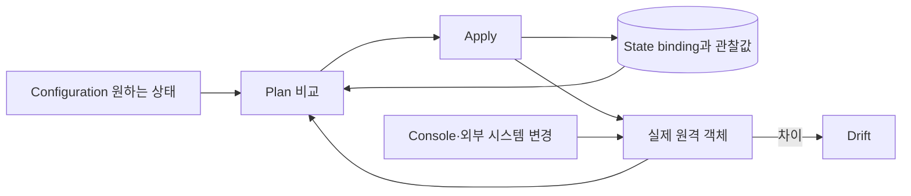

# 8교시: State와 Backend를 팀 운영 경계로 설계하기


환경별 보관함이 따로 있고, 각 보관함에는 잠금·버전·접근권한이 붙어 있습니다. State를 파일 저장 위치가 아니라 동시 변경과 Blast Radius를 통제하는 운영 경계로 봅니다.

## 오늘의 질문

State를 S3에 올리면 팀 협업 준비가 끝날까요? 저장 위치만 원격으로 바뀐 것입니다. Locking, 암호화, 최소 권한, 버전 복구, State 분리와 실행 직렬화까지 함께 설계해야 합니다.

## 수업 목표

- Configuration, State, 실제 객체의 관계를 설명한다.
- Local과 Remote Backend의 차이를 운영 관점에서 비교한다.
- 환경·위험 등급별 State와 접근 권한을 분리한다.
- Backend 이전에서 `-migrate-state`와 `-reconfigure`를 구분한다.
- State Lock과 버전 복구 Runbook을 작성한다.

## 오늘 반드시 가져갈 것

| 개념 | 이유 | 실패 위험 | 확인 위치 |
|---|---|---|---|
| State binding | 주소와 실제 ID를 연결합니다 | 중복 생성·잘못된 삭제 | `state list/show` |
| Remote Backend | 팀이 같은 최신 State를 사용합니다 | Local 파일 공유와 덮어쓰기 | backend 설정 |
| Locking | 같은 State 동시 변경을 막습니다 | 경쟁 apply와 State 손상 | `.tflock`/backend run |
| State versioning | 실수와 손상에서 이전 버전을 찾습니다 | 최신 State 유실 후 복구 불가 | S3 version ID |
| State 경계 | 환경과 SPOF의 Blast Radius를 제한합니다 | 앱 변경이 DB·DNS까지 포함 | Backend key와 IAM Role |

## 세 상태를 함께 봅니다



State는 실제 인프라 전체의 절대적 진실이라기보다 Terraform이 관리하는 주소와 원격 identity의 binding을 담습니다. 파일을 직접 편집하지 않고 지원되는 State 명령과 Backend 복구 기능을 사용합니다.

## Local과 Remote 비교

| 항목 | Local State | Remote Backend |
|---|---|---|
| 저장 위치 | 작업 PC | S3, HCP Terraform 등 |
| 팀 공유 | 파일 전달 위험 | 중앙 접근 가능 |
| Locking | Local process 범위 | Backend 지원에 따라 팀 단위 |
| 접근 제어 | OS 파일 권한 | IAM/RBAC와 감사 가능 |
| 버전 복구 | 별도 백업 필요 | Object versioning 등 활용 |
| 민감정보 | 로컬 노출 | 원격에서도 민감하므로 암호화·최소 권한 필요 |

Remote State라고 자동으로 안전해지는 것은 아닙니다. State에는 Resource attribute와 민감한 값이 포함될 수 있어 읽기 권한도 강한 권한입니다.

## 환경과 위험 등급으로 State를 나눕니다

```text
state/
├── dev/services/replaceable.tfstate
├── prod/services/replaceable.tfstate
├── prod/foundation/data.tfstate
├── prod/foundation/domain.tfstate
└── prod/foundation/security.tfstate
```

| 분리 축 | 나누는 이유 |
|---|---|
| dev/prod | 계정·승인·실패 영향 분리 |
| R1 Compute/R2 Data | 자동 복구 정책 분리 |
| R3 Domain/R4 Security | SPOF와 break-glass 승인 분리 |
| 팀 소유권 | 최소 권한과 변경 일정 분리 |
| 변경 주기 | 잦은 앱 배포가 기반 리소스를 잠그지 않게 함 |

[위험 민감 리소스 가이드](../risk-sensitive-resources.md)와 [Drift 자동 복구 가이드](../drift-remediation-guide.md)의 R1~R4 정책을 Backend key와 IAM Role까지 연결합니다.

## S3 Backend 예시를 읽습니다

다음은 현재 공식 문서 형태를 설명하기 위한 예시입니다. 실제 bucket과 key는 조직 기준으로 바꿉니다.

```hcl
terraform {
  backend "s3" {
    bucket       = "organization-terraform-state"
    key          = "prod/foundation/domain/terraform.tfstate"
    region       = "ap-northeast-2"
    encrypt      = true
    use_lockfile = true
  }
}
```

S3 Backend의 `use_lockfile`은 현재 공식 문서의 Locking 방식입니다. DynamoDB 기반 Locking은 deprecated 상태이므로 오래된 예제를 그대로 새 설계에 사용하지 않습니다. State bucket에는 Versioning을 켜 복구 지점을 남깁니다.

| 보호 항목 | 확인할 것 |
|---|---|
| 저장 암호화 | bucket 기본 암호화와 KMS 권한 |
| 전송·접근 | TLS, public access 차단, 최소 IAM |
| Lock | `.tflock` Get/Put/Delete 권한과 충돌 동작 |
| 버전 | bucket versioning, 보존 기간, 복구 시험 |
| 감사 | CloudTrail data event 또는 조직 감사 정책 |
| 삭제 | State object 삭제 권한 제한과 break-glass |

## Backend에는 변수를 쓸 수 없습니다

Backend block은 일반 Resource처럼 `var.environment`나 Resource attribute를 참조할 수 없습니다. Partial Configuration 파일이나 CI 입력을 사용할 수 있지만 credential을 `-backend-config`로 넘기면 `.terraform/`과 저장 Plan에 남을 수 있습니다. 인증은 OIDC, 환경변수, 표준 credential chain을 사용합니다.

## 이전과 재설정은 다릅니다

| 명령 | 의미 | 사용할 때 |
|---|---|---|
| `terraform init -migrate-state` | 기존 State를 새 Backend로 복사하려 시도 | Local→Remote 또는 Backend 이동 |
| `terraform init -reconfigure` | 기존 Backend 연결을 버리고 새 설정으로 초기화 | 이미 대상 State가 있고 migration이 불필요할 때 |
| `terraform state pull` | 현재 State를 stdout으로 읽음 | 승인된 백업·진단 절차 |
| `terraform state push` | State를 덮어쓸 수 있음 | 일반 운영 금지, 복구 승인 시에만 |

`-reconfigure`를 migration 대신 사용하면 기존 State를 새 위치로 옮기지 않습니다. 새 Backend가 비어 있으면 Terraform이 기존 객체를 새로 만들려는 Plan을 낼 수 있으므로 apply 전에 중단합니다.

## Migration Runbook

1. 모든 apply를 중지하고 변경 창구를 하나로 제한합니다.
2. 현재 Backend, workspace, State serial과 Resource 주소를 기록합니다.
3. `terraform state pull` 결과를 승인된 암호화 위치에 백업합니다.
4. 대상 bucket, key, versioning, encryption, Lock, IAM을 확인합니다.
5. Backend 설정을 바꾸고 `terraform init -migrate-state`를 실행합니다.
6. 새 Backend에서 `state list`와 `plan`을 확인합니다.
7. no-change가 아니면 apply하지 않고 이전·새 State를 비교합니다.
8. 복구 담당자, backup version ID, 검증 결과를 handoff에 남깁니다.

## Lock을 강제로 풀기 전에

`force-unlock`은 잠금 파일이 오래됐다고 바로 실행하는 명령이 아닙니다.

| 확인 | 질문 |
|---|---|
| 실행 주체 | 다른 사람이나 CI apply가 아직 실행 중인가? |
| Lock ID | 어떤 State와 작업이 만든 Lock인가? |
| 원격 작업 | HCP/CI run이 대기·실행 중인가? |
| 부분 적용 | API 변경은 됐지만 State 기록 전 실패했는가? |
| 승인 | 누가 강제 해제를 승인하고 재검증하는가? |

## GitOps와 Backend

예약 Drift 복구는 GitHub `concurrency`만으로 충분하지 않습니다. 다른 CI, 로컬 실행, HCP run까지 같은 State를 사용할 수 있으므로 Backend Locking이 필요합니다. R1 자동 복구 Role이 R2~R4 Backend key를 읽거나 쓸 수 없게 IAM도 나눕니다.

## 오해 점검

- S3에 State를 저장하면 자동으로 Locking도 켜지나요?
- State 읽기 권한은 단순 조회 권한인가요?
- Backend key만 다르면 같은 AWS Role을 써도 위험 경계가 충분한가요?
- `-reconfigure`가 Local State를 자동으로 새 Backend에 복사하나요?
- Lock이 오래됐으면 즉시 `force-unlock`해도 되나요?

## Evidence와 평가

| 수준 | evidence |
|---|---|
| 0 | Backend code만 있고 Lock·권한·복구 설명이 없습니다 |
| 1 | Remote State는 구성했지만 환경·위험 등급 분리나 migration 검증이 빠졌습니다 |
| 2 | key, IAM, encryption, locking, versioning, migration, no-change와 복구 책임을 연결합니다 |

## 공식 문서

- Backend overview: https://developer.hashicorp.com/terraform/language/backend
- S3 Backend: https://developer.hashicorp.com/terraform/language/backend/s3
- Remote State: https://developer.hashicorp.com/terraform/language/state/remote
- Terraform init: https://developer.hashicorp.com/terraform/cli/commands/init

## 혼자 다시 따라오기

- 최소 경로: dev/prod State 경계를 그리고 각 Backend key와 Role을 매핑합니다.
- 흔한 실패: State bucket만 만들고 Lock 미설정, credential 하드코딩, migration 후 no-change 미확인.
- 첫 확인 위치: 현재 working directory, Backend key, AWS identity입니다.
- 다음 준비 상태: Day 5 Import 전에 대상 Resource와 State의 단일 소유권을 확인할 수 있어야 합니다.
