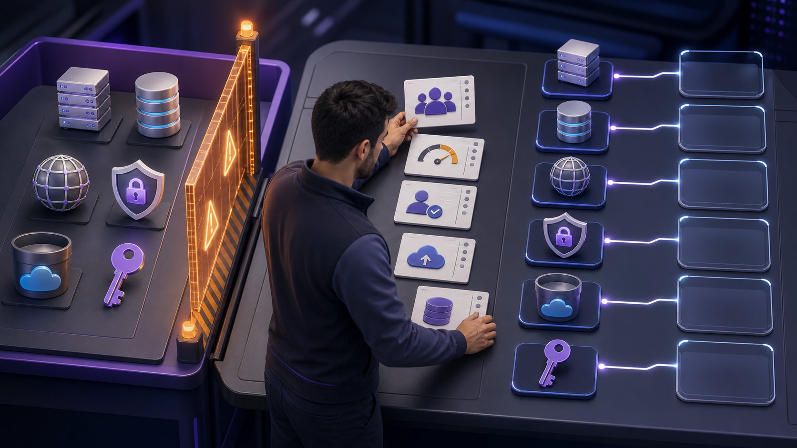
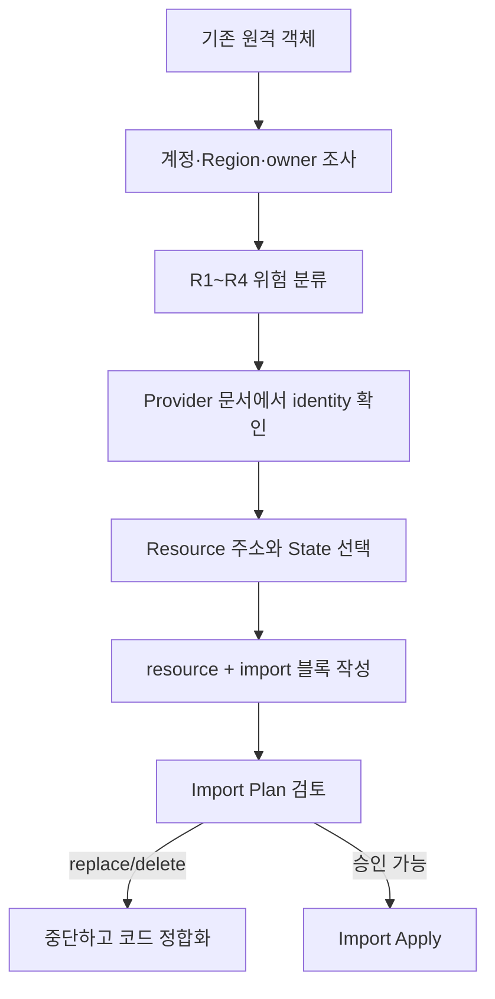

# 9교시: 기존 리소스를 조사하고 Import 주소 설계하기



왼쪽의 기존 객체를 바로 코드로 끌어오지 않고, 가운데의 소유권·위험·ID 조사대를 거쳐 오른쪽의 Terraform 주소에 하나씩 연결합니다. Import는 명령보다 Inventory가 먼저입니다.

## 오늘의 질문

Console에 이미 있는 RDS나 Route 53 Record를 찾았다고 바로 `terraform import`를 실행해도 될까요? 먼저 어느 State가 소유할지, 다른 자동화가 계속 수정하는지, 잘못된 Plan이 replace/delete를 제안할 때 멈출 수 있는지 확인해야 합니다.

## 수업 목표

- Import가 원격 객체와 Resource 주소의 binding을 만드는 작업임을 설명한다.
- 대상 계정·Region·소유권·위험 등급·Resource ID를 조사한다.
- Provider 문서에서 Resource별 Import identity를 찾는다.
- 단일·`for_each`·Module 내부 주소를 설계한다.
- Import 전 State 백업과 Rollback 계획을 작성한다.

## 오늘 반드시 가져갈 것

| 개념 | 이유 | 실패 위험 | evidence |
|---|---|---|---|
| 단일 소유권 | 같은 객체를 두 State가 관리하면 안 됩니다 | 경쟁 apply와 반복 Drift | owner/State 기록 |
| 정확한 identity | Import ID 형식은 Resource마다 다릅니다 | 다른 객체 또는 실패한 Import | Provider Import 문서 |
| 안정적인 주소 | 주소는 이후 수명주기와 리팩터링 기준입니다 | key 변경으로 destroy/create | address map |
| 위험 등급 | Import 후 첫 apply의 Gate를 정합니다 | RDS·DNS·ACM 무인 변경 | R1~R4 분류 |
| 사전 백업 | 실패·오편입에서 복구합니다 | 기존 State binding 손실 | encrypted backup 위치 |

## Import가 하는 일과 하지 않는 일

| Import가 하는 일 | Import가 하지 않는 일 |
|---|---|
| 기존 객체 identity를 Resource 주소에 연결 | 안전한 운영 코드를 자동 보장 |
| State에 binding과 관찰값을 기록 | 연관된 모든 하위 객체 자동 편입 |
| 이후 Plan 비교의 출발점 제공 | 기존 수동 변경자를 자동 차단 |
| 선언적 `import` 블록을 코드 리뷰 가능하게 함 | 데이터 백업과 Rollback 대신 수행 |



## Import Inventory

| 항목 | 기록 예 |
|---|---|
| AWS account/Region | 대상 좌표 |
| 실제 Resource 종류와 이름 | Console/API 기준 |
| Provider Resource type/version | Registry 기준 |
| Import ID/identity | 공식 문서 형식 |
| 현재 변경 주체 | 사람, 다른 State, controller |
| 대상 State/Backend key | 단일 소유권 |
| 위험 등급 | R1~R4 |
| 데이터·서비스 의존성 | 사용자와 downstream |
| 백업·복구 담당자 | 승인된 evidence |

RDS, Route 53, ACM, KMS는 [위험 민감 리소스 가이드](../risk-sensitive-resources.md)의 SPOF Gate를 먼저 통과합니다. 기존 운영 객체를 수업 중 실제 Import하는 대신 별도 계정의 교육용 객체나 읽기 전용 Inventory로 대체할 수 있습니다.

## 주소를 먼저 설계합니다

```hcl
import {
  to = aws_s3_bucket.logs
  id = "existing-log-bucket"
}

resource "aws_s3_bucket" "logs" {
  bucket = "existing-log-bucket"
}
```

| 상황 | 주소 예시 | 확인할 것 |
|---|---|---|
| 단일 Resource | `aws_s3_bucket.logs` | type과 local name |
| `for_each` instance | `aws_s3_bucket.this["logs"]` | key가 장기적으로 안정적인가 |
| Module 내부 | `module.storage.aws_s3_bucket.this` | Module input/output과 source version |
| 기존 주소 이동 | `moved` block 병행 | Import와 이동을 한 번에 섞지 않을지 |

같은 원격 객체를 두 주소에 Import하지 않습니다. Terraform은 원격 API가 같은 객체임을 항상 안전하게 감지해주지 못합니다.

## 선언적 Import와 CLI Import

| 방식 | 특징 | 수업 기준 |
|---|---|---|
| `import` block | 코드 리뷰와 반복 가능한 Plan | 기본 방식 |
| `terraform import ADDRESS ID` | State에 직접 binding | 기존 운영·복구 사례로 이해 |
| `-generate-config-out` | import block을 바탕으로 설정 생성 보조 | 생성 코드 전부 검토 |

생성된 Configuration은 정답이 아닙니다. read-only/computed 값, 기본값, 민감 설정, 분리된 하위 Resource를 현재 Provider 문서와 맞춰 다시 작성합니다.

## 실습 준비

`labs/import-hands-on`은 원격 비용 없이 `terraform_data` identity를 Import합니다.

```bash
cd week_over/terraform/day5/labs/import-hands-on
terraform init
terraform fmt -check
terraform validate
terraform plan
```

Plan에서 `1 to import`에 해당하는 표시, 대상 주소, ID를 찾습니다. 아직 apply하지 않고 `import-plan-review.md`를 작성합니다.

## 사전 Stop 조건

| 발견 | 행동 |
|---|---|
| 대상 객체 owner 불명 | Import 중지 |
| 다른 State에 같은 ID 존재 | Import 중지 후 소유권 해결 |
| replace/delete 동반 | apply 금지, schema 정합화 |
| R2~R4 백업·승인 없음 | Import 중지 |
| Provider 버전 문서 불일치 | lock/version 확인 후 재조사 |
| State 백업 복구 불가 | 먼저 복구 훈련 |

## Evidence와 평가

| 수준 | evidence |
|---|---|
| 0 | ID와 import 명령만 있고 owner·State·위험 근거가 없습니다 |
| 1 | 주소와 문서는 확인했지만 백업·Stop 조건이 빠졌습니다 |
| 2 | 좌표, owner, identity, 주소, 위험 등급, 백업, Plan Gate를 연결합니다 |

## 공식 문서

- Import overview: https://developer.hashicorp.com/terraform/language/import
- Import block: https://developer.hashicorp.com/terraform/language/block/import
- Resource addressing: https://developer.hashicorp.com/terraform/cli/state/resource-addressing

## 혼자 다시 따라오기

- 최소 경로: 교육용 객체 하나의 Inventory와 ID/address map을 작성하고 Import Plan까지만 확인합니다.
- 흔한 실패: 이름을 ID로 추측, 잘못된 Region, 같은 객체 중복 Import.
- 첫 확인 위치: Provider version의 Import section과 대상 State list입니다.
- 다음 준비 상태: Plan을 apply해도 되는 근거와 중단 조건을 설명할 수 있어야 합니다.
