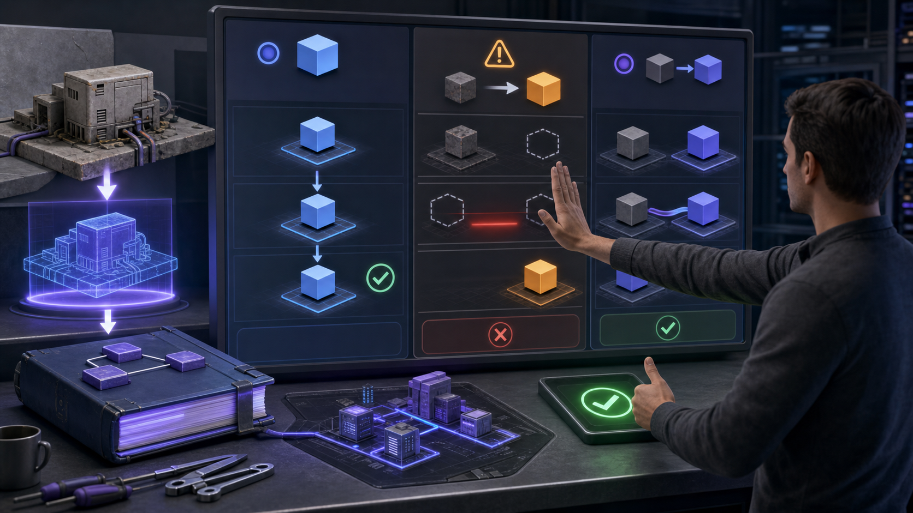
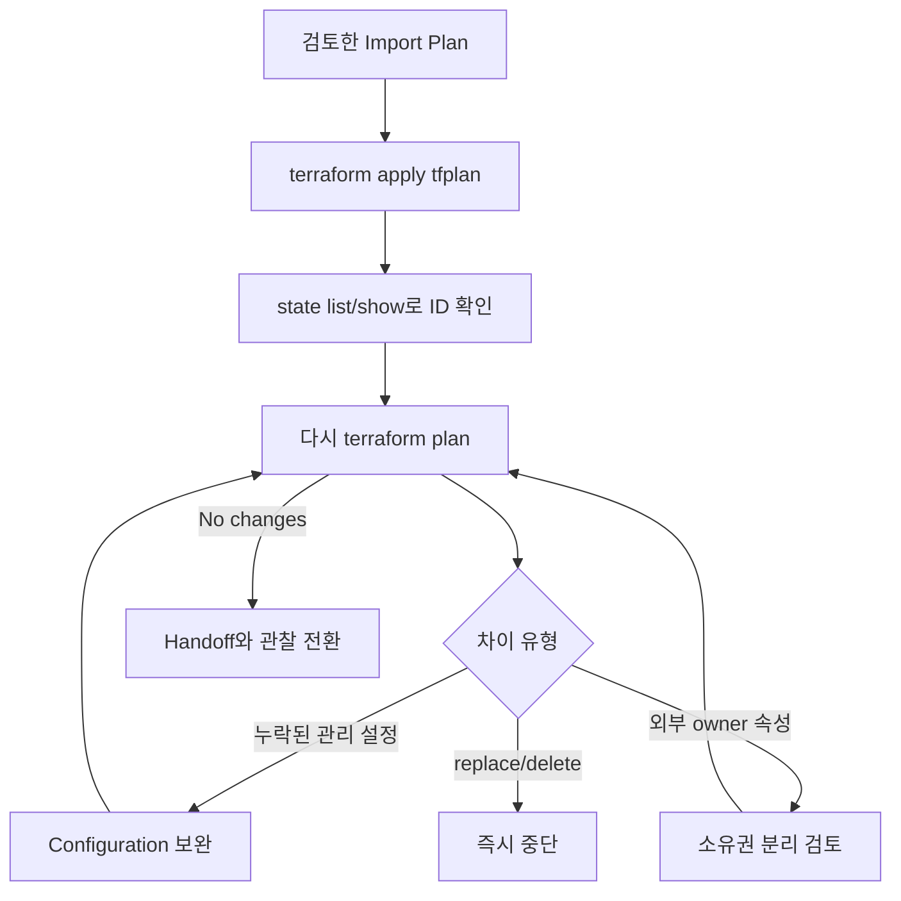
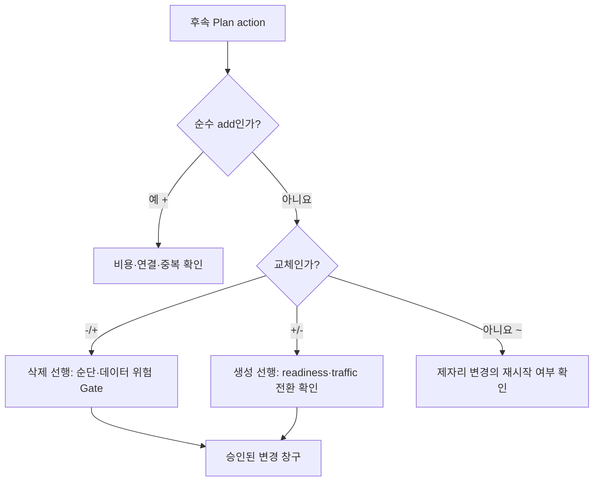

# 10교시: Import 실행 후 no-change Plan까지 맞추기



Import 연결 자체보다 오른쪽의 차이 검토판을 봅니다. binding이 성공해도 Configuration과 실제 객체가 다르면 다음 apply에서 수정·교체·삭제가 발생할 수 있습니다.

## 오늘의 질문

`Import successful`이 나오면 Terraform 전환이 끝난 걸까요? Import 직후부터가 실제 작업입니다. State를 확인하고, Configuration을 실제 운영 의도와 맞추며, 변경 없음 또는 승인 가능한 최소 Plan을 만들어야 합니다.

## 수업 목표

- 선언적 Import를 저장 Plan으로 실행한다.
- `state list/show`로 binding을 검증한다.
- Import 후 Drift를 입력 누락, 기본값, computed 값, 외부 소유로 분류한다.
- replace/delete가 나오면 apply하지 않고 원인을 좁힌다.
- 최종 Plan과 handoff 문서를 완성한다.

## 오늘 반드시 가져갈 것

| 개념 | 이유 | 실패 위험 | 확인 위치 |
|---|---|---|---|
| 저장 Plan | 검토한 Import 작업을 그대로 실행합니다 | 새 Plan이 다른 변경을 포함 | `tfplan` |
| State binding 검증 | 주소와 ID가 맞는지 확인합니다 | 엉뚱한 객체 관리 | `state show` |
| Configuration 정합화 | 다음 apply의 실제 변경을 통제합니다 | Import 직후 객체 변형 | 반복 Plan |
| no-change/설명 가능한 Plan | 전환 완료 기준입니다 | 숨은 Drift 방치 | Plan summary와 근거 |
| Handoff | 다음 운영자가 소유권과 복구를 이어받습니다 | 수동 변경 재발 | Runbook |

## 실행 흐름



## 선언적 Import 실행

```bash
cd week_over/terraform/day5/labs/import-hands-on
terraform plan -out=tfplan
terraform apply tfplan
terraform state list
terraform state show terraform_data.legacy
```

실습 Resource ID가 `legacy-service-001`인지 확인합니다. `terraform_data`는 교육용이므로 실제 API 객체 검증은 없지만, import block→Plan→State 주소 흐름은 동일하게 관찰할 수 있습니다.

## Import 후 Plan을 분류합니다

| Plan 차이 | 원인 후보 | 행동 |
|---|---|---|
| update in-place | 관리할 argument 누락·기본값 차이 | 공식 schema와 운영 의도 확인 |
| replace | identity나 immutable argument 불일치 | apply 금지, ID/address/config 재검토 |
| destroy | 코드·주소·for_each key 누락 | 소유권 확인 전 apply 금지 |
| 계속 바뀌는 값 | 외부 controller 또는 정규화 | owner와 Provider 이슈 조사 |
| no changes | 현재 binding과 Configuration 일치 | probe와 handoff 진행 |

## 신규 추가와 교체를 따로 읽습니다

Plan 기호는 생성과 교체 순서를 구분합니다.

| Plan action | 실행 의미 | 순단 가능성 | 적용 전 확인 |
|---|---|---|---|
| `+` | 기존 객체는 유지하고 새 객체 추가 | 기존 서비스에는 보통 직접 순단 없음 | 비용, 연결, 중복 역할 |
| `-/+` | 기존 객체 삭제 후 새 객체 생성 | 높음 | 데이터, endpoint, 복구 시간, maintenance window |
| `+/-` | 새 객체 생성 후 기존 객체 삭제 | 낮출 수 있지만 0은 아님 | 고유 이름 충돌, traffic 전환, 동시 비용, readiness |
| `~` | 같은 객체를 제자리 수정 | 속성에 따라 재시작 가능 | Provider/AWS 서비스의 적용 방식 |
| `-` | 기존 객체 삭제 | 매우 높을 수 있음 | 백업, 의존 서비스, 승인자 |

`create_before_destroy`는 교체 순서를 `+/-`로 바꾸는 lifecycle 규칙입니다. 새 객체가 실제로 healthy해지고 traffic이 넘어갔다는 것까지 보장하지 않습니다. RDS identifier, Route 53 zone, 고정 IP처럼 동시에 둘을 만들 수 없거나 identity가 중요한 객체에서는 실패할 수 있습니다.



### 실습: Import 객체 교체와 신규 추가 비교

Import 후 no-change를 확인한 상태에서 다음 Plan을 실행합니다.

```bash
terraform plan \
  -var='add_compute=true'
```

다음을 분리해서 기록합니다.

- `terraform_data.new_compute[0]`: 기존 객체와 무관한 순수 `+`인가?
- Import한 legacy 객체에는 변경이 없는가?

이 Plan은 관찰만 하고 적용하지 않습니다. 이제 교체 상황을 별도로 만들기 위해 `terraform_data.legacy`에 다음 argument를 임시로 추가합니다.

```hcl
triggers_replace = ["replacement-experiment"]
```

다시 Plan하면 Import된 legacy 객체에 `-/+`가 나타납니다. 이 상태는 적용하지 않습니다. legacy가 RDS나 DNS였다면 어떤 probe와 변경 창구가 필요한지 기록합니다.

그다음 다음 lifecycle도 임시로 추가해 교체 기호가 `+/-`로 바뀌는지 비교합니다.

```hcl
lifecycle {
  create_before_destroy = true
}
```

비교가 끝나면 `triggers_replace`와 lifecycle을 모두 제거하고 원래 Configuration으로 복구합니다. 다시 Plan해 Import 객체가 no-change인지 확인합니다.

`ignore_changes`를 첫 해결책으로 쓰지 않습니다. 외부 시스템이 실제로 소유하는 속성이라면 owner와 관찰 경로를 문서화하고 제한적으로 사용합니다. RDS·DNS·ACM 설정 차이를 조용히 숨기는 데 사용하지 않습니다.

## AWS 전환에서 추가로 확인할 것

| 대상 | Import 후 probe | 금지 신호 |
|---|---|---|
| RDS | endpoint 연결, snapshot, backup 상태 | replacement, deletion protection 해제 |
| Route 53 | 권한 있는 DNS 조회, NS/TTL | hosted zone replacement/delete |
| ACM | 인증서 상태, validation, TLS handshake | validation record 삭제, listener 이탈 |
| KMS | key state, alias, decrypt canary | key policy 축소, deletion schedule |
| Compute | health check, instance/ASG 상태 | 데이터가 로컬에만 존재 |

## 잘못 Import했을 때

원격 객체를 삭제하려는 것이 아니라 Terraform의 binding만 제거해야 한다면 `terraform state rm`을 검토합니다. 실행 전 State 백업과 주소·ID 기록이 필요합니다.

```bash
terraform state rm terraform_data.legacy
```

이 명령은 Configuration을 삭제하지 않습니다. Resource block이 남아 있으면 다음 Plan에서 새 객체 생성을 제안할 수 있습니다. 실제 운영 객체에서는 즉시 apply하지 않습니다.

## Handoff 문서

```markdown
# Imported resource handoff
- Account / Region:
- Provider and version:
- Terraform address:
- Remote resource identity:
- Backend key / State owner:
- Risk class and dependencies:
- Import run URL and approver:
- Final plan summary:
- External owners / ignored attributes:
- Health probes:
- Backup and rollback:
- Next permitted change window:
```

## 실습 정리

교육용 실습에서는 binding을 State에서 제거해 초기 상태로 돌립니다.

```bash
terraform state rm terraform_data.legacy
rm -f tfplan terraform.tfstate terraform.tfstate.backup
```

실제 원격 Resource에서는 State 파일을 shell로 삭제하지 않습니다. 승인된 Backend 복구 절차와 State 명령을 사용합니다.

## Evidence와 평가

| 수준 | evidence |
|---|---|
| 0 | Import 성공 메시지만 있고 주소·ID·후속 Plan이 없습니다 |
| 1 | State는 확인했지만 위험 probe나 handoff가 빠졌습니다 |
| 2 | 저장 Plan, binding, 반복 Plan, Stop 판단, probe, 백업과 handoff를 연결합니다 |

## 공식 문서

- Import resources: https://developer.hashicorp.com/terraform/language/import
- Import block: https://developer.hashicorp.com/terraform/language/block/import
- State commands: https://developer.hashicorp.com/terraform/cli/commands/state

## 혼자 다시 따라오기

- 최소 경로: Plan 저장→Import apply→state show→후속 Plan→binding 정리 순서로 실행합니다.
- 흔한 실패: 성공 메시지만 확인, replace를 승인, State binding과 원격 삭제를 혼동.
- 첫 확인 위치: Resource 주소, remote ID, 후속 Plan의 첫 action입니다.
- 완료 상태: 다음 운영자가 같은 State에서 안전하게 Plan하고 중단 조건을 판단할 수 있어야 합니다.
