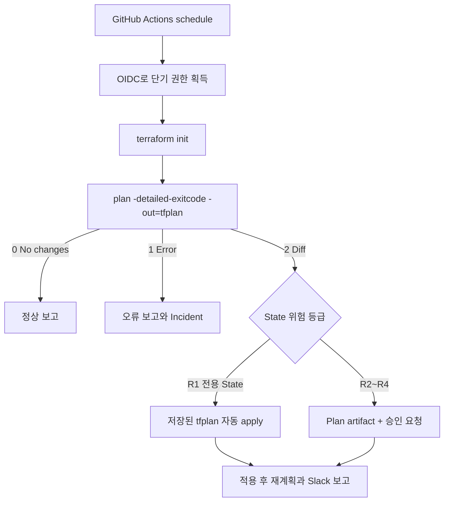

# GitOps 기반 Terraform Drift 탐지와 제한적 자동 복구

## 운영 시나리오

Git의 Terraform Configuration을 원하는 상태로 두고, 매일 밤 현재 인프라와 비교한다. `terraform plan -detailed-exitcode` 결과가 0이면 변경 없음, 1이면 실행 오류, 2이면 Drift 또는 미적용 Configuration 변경이 있다는 뜻이다.

여기서 곧바로 모든 State에 `terraform apply -auto-approve`를 실행하지 않는다. 자동 복구 대상은 빠르게 재생성 가능한 R1 State로 물리적으로 분리한다. RDS, Route 53, ACM, KMS, 핵심 IAM·Network가 포함된 R2~R4 State는 Plan과 보고만 만들고 사람이 승인한다.



## 왜 `apply --auto-approve`를 그대로 쓰지 않나요

인자 없이 다시 `terraform apply -auto-approve`를 실행하면 Plan 뒤 상태가 바뀌었을 때 새 계획을 만들어 적용할 수 있다. 자동화에서는 검토·분류한 `tfplan`을 저장하고 `terraform apply tfplan`으로 같은 계획을 실행한다. 저장 Plan에는 전체 Configuration과 입력값, 민감정보가 포함될 수 있으므로 공개 artifact나 Git에 올리지 않는다.

| 전략 | 사용 범위 | 위험 |
|---|---|---|
| Plan 후 무조건 auto-approve | 사용하지 않음 | DNS·DB·인증서까지 강제 변경 가능 |
| 주소 allowlist 후 자동 apply | 보조 방어 | 새 Resource나 주소 변경을 놓칠 수 있음 |
| R1 전용 State에서 저장 Plan apply | 제한적 자동 복구 | State 분류가 잘못되면 위험 |
| R2~R4 Plan + 보호 Environment 승인 | 기본 정책 | 복구가 느리지만 사람 판단을 보존 |

## State와 권한 경계

```text
terraform-live/
├── services/replaceable/   # R1, 제한적 자동 복구 허용
├── foundation/data/        # R2, plan/report only
├── foundation/domain/      # R3, plan/report only
└── foundation/security/    # R3~R4, plan/report only
```

- 각 경로는 별도 Backend key/State를 사용한다.
- GitHub job은 OIDC로 해당 State에 필요한 최소 AWS Role만 맡는다.
- R1 Role에는 Route 53 zone, ACM, RDS, KMS, 핵심 IAM 삭제 권한을 주지 않는다.
- `concurrency`를 사용해 같은 State의 중복 실행을 막고 Backend locking도 사용한다.
- GitHub Environment에는 승인자와 배포 제한을 설정한다.

## 예약 시간

GitHub Actions cron은 UTC 기준이다. 한국 시간 22시는 `13:00 UTC`다.

```yaml
on:
  schedule:
    - cron: "0 13 * * *"
  workflow_dispatch:
```

예약 Workflow는 기본 Branch의 최신 commit에서 실행되며 부하에 따라 지연될 수 있다. 정확한 시각의 장애 복구 장치가 아니라 정기 Drift 점검으로 사용한다.

## 보고해야 할 내용

| 필드 | 이유 |
|---|---|
| Repository, commit SHA, workflow run URL | 어떤 원하는 상태를 사용했는지 추적 |
| State/환경/계정/Region | 잘못된 운영 좌표 탐지 |
| Plan exit code | no-change, diff, error 구분 |
| add/change/destroy 수 | 영향 규모 파악 |
| 변경 Resource 주소와 action | 무엇을 되돌렸는지 확인 |
| 자동 적용 여부와 승인자 | 책임 경로 기록 |
| apply 후 두 번째 Plan | 복구 뒤 no-change 확인 |
| 실패한 probe | DNS, TLS, DB, HTTP 상태 확인 |

Slack Incoming Webhook URL은 GitHub Secret으로 저장하고 로그에 출력하지 않는다. Webhook 자체가 Secret이며 유출되면 폐기·교체한다.

## 예제 파일

- 탐지·보고 전용: `examples/github-actions/terraform-drift-detect.yml`
- R1 State 제한 자동 복구: `examples/github-actions/terraform-r1-remediate.yml`

두 파일은 교육용 골격이다. 실제 사용 전 Backend, OIDC Role, 작업 경로, Slack payload, 보호 Environment를 조직 기준에 맞춰야 한다.

## 실패 시 행동

- Plan exit 1: apply하지 않고 Terraform 오류, Lock, 인증, Provider 상태를 보고한다.
- Plan exit 2 + destroy/replace: R1 State라도 자동 적용을 중단하는 정책을 고려한다.
- apply 실패: 재시도 루프를 돌리지 않고 State와 부분 적용 결과를 확인한다.
- apply 후 Plan exit 2: Drift 원인이 계속 동작 중이므로 외부 controller/수동 변경자를 조사한다.
- Slack 전송 실패: Workflow 결과를 실패로 가리지 말고 별도 알림 경로를 둔다.

## 공식 문서

- Terraform Plan: https://developer.hashicorp.com/terraform/cli/commands/plan
- Running Terraform in automation: https://developer.hashicorp.com/terraform/tutorials/automation/automate-terraform
- GitHub scheduled workflows: https://docs.github.com/actions/using-workflows/events-that-trigger-workflows#schedule
- Slack Incoming Webhooks: https://api.slack.com/messaging/webhooks
