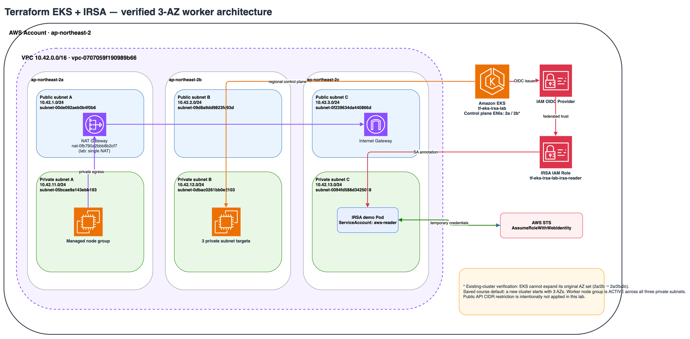
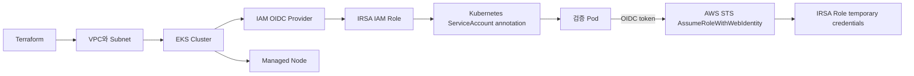

# Terraform EKS + IRSA 생성·검증·삭제 핸즈온

## 목표

Terraform이 VPC, EKS Control Plane, Managed Node Group, OIDC Provider, IRSA Role과 Kubernetes ServiceAccount까지 하나의 의존성 그래프로 만들고 삭제할 수 있음을 실제로 검증한다.

이 실습은 교육용 EKS를 실제 AWS 계정에 생성하므로 비용이 발생한다. 시작 전 Budget과 현재 Region을 확인하고, 검증이 끝나면 같은 날 `terraform destroy`와 잔여 리소스 점검까지 완료한다.

## 만드는 리소스



이 그림은 편집 가능한 [`eks-irsa-architecture.drawio`](./assets/eks-irsa-architecture.drawio)에서 PNG로 내보낸 AWS Architecture 스타일 자료다. VPC/AZ/Subnet 경계와 OIDC Provider→IRSA Role→ServiceAccount→Pod→STS 흐름을 순서대로 본다.

| 영역 | 리소스 | 실습 설계 |
|---|---|---|
| Network | VPC, 3 Public + 3 Private Subnet, IGW, NAT, Route | 3개 AZ에 public/private subnet을 하나씩 두며 실습 기본값은 비용 절감을 위해 NAT 1개 사용 |
| EKS | Control Plane, Add-ons | 실습 접근을 위해 Public/Private endpoint 활성화 |
| Compute | Managed Node Group | 3개 private subnet을 대상으로 하는 `t3.small` 1대, min/max/desired 1 |
| Identity | Cluster IAM, Node IAM, OIDC Provider | Module에서 생성·연결 |
| IRSA | IAM Role, Trust Policy | namespace와 ServiceAccount subject를 정확히 제한 |
| Kubernetes | Namespace, ServiceAccount, 검증 Pod | Pod에서 STS Caller Identity 확인 |

EKS secret은 AWS 관리 기본 암호화에 맡기고 실습용 Customer Managed KMS Key는 만들지 않는다. KMS Key는 삭제 예약 기간 때문에 `terraform destroy` 직후 완전히 제거되지 않으므로, 당일 생성·삭제 검증이라는 이 실습의 범위와 맞지 않는다. 운영에서는 조직의 KMS 소유권·복구·삭제 정책에 따라 별도 State에서 관리한다.



## IRSA를 정확히 이해하기

IRSA는 Node IAM Role을 Pod에 나눠주는 기능이 아니다. EKS의 OIDC issuer를 IAM OIDC Provider로 등록하고, Kubernetes ServiceAccount token의 claim을 IAM Role trust policy가 검증한다. AWS SDK/CLI는 projected web identity token으로 `AssumeRoleWithWebIdentity`를 호출해 임시 자격증명을 받는다.

| 연결 지점 | 이 예제의 값 | 틀리면 나타나는 증상 |
|---|---|---|
| OIDC Provider | EKS cluster issuer | STS가 token issuer를 신뢰하지 않음 |
| audience claim | `sts.amazonaws.com` | Trust condition 불일치 |
| subject claim | `system:serviceaccount:irsa-demo:aws-reader` | 다른 namespace/SA 또는 AccessDenied |
| SA annotation | `eks.amazonaws.com/role-arn` | Pod에 web identity 환경이 주입되지 않음 |
| Pod ServiceAccount | `aws-reader` | default SA를 사용해 IRSA가 동작하지 않음 |
| SDK credential chain | Web Identity 지원 AWS CLI/SDK | Node Role 또는 다른 앞선 credential을 사용할 수 있음 |

`hostNetwork: true` Pod는 IMDS에 접근할 수 있으므로 이 실습에서 사용하지 않는다. 운영에서는 Node IMDS 접근도 제한해 Pod가 Node Role 자격증명을 가져가지 못하게 해야 한다.

## 사전 준비

```bash
terraform version
aws --version
kubectl version --client
aws sts get-caller-identity
```

필요 권한에는 VPC, EC2, EKS, IAM Role/Policy/OIDC Provider, CloudWatch Log Group, 관련 Service Linked Role 작업이 포함된다. 개인 장기 Access Key보다 실습용 Role과 단기 자격증명을 권장한다.

이번 실습에서는 Public IP 조회와 CIDR 제한을 절차에 넣지 않는다. 짧은 수업에서 접속 좌표가 바뀌어 실습이 중단되는 상황을 줄이기 위한 선택이다. 운영 환경에서는 다음처럼 API endpoint 접근 CIDR을 명시적으로 제한하거나 Private endpoint와 VPN·사내망 접근을 사용한다.

```hcl
endpoint_public_access_cidrs = ["203.0.113.10/32"] # 문서용 예시 주소
```

위 예시 주소를 실제 Configuration에 그대로 사용하지 않는다. 조직의 접속 경계와 break-glass 절차를 기준으로 정한다.

## 생성

```bash
cd week_over/terraform/eks-hands-on
terraform init
terraform fmt -check
terraform validate
terraform plan -out=eks.tfplan
terraform show eks.tfplan
terraform apply eks.tfplan
```

Plan에서 EKS·IAM·VPC 외에 RDS, Route 53, ACM, KMS 삭제가 없는지 확인한다. 이 구성은 private node의 외부 통신을 위해 NAT Gateway를 만든다. `single_nat_gateway=true`는 실습 비용 절감값이며, 운영에서는 AZ별 NAT 또는 VPC Endpoint 중심 설계를 검토한다.

새 클러스터는 `availability_zone_count=3`, `control_plane_az_count=3`이 기본값이다. 기존 EKS Cluster는 최초 생성 때 선택한 AZ 집합을 나중에 늘릴 수 없다. 2-AZ Cluster를 3-AZ로 바꾸려면 단순 subnet 추가가 아니라 새 Cluster로의 migration을 설계해야 한다.

## Cluster 검증

```bash
aws eks update-kubeconfig \
  --region "$(terraform output -raw region)" \
  --name "$(terraform output -raw cluster_name)"

kubectl get nodes -o wide
kubectl get pods -A
kubectl wait --for=condition=Ready node --all --timeout=10m
```

통과 기준:

- Cluster status가 `ACTIVE`
- Managed Node 1개가 `Ready`
- CoreDNS, VPC CNI, kube-proxy가 정상
- `irsa-demo` namespace에 검증 Pod가 생성됨

## IRSA 검증

```bash
kubectl -n irsa-demo get serviceaccount aws-reader -o yaml
kubectl -n irsa-demo describe pod irsa-check
kubectl -n irsa-demo logs irsa-check
```

로그의 ARN이 다음 형태인지 확인한다.

```text
arn:aws:sts::<account-id>:assumed-role/<cluster-name>-irsa-reader/<session>
```

Node IAM Role ARN이 나오면 통과가 아니다. 다음을 확인한다.

```bash
kubectl -n irsa-demo exec irsa-check -- env | grep '^AWS_'
```

확인할 환경변수는 `AWS_ROLE_ARN`, `AWS_WEB_IDENTITY_TOKEN_FILE`이다. Token 본문은 출력하거나 제출하지 않는다.

## IRSA Trust Policy 읽기

Terraform의 `data.aws_iam_policy_document.irsa_assume`에는 두 조건이 있다.

```text
<oidc-provider>:aud = sts.amazonaws.com
<oidc-provider>:sub = system:serviceaccount:irsa-demo:aws-reader
```

namespace 전체에 `StringLike ...:*`를 허용하는 방식보다 정확한 ServiceAccount 하나를 `StringEquals`로 제한한다. 여러 ServiceAccount가 필요하면 필요한 subject만 명시적으로 추가한다.

## IRSA와 EKS Pod Identity 비교

| 항목 | IRSA | EKS Pod Identity |
|---|---|---|
| 신뢰 기반 | Cluster OIDC Provider와 web identity | EKS Pod Identity service principal/association |
| Kubernetes 연결 | ServiceAccount annotation | EKS association |
| 적용 범위 | EKS, EKS Anywhere 등 OIDC 기반 | EKS 중심 |
| 이 실습 | 상세 구현·검증 | 개념 비교만 다룸 |

AWS는 두 방식을 모두 제공한다. 기존 조직 표준, add-on 지원, cross-account 요구와 운영 규모를 확인해 선택한다.

## 삭제 전 점검

Service/Ingress가 `LoadBalancer`를 만들었다면 EKS보다 먼저 Kubernetes 객체를 삭제하고 AWS Load Balancer가 사라질 때까지 기다린다. 이 예제는 외부 LoadBalancer를 만들지 않는다.

```bash
kubectl -n irsa-demo get all
terraform plan -destroy -out=destroy.tfplan
terraform show destroy.tfplan
terraform apply destroy.tfplan
```

저장한 Destroy Plan을 적용해 검토한 삭제 범위를 유지한다. `terraform destroy -auto-approve`는 교육용 편의보다 검토 evidence가 약하므로 기본 절차로 사용하지 않는다.

## 삭제 검증

```bash
aws eks describe-cluster \
  --region ap-northeast-2 \
  --name "<삭제한 cluster name>"

aws ec2 describe-instances \
  --region ap-northeast-2 \
  --filters "Name=tag:Course,Values=terraform-eks-hands-on" \
  --query 'Reservations[].Instances[?State.Name!=`terminated`].[InstanceId,State.Name]'

aws elbv2 describe-load-balancers --region ap-northeast-2
aws ec2 describe-volumes \
  --region ap-northeast-2 \
  --filters "Name=tag:Course,Values=terraform-eks-hands-on"
```

EKS `ResourceNotFoundException`은 Cluster 삭제 확인의 기대 결과다. EC2, EBS, ELB, EIP, NAT Gateway, CloudWatch Log Group과 IAM/OIDC Provider의 잔여 여부도 Console 또는 CLI로 확인한다.

## Evidence

| 단계 | 남길 증거 |
|---|---|
| 사전 | Account, Region, caller ARN, Budget 확인 |
| Plan | add/change/destroy 수, Module version, NAT 개수 |
| Cluster | EKS ACTIVE, Node Ready, System Pod 상태 |
| IRSA | SA annotation, Pod의 assumed-role ARN |
| Destroy | Destroy Plan 수와 완료 메시지 |
| Cleanup | EKS not found, EC2/EBS/ELB/EIP/NAT 잔여 확인 |

## 공식 문서

- EKS 생성: https://docs.aws.amazon.com/eks/latest/userguide/create-cluster.html
- IRSA: https://docs.aws.amazon.com/eks/latest/userguide/iam-roles-for-service-accounts.html
- ServiceAccount Role 연결: https://docs.aws.amazon.com/eks/latest/userguide/associate-service-account-role.html
- IRSA SDK 동작: https://docs.aws.amazon.com/eks/latest/userguide/iam-roles-for-service-accounts-minimum-sdk.html
- Terraform EKS tutorial: https://developer.hashicorp.com/terraform/tutorials/kubernetes/eks
