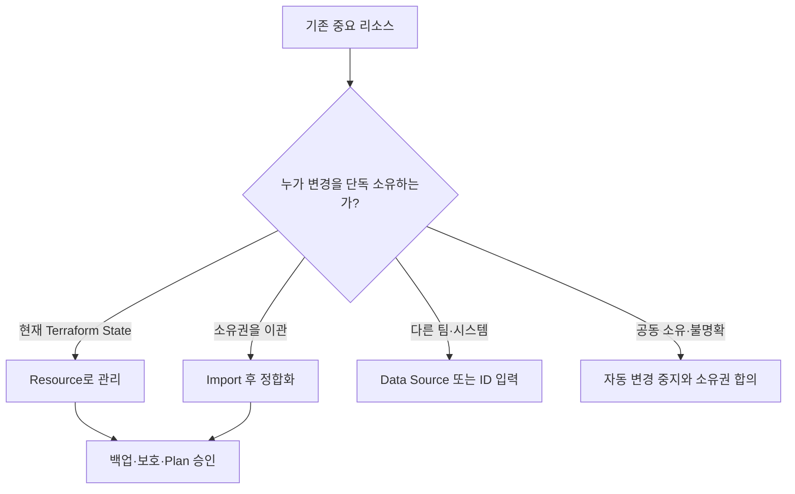

# Terraform 위험 민감 리소스 관리 가이드

## 복구 시간과 Blast Radius를 먼저 봅니다

컴퓨팅 인스턴스는 이미지와 데이터가 분리되어 있다면 비교적 빠르게 다시 만들 수 있습니다. 반면 RDS 데이터, DNS 위임, 인증서, 암호화 키, 핵심 IAM과 네트워크는 잘못된 변경 하나가 서비스 전체를 끊거나 복구 수단까지 없앨 수 있습니다. Terraform 관리 여부를 정할 때는 `재생성 가능한가`, `복구 시간은 얼마인가`, `SPOF인가`, `실패가 몇 서비스에 번지는가`를 먼저 묻습니다.

| 등급 | 성격 | 대표 예 | 기본 변경 정책 |
|---|---|---|---|
| R1 Replaceable | 이미지와 코드로 빠르게 재생성 | Stateless EC2, ASG instance, 임시 worker | 자동 Plan과 표준 승인 가능 |
| R2 Stateful | 데이터와 endpoint 복구 필요 | RDS, EFS, 중요 S3 | 백업·복구 검증과 별도 승인 |
| R3 Control/SPOF | 여러 서비스의 진입·신뢰·통신을 좌우 | Route 53 zone/NS, ACM certificate, 핵심 route, ALB listener | 제한된 State, 이중 리뷰, 변경 창구 단일화 |
| R4 Irrecoverable/Critical | 삭제가 데이터 복호화·계정 접근 자체를 막음 | KMS key, 핵심 IAM trust, domain registrar delegation | break-glass와 외부 복구 절차 없이는 자동 변경 금지 |

| 관리 방식 | 선택 조건 | 장점 | 주의점 |
|---|---|---|---|
| Terraform Resource | 해당 State가 수명주기를 단독 소유 | 변경 리뷰와 재현 가능 | destroy·replace 영향과 복구 검증 필요 |
| Resource + Import | 기존 수동 객체의 소유권을 Terraform으로 이관 | 기존 객체를 코드화 | Import 후 no-change Plan까지 정합화 |
| Data Source | 다른 팀·시스템이 객체를 소유하고 조회만 필요 | 소유권 충돌 방지 | 조회 조건과 반환값 안정성 확인 |
| 명시적 variable | ID를 배포 계약으로 전달 | 조회 모호성 감소 | 값 갱신 책임과 검증 필요 |
| Terraform 관리 제외 | API나 Provider가 수명주기를 안전하게 표현하지 못함 | 위험한 자동 변경 방지 | 별도 Runbook과 변경 기록 필요 |



## 자주 신중하게 다루는 리소스

| 영역 | 대표 객체 | 잘못된 변경의 영향 | Resource 관리 전 확인 |
|---|---|---|---|
| Database | RDS instance/cluster, parameter group | 데이터 손실, 재시작, endpoint 변경 | snapshot 복구 시험, deletion protection, backup, maintenance window |
| DNS/domain | Route 53 zone/record, registrar NS 위임 | 전체 서비스 접속 장애, 도메인 장악·복구 지연 | zone ID, TTL, NS 위임, registrar lock, break-glass |
| Certificate | ACM certificate, validation record, listener binding | TLS 실패, 배포·접속 중단 | 갱신 방식, DNS validation, 만료 알림, 교체 순서 |
| Identity | IAM role/policy, SSO 연동 | 접근 차단 또는 권한 확대 | break-glass, policy review, session 경로 |
| Encryption | KMS key/alias/policy | 암호화 데이터 복호화 불가 | key policy, deletion window, 사용 서비스 inventory |
| Network core | VPC route, TGW, NAT, firewall | 광범위한 통신 장애와 비용 | blast radius, 대체 경로, console access |
| Storage | S3 bucket, EBS/EFS | 데이터 삭제·공개·보존 위반 | versioning, retention, backup, public access |
| Kubernetes foundation | EKS cluster/node/IAM | workload 전체 중단 | upgrade, drain, workload owner, rollback |

## `ignore_changes`는 소유권 계약입니다

```hcl
lifecycle {
  ignore_changes = [some_attribute]
}
```

이 설정은 해당 속성의 외부 변경을 안전하게 동기화하지 않습니다. Terraform이 그 차이를 변경 계획에서 무시하도록 합니다.

| 적절할 수 있는 경우 | 피해야 할 경우 |
|---|---|
| 외부 autoscaler가 용량을 단독 관리하고 소유권이 문서화됨 | Plan을 조용하게 만들기 위해 원인을 모른 채 추가 |
| 별도 보안 시스템이 특정 Tag를 단독 관리 | 비밀번호·암호화·public access drift를 숨김 |
| Provider/API 정규화 차이를 공식 근거로 우회 | `ignore_changes = all`로 객체 전체 변경을 가림 |

`ignore_changes`를 쓸 때는 속성 owner, 외부 변경 시스템, 별도 관찰 위치, 제거 조건을 코드 옆 문서에 남깁니다.

SPOF 리소스에 `ignore_changes`를 많이 거는 것은 보호 전략이 아닙니다. 중요한 DNS, 인증서, DB 설정의 실제 Drift가 Plan에서 사라질 수 있습니다. Terraform이 소유하지 않을 속성이라면 Data Source나 별도 State로 경계를 나누고, Terraform이 소유한다면 Drift를 보이게 둔 채 강한 승인 절차를 적용하는 편이 낫습니다.

## SPOF 변경 Gate

| Gate | 통과 질문 |
|---|---|
| Replace 확인 | Plan에 `-/+`, `+/-`, destroy가 한 줄이라도 있는가? |
| Service dependency | 이 DNS·인증서·DB·route를 사용하는 서비스 목록이 있는가? |
| Recovery | 백업이 아니라 실제 복구 시간과 절차를 시험했는가? |
| Out-of-band access | DNS/IAM/network 실패 뒤에도 접근 가능한 break-glass 경로가 있는가? |
| State isolation | 일반 compute 변경과 같은 State/apply에 묶이지 않았는가? |
| Human approval | 소유 팀과 영향받는 서비스 팀이 Plan을 함께 검토했는가? |
| Observation | 변경 직후 DNS, TLS, DB 연결, route를 확인할 probe가 있는가? |

권장 State 경계 예시는 다음과 같습니다.

```text
foundation/domain-dns     # hosted zone, delegation, 핵심 record
foundation/security       # KMS, 핵심 IAM, certificate
foundation/data           # RDS와 영속 storage
services/application      # 교체 가능한 compute와 service 단위 리소스
```

이 분리는 폴더 정리만을 뜻하지 않습니다. State, 권한, 승인자, 적용 주기를 분리해 애플리케이션 배포가 핵심 DNS zone이나 KMS key를 함께 변경하지 못하게 하는 경계입니다.

## 보호 기능의 역할을 섞지 않습니다

| 기능 | 막거나 바꾸는 것 | 대신하지 못하는 것 |
|---|---|---|
| `prevent_destroy` | Terraform의 삭제 Plan | Console/API 삭제, 데이터 백업 |
| `create_before_destroy` | 교체 순서 | 이름 충돌, 동시 비용, 데이터 이동 |
| RDS deletion protection | 서비스 수준 삭제 | snapshot 검증과 복구 훈련 |
| Backup/snapshot | 데이터 복구 지점 | Configuration과 State 복구 |
| Plan approval | 의도하지 않은 변경 | 런타임 장애 탐지 |

## 권장 수업 사례

- RDS: 기존 운영 DB는 Data Source/ID 입력으로 참조한 뒤, 별도 실습 객체에서 deletion protection과 snapshot 절차를 학습합니다.
- Route 53: 기존 public hosted zone은 Data Source로 조회하고, 교육용 subdomain record만 명확한 State가 소유합니다.
- ACM: 인증서와 DNS validation record, listener 연결의 교체 순서를 분리해 보고 만료·갱신 관찰 경로를 둡니다.
- IAM/KMS: 최소 권한의 교육용 객체로 실습하고 조직 공용 객체는 조회 또는 명시적 입력으로 연결합니다.
- 소유권 이관: Day 5 Import에서 기존 객체를 편입하되 no-change Plan, 백업, 승인자가 없으면 apply하지 않습니다.

## 리뷰 체크리스트

- 이 객체를 변경하는 State와 시스템이 하나인가?
- destroy 또는 replace 때 데이터와 endpoint는 어떻게 되는가?
- 서비스 수준 보호와 Terraform lifecycle을 각각 확인했는가?
- Data Source 조회 조건이 한 객체를 안정적으로 선택하는가?
- `ignore_changes`마다 외부 owner와 관찰 경로가 있는가?
- 복구를 실제로 시험한 증거가 있는가?

정기 Drift 탐지와 자동 복구 전략은 [GitOps 기반 Drift 탐지와 제한적 자동 복구](./drift-remediation-guide.md)에서 이어서 다룬다.
